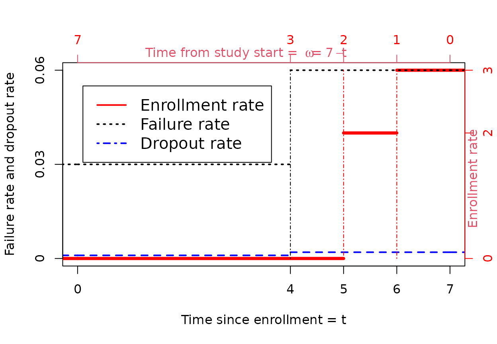

# Computing expected events by interval at risk

``` r
library(gsDesign2)
```

## Introduction

This document derives an algorithm for computing expected events
observed for a model with piecewise constant enrollment, failure and
dropout rates similar to Lachin and Foulkes (1986). Specifically, we
design this to enable computation of an *average hazard ratio* which we
will use elsewhere to approximate sample size for fixed or group
sequential designs under a non-proportional hazards assumption
(Kalbfleisch and Prentice (1981), Schemper, Wakounig, and Heinze
(2009)). The expected events calculation outlined here is implemented in
the function
[`expected_event()`](https://merck.github.io/gsDesign2/reference/expected_event.md).

## General formulation and notation

For notation, the study time scale will denoted with \\\omega\\ with the
study start first opening for enrollment at \\\omega=0\\. We will use
the variable \\t\\ to indicate patient time with \\t=0\\ representing
the time a patient is enrolled. We assume the patient time from
enrollment to an event is independent and identically distributed for
all subjects enrolled. We also assume the patient time of censoring is
independent and identically distributed for all subjects enrolled. For
an individual, let \\X\>0\\ denote the patient time until an event and
\\Y\>0\\ denote the patient time until loss-to-follow-up. We also let
\\U\\ denote the (independent) study time of entry for the patient. We
assume the triplet \\X\\, \\Y\\, \\U\\ are independent.

We will consider a single treatment group and stratum and assume
subjects enroll according to a Poisson process with entry rate
\\g(\omega)\geq 0\\ for \\0 \leq \omega\\. The expected number of
subjects enrolled by study time \\\omega\\ is simply

\\\begin{equation} G(\omega)=\int_0^\omega g(u)du. \end{equation}\\

Analysis of time-to-event data is done using the time from enrollment
until the patient has an event, drops out, or is censored prior having
an event at the time of a data cutoff; we will consider the data cutoff
to be fixed at time \\\Omega\\. The key counts we consider here is:

- \\\bar{N}(t)\\ : the number of patients with events at or before being
  on study for at least a duration \\0\<t \leq \Omega\\ at time of data
  cutoff at study time \\\Omega\\.
- \\\bar{n}(t_1,t_2)\equiv E\\\bar{N}(t_2)-\bar{N}(t_1)\\\\ : the number
  of patients with events in the interval \\(t_1,t_2\]\\, \\0\leq t_1\<
  t_2\leq \Omega\\.

We will focus on the the expected value of \\\bar{n}(t_1,t_2)\\ due to
its usefulness in computing an average hazard ratio under the piecewise
model outlined below. For a patient to be in the count
\\\bar{n}(t_1,t_2)\\ they must be enrolled prior to time \\\Omega -
t_1\\. Also, for a patient enrolled at time \\0\<u\<\Omega\\ the maximum
time they would be observed for occurrence of an event would be
\\\Omega - u\\. Thus, \\\begin{align}
E\\\bar{n}(t_1,t_2)\\&=\int_0^{\Omega-{t_1}} g(u) P\\t_1\<X\leq
\min(t_2,\Omega-u), X\leq Y\\ du\nonumber\\ &=\int_0^{\Omega-t_2} g(u)
P\\t_1\<X\leq t_2, X\leq Y\\ du+ \int\_{\Omega-t_2}^{\Omega-t_1} g(u)
P\\t_1\< X\leq \Omega-u, X\leq Y\\ du\nonumber\\
&=G(\Omega-t_2)P\\t_1\<X\leq t_2, X\leq Y\\+
\int\_{\Omega-t_2}^{\Omega-t_1} g(u) P\\t_1\< X\leq \Omega-u, X\leq Y\\
du.\nonumber \end{align}\\

## The piecewise model

The model here is as follows:

- Piecewise constant enrollment rates are allowed given that the
  enrollment rate often accelerates early in the trial.
- Piecewise exponential failure rates are allowed to allow changing
  outcome incidence over time.
- Piecewise exponential censoring rates allow changing dropout rates
  over time.
- A fixed study duration.

Lachin and Foulkes (1986) has provided a general formulation for
calculating the expected number of events over time in the scenario
described above. However, we alter their algorithm to compute the
expected number of events \\E\\\bar n(t_1,t_2)\\\\ in each follow-up
period with a constant failure rate; this will later enable computing an
average hazard ratio (Kalbfleisch and Prentice (1981), Schemper,
Wakounig, and Heinze (2009)).

We define a piecewise time-to-event and dropout random variables on the
patient time scale. We assume \\0=t_0\<t_1\<...\<t_M=\infty\\ and for
\\m=1,2,\ldots,M\\. For \\m=1,2,\ldots,M\\, we assume \\X_m\>0\\,
\\Y_m\>0\\ are random variables that are independent of the study entry
time \\U\\. We let \\X_m\\ and \\Y_m\\ define \\X\\ and \\Y\\,
respectively, on the interval \\(t\_{m-1},t_m\]\\, \\m=1,2,\ldots,M\\,
as follows:

\\\begin{align} X&=\sum\_{m=1}^M \min(X_m,t_m-t\_{m-1})
\prod\_{j=1}^{m-1}I\\X_j\>t_j-t\_{j-1}\\\label{eq:Xdef}\\
Y&=\sum\_{m=1}^M
\min(Y_m,t_m-t\_{m-1})\prod\_{j=1}^{m-1}I\\Y_j\>t_j-t\_{j-1}\\\label{eq:Ydef}.
\end{align}\\

Here assume that \\X_m\\ and \\Y_m\\ are independent and exponentially
distributed with failure rates \\\lambda_m\\ and \\\eta_m\\,
respectively, \\m=1,2,\ldots,M\\.

We now assume subjects enroll at a constant rate in each of \\J\\
intervals defined by \\0=\omega_0\<\omega_1\<\ldots\<\omega_J\<\infty\\.
We denote the enrollment rates by
\\\begin{equation}g(\omega)=\gamma_j\geq 0\label{eq:gj}\end{equation}\\
for \\\omega\\ in the interval \\(\omega\_{j-1},\omega_j\]\\,
\\j=0,1,2,\ldots,J\\. We assume \\\gamma_1\>0\\, but for \\j\>1\\ we
assume \\\gamma_j \geq 0\\. Letting \\G_0=0\\ we recursively define for
\\j=1,\ldots,J\\

\\\begin{equation}G_j=G(\omega_j)=G\_{j-1}+\gamma_j(\omega_j-\omega\_{j-1})\label{eq:Gj}\end{equation}\\
and thus for \\\omega\in \[\omega\_{j-1},\omega_j\]\\ that the expected
enrollment by study time \\\omega\\ is
\\\begin{equation}G(\omega)=G\_{j-1}+\gamma_j(\omega-\omega\_{j-1}).\label{eq:ENpw}\end{equation}\\

### An example under the piecewise model

We consider an example of this piecewise model assuming \\J=3\\,
\\\omega_j=1,2,7\\ and \\\gamma_j=3,2,0\\ for \\j=1,2,3\\. We assume
\\M=2\\ with \\t_m=4,\infty\\, failure rates \\\lambda_m=.03,.06\\, and
dropout rates \\\eta_m=0.001,.002\\. We plot all of these in the
following plot with the enrollment rate axis on the right and the
failure and dropout rate axis on the left. We plot \\\omega\\ in reverse
order which is related to the integration in the equation for
\\E\\\bar{n}(t_1,t_2)\\\\ above. We have also plotted a vertical
dot-dashed line at each point where either the enrollment rate or a
failure (and dropout) rate changes.



### Organizing calculations under the piecewise model

We now proceed to define algorithms for computing expected events
observed in an interval for the model with piecewise constant
enrollment, failure rates, and dropout rates. We assume study duration
is \\\Omega=t_M\\. We assume without loss of generality a sequence
\\t_m\\, \\m=1,2,\ldots, M\\ such that there is a constant failure rate
\\\lambda_m\\ and dropout rate \\\eta_m\\ in the interval
\\(t\_{m-1},t_m\]\\ as well as a constant enrollment rate \\\gamma_m\\
in the interval \\(t_M-t_m,t_M-t\_{m-1}\]\\. Deriving the intervals is
relatively a straightforward exercise as shown in the example above. For
example, for the example above, the change points are where the vertical
lines are drawn and we have the following scenario for calculation
purposes.

[TABLE]

We define for \\m=1,\ldots,M\\ intermediate probability calculations for
use in calculating \\\bar n(t\_{m-1},t_m)\\ as follows:

\\\begin{align}
q_m&=P\\\min(X_m,Y_m)\>t_m-t\_{m-1}\\=\exp^{-(\lambda_m+\eta_m)(t_m-t\_{m-1})}
\label{eq:qm}\\ Q_m&=P\\\min(X,Y)\>t_m\\=\prod\_{j=1}^m
q_j\label{eq:Qm}\\ d_m&=P\\t\_{m-1}\<X\leq t_m,X\leq Y\\\\
&=P\\\min(X,Y)\>t\_{m-1}\\\cdot P\\0\<\min (X_m,Y_m)\leq
t_m-t\_{m-1},X_m\leq Y_m\\\\ &=P\\\min(X,Y)\>t\_{m-1}\\\cdot P\\0\<\min
(X_m,Y_m)\leq t_m-t\_{m-1}\\\cdot P\\X_m\leq Y_m\|0\<\min (X_m,Y_m)\leq
t_m-t\_{m-1}\\\\ &=Q\_{m-1}(1-e^{-(\lambda_m+\eta_m)(t_m-t\_{m-1})})
\frac{\lambda_m}{\lambda_m+\eta_m}\\ \bar n_m&=E\\\bar n(t\_{m-1},t_m)\\
\end{align}\\ Note that if \\\lambda_m+\eta_m=0\\, we have \\d_m=0\\.

From above, we have

\\\begin{align} \bar n_m&=G(t_M-t_m)P\\t\_{m-1}\<X\leq t_m, X\leq Y\\+
\int\_{t_M-t_m}^{t_M-t\_{m-1}} g(u) P\\t\_{m-1}\< X\leq t_M-u, X\leq Y\\
du\\ &=G\_{M+1-m}d_m+P\\\min(X,Y)\>t\_{m-1}\\
\int_0^{t_m-t\_{m-1}}g\_{M+1-m}P\\X_m\leq v, X_m\leq Y_m\\dv\\
&=G\_{M+1-m}d_m + \frac{Q\_{m-1}g\_{M+1-m}\lambda_m}{\lambda_m+\eta_m}
\int_0^{t_m-t\_{m-1}}\left(1-\exp^{-(\lambda_m+\eta_m)v}\right)dv\\
&=G\_{M+1-m}d_m + \frac{Q\_{m-1}g\_{M+1-m}\lambda_m}{\lambda_m+\eta_m}
\left(t_m-t\_{m-1}-\frac{1-\exp^{-(\lambda_m+\eta_m)(t_m-t\_{m-1})}}{\lambda_m+\eta_m}\right)\\
&=G\_{M+1-m}d_m + \frac{Q\_{m-1}g\_{M+1-m}\lambda_m}{\lambda_m+\eta_m}
\left(t_m-t\_{m-1}-\frac{1-q_m}{\lambda_m+\eta_m}\right) \end{align}\\

We now add \\q_m\\, \\Q_m\\, and \\d_m\\ to the calculations above to
enable computation of \\\bar n_m\\, the expected events in each time
interval.

``` r
name_tem <- names(x)

names(x) <- c("m", "tm", "lambda", "eta", "j", "omega", "gamma")

y <- x |>
  mutate(
    tdel = tm - lag(tm, default = 0),
    q = exp(-(lambda + eta) * tdel),
    Q = lag(cumprod(q), default = 1),
    d = Q * (1 - q) * lambda / (lambda + eta),
    G = c(5, 5, 3, 0),
    nbar = G * d + (lambda * Q * gamma) / (lambda + eta) * (tdel - (1 - q) / (lambda + eta))
  )

yy <- y

names(yy) <- c(
  "$m$", "$t_m$", "$\\lambda_m$", "$\\eta_m$", "$j$",
  "$\\omega_j=t_M-t_{m-1}$",
  "$\\gamma_j$", "$t_m-t_{m-1}$", "$q_m$", "$Q_{m-1}$",
  "$d_m$", "$G_{j-1}$", "$\\bar{n}_m$"
)

yy <- yy |> select(c(1:7, 12, 8:11, 13))

yy |>
  kable(digits = 4) |>
  kable_styling(c("striped", "bordered")) |>
  add_header_above(c(
    "Failure and dropout rates" = 4,
    "Enrollment" = 4,
    "Events by time period" = 5
  ))
```

[TABLE]

### Verifying calculations

We check the above for the total number of events using the **gsDesign**
function
[`eEvents()`](https://keaven.github.io/gsDesign/reference/eEvents.html).
First, we sum the \\\bar{n}\_m\\ values `sum(y$nbar)` to get 1.083773
and compare to:

``` r
event <- gsDesign::eEvents(
  lambda = y$lambda,
  eta = y$eta,
  gamma = y$gamma[rev(seq_along(y$gamma))],
  S = y$tdel[seq_len(length(y$tdel) - 1)],
  R = y$tdel[rev(seq_along(y$tdel))],
  T = max(y$tm)
)$d

event
#> [1] 1.083773
```

Next, we examine by the periods defined by `fail_rate`:

``` r
expected_event(
  enroll_rate = define_enroll_rate(duration = c(1, 1), rate = c(3, 2)),
  fail_rate = define_fail_rate(duration = c(4, 3), fail_rate = c(.03, .06), dropout_rate = c(.001, .002)),
  total_duration = 7,
  simple = FALSE
)
#>   t fail_rate     event
#> 1 0      0.03 0.5642911
#> 2 4      0.06 0.5194821
```

Now we group rows of `y` above into these same intervals.

``` r
y |>
  mutate(t = c(0, 4, 4, 4)) |>
  group_by(t) |>
  summarise(
    fail_rate = first(lambda),
    Events = sum(nbar)
  )
#> # A tibble: 2 × 3
#>       t fail_rate Events
#>   <dbl>     <dbl>  <dbl>
#> 1     0      0.03  0.564
#> 2     4      0.06  0.519
```

Finally, we approximate specific numbers using simulation. First, we
simulate a large dataset and confirm the simulation has the targeted
enrollment pattern.

``` r
nsim <- 1e6
```

``` r
xx <- simtrial::simPWSurv(
  n = nsim,
  block = (rep("xx", 4)),
  enroll_rate = define_enroll_rate(rate = c(3, 2) * nsim / 5, duration = c(1, 1)),
  fail_rate = tibble(
    stratum = "All", period = 1:2, Treatment = "xx",
    rate = c(.03, .06), duration = c(4, Inf)
  ),
  dropout_rate = tibble(
    stratum = "All", period = 1:2, Treatment = "xx",
    rate = c(.001, .002), duration = c(4, Inf)
  )
)

saveRDS(xx, file = "fixtures/compute_expected_events.rds", compress = "xz")
```

``` r
xx <- readRDS("fixtures/compute_expected_events.rds")
ecat <- 1 + (xx$enrollTime > 1) + (xx$enrollTime > 2)
cat("Enrollment pattern: ", table(ecat) / nsim)
#> Enrollment pattern:  0.599697 0.399995 0.000308
```

Now we confirm the expected events in each follow-up interval given the
targeted enrollment.

``` r
#' This function is borrowed from Merck/simtrial.
#' We copy it here to make gsDesign2 self-contained.
#'
#' Cut a Dataset for Analysis at a Specified Date
#'
#' @param x a time-to-event dataset, e.g., generated by \code{simPWSurv}
#' @param cut_date date relative to start of randomization (\code{cte} from input dataset)
#' at which dataset is to be cut off for analysis
#' @return A dataset ready for survival analysis
#' @examples
#' # Use default enrollment and event rates and cut at calendar time 5 after start
#' # of randomization
#' simPWSurv(n = 20) |> cut_data(5)
cut_data <- function(x, cut_date) {
  x |>
    filter(enrollTime <= cut_date) |>
    mutate(
      tte = pmin(cte, cut_date) - enrollTime,
      event = fail * (cte <= cut_date)
    ) |>
    select(tte, event, Stratum, Treatment)
}
```

``` r
yy <- xx |>
  cut_data(7) |>
  filter(event == 1) |>
  mutate(tcat = 4 + (tte > 4) + (tte > 5) + (tte > 6))
cat("Event by interval: ", table(yy$tcat) / nsim * 5, "\n")
#> Event by interval:  0.56421 0.2591 0.19403 0.067865
cat("Total events: ", sum(yy$event) / nsim * 5)
#> Total events:  1.085205
```

## References

Kalbfleisch, John D, and Ross L Prentice. 1981. “Estimation of the
Average Hazard Ratio.” *Biometrika* 68 (1): 105–12.

Lachin, John M, and Mary A Foulkes. 1986. “Evaluation of Sample Size and
Power for Analyses of Survival with Allowance for Nonuniform Patient
Entry, Losses to Follow-up, Noncompliance, and Stratification.”
*Biometrics* 42 (3): 507–19.

Schemper, Michael, Samo Wakounig, and Georg Heinze. 2009. “The
Estimation of Average Hazard Ratios by Weighted Cox Regression.”
*Statistics in Medicine* 28 (19): 2473–89.
