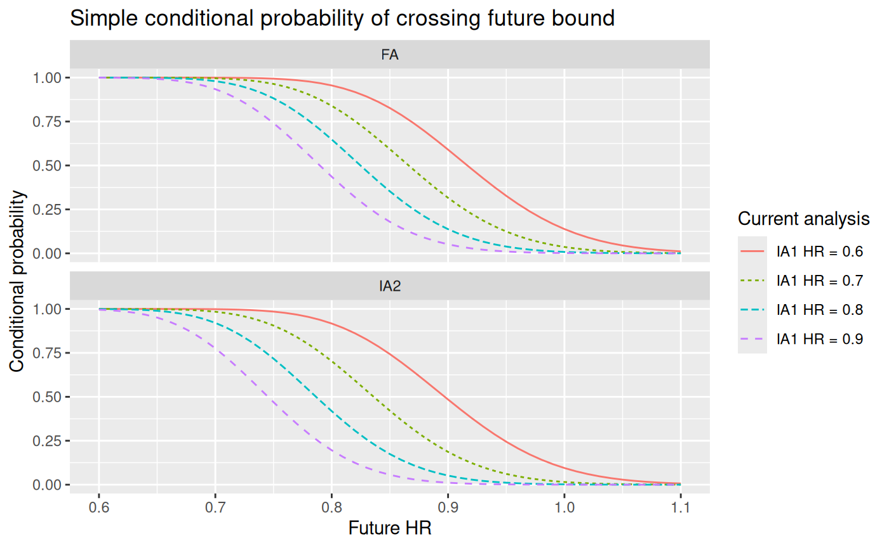
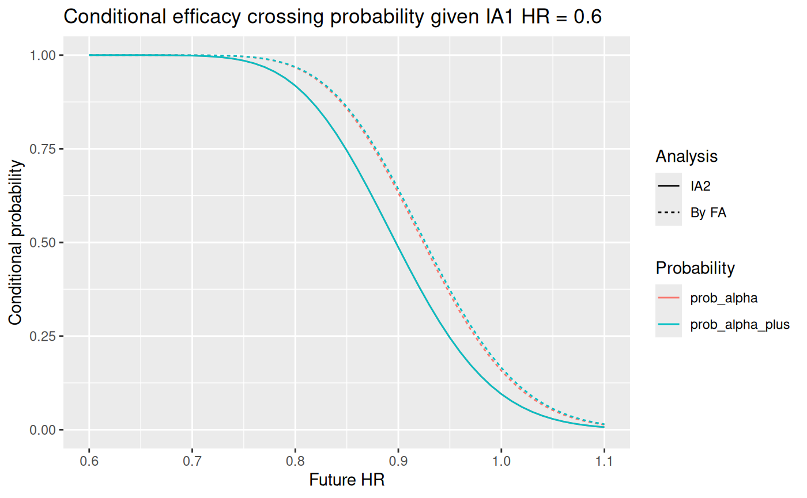
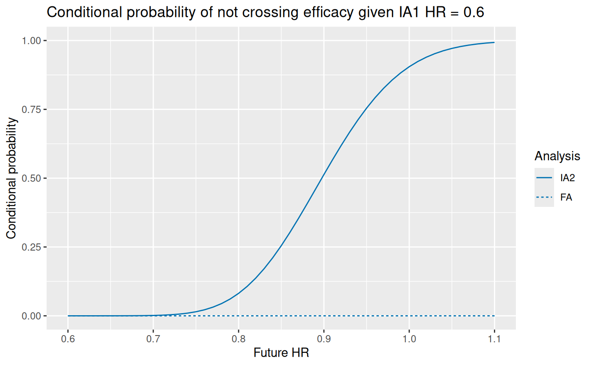

# Conditional power

``` r

library(gsDesign)
library(gsDesign2)
library(gt)
library(ggplot2)
library(tibble)
```

## Introduction

We provide a simple plot of conditional power at the time of interim
analysis. The conditional power evaluations can be useful supportive
information for boundaries determined by other methods.

## Design

We consider the default design from
[`gs_design_ahr()`](https://merck.github.io/gsDesign2/reference/gs_design_ahr.md).
We assume enrollment will ramp-up with 25%, 50%, and 75% of the final
enrollment rate for consecutive 2 month periods followed by a steady
state 100% enrollment for another 6 months. The rates will be increased
later to power the design appropriately. However, the fixed enrollment
rate periods and relative enrollment rates will remain unchanged.

For the control group, we assume an exponential failure rate
distribution with a 12 month median. We assume a hazard ratio of 1 for 4
months, followed by a hazard ratio of 0.6 thereafter. Finally, we assume
a 0.001 exponential dropout rate per month for both treatment groups.

Here we implement the asymmetric 2-sided design. We will add an early
futility analysis where if there is a nominal 1-sided p-value of 0.05 in
the wrong direction. This might be considered a disaster check. After
this point in time, there may be no perceived need for further futility
analysis. For efficacy, we use alpha-spending approach with the
Lan-DeMets spending function to approximate O’Brien-Fleming bounds with
one-sided Type I error \\\alpha = 0.025\\.

``` r

enroll_rate <- define_enroll_rate(
  duration = c(2, 2, 2, 6),
  rate = (1:4) / 4)

fail_rate <- define_fail_rate(
  duration = c(4, Inf),
  fail_rate = log(2) / 12,
  hr = c(1, .6),
  dropout_rate = .001)

x <- gs_design_ahr(
  alpha = 0.025,
  beta = 0.15,
  enroll_rate = enroll_rate,
  fail_rate = fail_rate,
  analysis_time = c(16, 26, 36),
  upper = gs_spending_bound,
  upar = list(sf = sfLDOF, total_spend = 0.025), 
  test_upper = c(TRUE, TRUE, TRUE), 
  lower = gs_spending_bound,
  lpar = list(sf = sfHSD, total_spend = 0.15, param = 3)) |> to_integer()

# Round analysis time to nearest month
x$analysis$time <- round(x$analysis$time)
x |> gs_bound_summary() |> gt()
```

| Analysis    | Value                | Efficacy | Futility |
|-------------|----------------------|----------|----------|
| IA 1: 49%   | Z                    | 3.0103   | 0.2907   |
| N: 544      | p (1-sided)          | 0.0013   | 0.3856   |
| Events: 192 | ~HR at bound         | 0.6476   | 0.9589   |
| Month: 16   | P(Cross) if HR=1     | 0.0013   | 0.6144   |
|             | P(Cross) if AHR=0.81 | 0.0642   | 0.1206   |
| IA 2: 80%   | Z                    | 2.2595   | 1.4315   |
| N: 544      | p (1-sided)          | 0.0119   | 0.0761   |
| Events: 317 | ~HR at bound         | 0.7758   | 0.8515   |
| Month: 26   | P(Cross) if HR=1     | 0.0123   | 0.9271   |
|             | P(Cross) if AHR=0.72 | 0.7242   | 0.1431   |
| Final       | Z                    | 2.0282   | 1.9089   |
| N: 544      | p (1-sided)          | 0.0213   | 0.0281   |
| Events: 395 | ~HR at bound         | 0.8154   | 0.8252   |
| Month: 36   | P(Cross) if HR=1     | 0.0228   | 0.9730   |
|             | P(Cross) if AHR=0.69 | 0.8498   | 0.1494   |

## Update design at time of interim analysis

Assume there are 145 instead of the planned 192 events at the first IA.
Assume further there are 90 events observed within 4 months of subject
randomization, and 55 events more than 4 months after randomization. The
IA1 blinded estimate of minus the average log hazard ratio (-log(AHR))
based on the original assumptions of HR = 1 for 4 months and 0.6
thereafter is computed as follows:

``` r

ia1_theta <- -sum(log(c(1, 0.6)) * c(90, 55)) / 145
ia1_theta
#> [1] 0.1937614
```

For IA alpha spending, we take the minimum of planned and actual
information fraction, allocating remaining \\\alpha\\ to the FA. Note
that in the following, the calendar time of analysis is assumed to be
the same as in the planned design. Also, the effect size and event
counts at analyses after IA1 are assumed the same as at the time of
design unless otherwise specified by the user. Just as an example, we
assume the actual timing of IA1 is at 17 months after study start. We
update the design bounds as follows:

``` r

ustime <- x$analysis$info_frac
ustime[1] <- min(145, x$analysis$event[1]) / max(x$analysis$event)
xu <- gs_update_ahr(
  x = x,
  ustime = ustime,
  event_tbl = data.frame(analysis = c(1, 1), event = c(90, 55)))
xu$analysis$time <- c(17, x$analysis$time[2:3])

xu |> gs_bound_summary() |> gt()
```

| Analysis    | Value                | Efficacy | Futility |
|-------------|----------------------|----------|----------|
| IA 1: 37%   | Z                    | 3.5196   | -0.0849  |
| N: 544      | p (1-sided)          | 0.0002   | 0.5338   |
| Events: 145 | ~HR at bound         | 0.5573   | 1.0142   |
| Month: 17   | P(Cross) if HR=1     | 0.0002   | 0.4662   |
|             | P(Cross) if AHR=0.82 | 0.0093   | 0.1054   |
| IA 2: 80%   | Z                    | 2.2576   | 1.5168   |
| N: 544      | p (1-sided)          | 0.0120   | 0.0647   |
| Events: 317 | ~HR at bound         | 0.7760   | 0.8433   |
| Month: 26   | P(Cross) if HR=1     | 0.0120   | 0.9376   |
|             | P(Cross) if AHR=0.72 | 0.7243   | 0.1436   |
| Final       | Z                    | 2.0228   | 1.9453   |
| N: 544      | p (1-sided)          | 0.0215   | 0.0259   |
| Events: 395 | ~HR at bound         | 0.8158   | 0.8222   |
| Month: 36   | P(Cross) if HR=1     | 0.0221   | 0.9755   |
|             | P(Cross) if AHR=0.69 | 0.8476   | 0.1500   |

## Testing and simple conditional power

We assume possible IA1 observed HR values of 0.6, 0.7, 0.8, and 0.9. We
compute the conditional power at IA2 and FA given the IA1 observed HR
and observed blinded events. The function
[`gsDesign::hrn2z()`](https://keaven.github.io/gsDesign/reference/nSurvival.html)
translates a hazard ratio and number of events into an approximate
corresponding Z-value, using the Schoenfeld approximation.

``` r

ia1_hr <- seq(0.6, 0.9, 0.1)
ia1_z <- -hrn2z(hr = ia1_hr, n = 145, ratio = 1)
```

We demonstrate a conditional power plot that may be of some use. The
simple conditional power ignores future interim bounds and targets the
probability of crossing the final efficacy bound given the IA1 Z-value.
Assuming a future HR between IA1 and FA from 0.6 to 1.1, we translate
the HR to natural treatment effect parameter as shown below.

``` r

future_hr <- seq(0.6, 1.1, .01)
future_theta <- -log(future_hr)
```

For each combination of future HR and currently observed HR, we
calculate the simple conditional power via the
[`gs_cp_simple()`](https://merck.github.io/gsDesign2/reference/gs_cp_simple.md)
function for both IA2 and the final analysis.

``` r

ia2_cp <- NULL
fa_cp <- NULL

# calculate IA2 and FA conditional power/error
for (i in seq_along(future_theta)) {
  for (j in seq_along(ia1_z)) {
    cp <- gs_cp_simple(
      x = xu,
      theta = c(ia1_theta, future_theta[i], future_theta[i]),
      i = 1,
      zi = ia1_z[j]
    )
    # calculate IA2 conditional power
    ia2_cp_new <- tibble(future_analysis = "IA2",
                         future_hr = future_hr[i], 
                         current_hr = paste0("IA1 HR = ", ia1_hr[j]),
                         cond_prob = cp[1])
    # calculate FA conditional power
    fa_cp_new <- tibble(future_analysis = "FA",
                        future_hr = future_hr[i],
                        current_hr = paste0("IA1 HR = ", ia1_hr[j]),
                        cond_prob = cp[2])
    
    ia2_cp <- rbind(ia2_cp, ia2_cp_new)
    fa_cp <- rbind(fa_cp, fa_cp_new)
  }
}
```

The panels show the simple conditional probability of crossing the
future efficacy bound at FA and IA2, separately. Within each panel,
curves correspond to different observed IA1 HR values.

``` r

# plot the simple conditional power
ggplot(
  data = rbind(ia2_cp, fa_cp),
  aes(
    x = future_hr,
    y = cond_prob,
    color = current_hr,
    linetype = current_hr
  )
) +
  geom_line() +
  facet_wrap(~ future_analysis, ncol = 1) +
  coord_cartesian(ylim = c(0, 1)) +
  ggtitle("Simple conditional probability of crossing future bound") +
  xlab("Future HR") +
  ylab("Conditional probability") +
  labs(color = "Current analysis", linetype = "Current analysis")
```



## Assumptions used to plot the above conditional power

- We assume there are 145 observed at IA1, with 90 events observed
  during the first 4 months since randomization when HR = 1, and 55
  events after month 4 when HR = 0.6.
- Based on the above assumed blinded event, the IA1 blinded treatment
  effect is estimated by `-sum(log(c(1, 0.6)) * c(90, 55)) / 145`, and
  the IA1 statistical information is estimated as 145/4.
- The statistical information of future analysis is under the null
  hypothesis, i.e., event/4 for equal randomization.
- Given the IA1 observed HR, the IA1 Z-score is calculated using the
  Schoenfeld approximation.
- Conditional power for future analyses ignores intervening interim
  analyses.

## Conditional power accounting for future interim analyses

The simple conditional power above calculates the probability of
crossing a future bound at each analysis separately. It does not account
for the possibility that the trial may cross a futility or efficacy
bound earlier at an intervening interim analysis.

The function
[`gs_cp()`](https://merck.github.io/gsDesign2/reference/gs_cp.md)
accounts for future interim analyses by calculating path probabilities
conditional on the current Z-value.

In this example,

For `prob_alpha`:

- `prob_alpha[1]` is the conditional probability of crossing the
  efficacy bound at IA2.
- `prob_alpha[2]` is the conditional probability of staying between the
  IA2 futility and efficacy bounds, then crossing the efficacy bound at
  FA.
- `sum(prob_alpha)` is the cumulative conditional probability of
  crossing an efficacy bound by FA, accounting for future futility and
  efficacy bound crossings.

For `prob_alpha_plus`:

- `prob_alpha_plus[1]` is the conditional probability of crossing the
  efficacy bound at IA2.
- `prob_alpha_plus[2]` is the conditional probability of not crossing
  the IA2 efficacy bound, then crossing the efficacy bound at FA. Unlike
  `prob_alpha[2]`, this does not require the IA2 Z-value to stay above
  the futility bound.
- `sum(prob_alpha_plus)` is the cumulative conditional probability of
  crossing an efficacy bound by FA when future futility bounds are
  ignored.

For `prob_beta`:

- `prob_beta[1]` is the conditional probability of not crossing the
  efficacy bound at IA2.
- `prob_beta[2]` is the conditional probability of staying between the
  IA2 futility and efficacy bounds, then not crossing the efficacy bound
  at FA.

We calculate these quantities for the same IA1 observed HR values used
above, then plot the case with IA1 HR = 0.6 as an example.

``` r

gs_cp_tbl <- NULL

for (i in seq_along(future_theta)) {
  for (j in seq_along(ia1_z)) {
    cp <- gs_cp(
      x = xu,
      theta = c(ia1_theta, future_theta[i], future_theta[i]),
      i = 1,
      zi = ia1_z[j]
    )

    cp_new <- tibble(
      probability_type = c(rep("prob_alpha", 3), 
                           rep("prob_alpha_plus", 3), 
                           rep("prob_beta", 2)),
      future_analysis = c(rep(c("IA2", "FA", "By FA"), 2),
                          "IA2", "FA"),
      future_hr = future_hr[i],
      current_hr = paste0("IA1 HR = ", ia1_hr[j]),
      cond_prob = c(
        cp$prob_alpha[1],
        cp$prob_alpha[2],
        sum(cp$prob_alpha),
        cp$prob_alpha_plus[1],
        cp$prob_alpha_plus[2],
        sum(cp$prob_alpha_plus),
        cp$prob_beta[1],
        cp$prob_beta[2]
      )
    )

    gs_cp_tbl <- rbind(gs_cp_tbl, cp_new)
  }
}

gs_cp_tbl$future_analysis <- factor(
  gs_cp_tbl$future_analysis,
  levels = c("IA2", "FA", "By FA")
)

gs_cp_tbl$probability_type <- factor(
  gs_cp_tbl$probability_type,
  levels = c("prob_alpha", "prob_alpha_plus", "prob_beta")
)
```

To summarize the efficacy-crossing probabilities, we focus on
`prob_alpha` and `prob_alpha_plus`. For each quantity, the IA2 curve
gives the conditional probability of crossing the efficacy bound at IA2,
while the by-FA curve gives the cumulative conditional probability of
crossing an efficacy bound by FA.

The difference between `prob_alpha` and `prob_alpha_plus` reflects the
role of future futility bounds. `prob_alpha` requires the trial to
remain between the futility and efficacy bounds at any intervening
analysis before crossing efficacy, whereas `prob_alpha_plus` ignores
future futility bounds and only requires no earlier efficacy crossing.
In this design, the two curves are close because the future futility
bound has little impact on the efficacy-crossing probability for the
illustrated case.

``` r

gs_cp_plot_tbl <- subset(gs_cp_tbl, current_hr == "IA1 HR = 0.6")

efficacy_plot_tbl <- subset(
  gs_cp_plot_tbl,
  probability_type %in% c("prob_alpha", "prob_alpha_plus") &
    future_analysis %in% c("IA2", "By FA")
)

efficacy_plot_tbl <- droplevels(efficacy_plot_tbl)

ggplot(
  data = efficacy_plot_tbl,
  aes(
    x = future_hr,
    y = cond_prob,
    color = probability_type,
    linetype = future_analysis
  )
) +
  geom_line() +
  coord_cartesian(ylim = c(0, 1)) +
  ggtitle("Conditional efficacy crossing probability given IA1 HR = 0.6") +
  xlab("Future HR") +
  ylab("Conditional probability") +
  labs(color = "Probability", linetype = "Analysis")
```



We next show `prob_beta`, which is interpreted analysis by analysis.
Here `prob_beta[1]` is the conditional probability of not crossing the
efficacy bound at IA2, and `prob_beta[2]` is the conditional probability
of staying between the IA2 futility and efficacy bounds, then not
crossing the efficacy bound at FA.

``` r

gs_cp_plot_tbl <- subset(gs_cp_tbl, current_hr == "IA1 HR = 0.6")

beta_plot_tbl <- subset(
  gs_cp_plot_tbl,
  probability_type == "prob_beta" &
    future_analysis %in% c("IA2", "FA")
)


beta_plot_tbl <- droplevels(beta_plot_tbl)

ggplot(
  data = beta_plot_tbl,
  aes(
    x = future_hr,
    y = cond_prob,
    linetype = future_analysis
  )
) +
  geom_line(color = "#0072B2") +
  coord_cartesian(ylim = c(0, 1)) +
  ggtitle("Conditional probability of not crossing efficacy given IA1 HR = 0.6") +
  xlab("Future HR") +
  ylab("Conditional probability") +
  labs(linetype = "Analysis")
```


