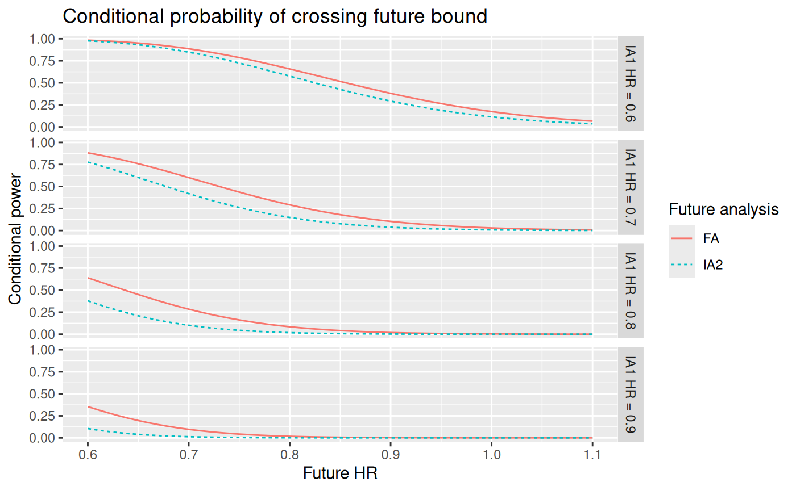

# Conditional power

``` r
library(gsDesign)
library(gsDesign2)
library(gt)
library(ggplot2)
library(tibble)
```

## Introduction

We provide a simple plot of conditional power at the time of interim
analysis. The conditional power evaluations can be useful supportive
information for boundaries determined by other methods.

## Design

We consider the default design from
[`gs_design_ahr()`](https://merck.github.io/gsDesign2/reference/gs_design_ahr.md).
We assume enrollment will ramp-up with 25%, 50%, and 75% of the final
enrollment rate for consecutive 2 month periods followed by a steady
state 100% enrollment for another 6 months. The rates will be increased
later to power the design appropriately. However, the fixed enrollment
rate periods and relative enrollment rates will remain unchanged.

For the control group, we assume an exponential failure rate
distribution with a 12 month median. We assume a hazard ratio of 1 for 4
months, followed by a hazard ratio of 0.6 thereafter. Finally, we assume
a 0.001 exponential dropout rate per month for both treatment groups.

Here we implement the asymmetric 2-sided design. We will add an early
futility analysis where if there is a nominal 1-sided p-value of 0.05 in
the wrong direction. This might be considered a disaster check. After
this point in time, there may be no perceived need for further futility
analysis. For efficacy, we use alpha-spending approach with the
Lan-DeMets spending function to approximate O’Brien-Fleming bounds with
one-sided Type I error \\\alpha = 0.025\\.

``` r
enroll_rate <- define_enroll_rate(
  duration = c(2, 2, 2, 6),
  rate = (1:4) / 4)

fail_rate <- define_fail_rate(
  duration = c(4, Inf),
  fail_rate = log(2) / 12,
  hr = c(1, .6),
  dropout_rate = .001)

x <- gs_design_ahr(
  alpha = 0.025,
  beta = 0.15,
  enroll_rate = enroll_rate,
  fail_rate = fail_rate,
  analysis_time = c(16, 26, 36),
  upper = gs_spending_bound,
  upar = list(sf = sfLDOF, total_spend = 0.025), 
  test_upper = c(FALSE, TRUE, TRUE), 
  lower = gs_b,
  lpar = c(qnorm(.05), -Inf, -Inf)) |> to_integer()
# Round analysis time to nearest month
x$analysis$time <- round(x$analysis$time)
x |> gs_bound_summary() |> gt()
```

| Analysis    | Value                | Efficacy | Futility |
|-------------|----------------------|----------|----------|
| IA 1: 49%   | Z                    | NA       | -1.6449  |
| N: 388      | p (1-sided)          | NA       | 0.9500   |
| Events: 138 | ~HR at bound         | NA       | 1.3232   |
| Month: 16   | P(Cross) if HR=1     | NA       | 0.0500   |
|             | P(Cross) if AHR=0.81 | NA       | 0.0020   |
| IA 2: 80%   | Z                    | 2.2420   | NA       |
| N: 388      | p (1-sided)          | 0.0125   | NA       |
| Events: 227 | ~HR at bound         | 0.7426   | NA       |
| Month: 26   | P(Cross) if HR=1     | 0.0125   | NA       |
|             | P(Cross) if AHR=0.72 | 0.5896   | NA       |
| Final       | Z                    | 2.0263   | NA       |
| N: 388      | p (1-sided)          | 0.0214   | NA       |
| Events: 282 | ~HR at bound         | 0.7856   | NA       |
| Month: 36   | P(Cross) if HR=1     | 0.0250   | NA       |
|             | P(Cross) if AHR=0.69 | 0.8501   | NA       |

## Update design at time of interim analysis

Assume there are 145 instead of the planned 138 events at the first IA.
Assume further there are 90 events observed within 4 months of subject
randomization, and 55 events more than 4 months after randomization. The
IA1 blinded estimate of minus the average log hazard ratio (-log(AHR))
based on the original assumptions of HR = 1 for 4 months and 0.6
thereafter is computed as follows:

``` r
ia1_theta <- -sum(log(c(1, 0.6)) * c(90, 55)) / 145
ia1_theta
#> [1] 0.1937614
```

For IA alpha spending, we take the minimum of planned and actual
information fraction, allocating remaining \\\alpha\\ to the FA. Note
that in the following, the calendar time of analysis is assumed to be
the same as in the planned design. Also, the effect size and event
counts at analyses after IA1 are assumed the same as at the time of
design unless otherwise specified by the user. Just as an example, we
assume the actual timing of IA1 is at 17 months after study start. We
update the design bounds as follows:

``` r
ustime <- x$analysis$info_frac
ustime[1] <- min(145, x$analysis$event[1]) / max(x$analysis$event)
xu <- gs_update_ahr(
  x = x,
  ustime = ustime,
  event_tbl = data.frame(analysis = c(1, 1), event = c(90, 55)))
xu$analysis$time <- c(17, x$analysis$time[2:3])

xu |> gs_bound_summary() |> gt()
```

| Analysis    | Value                | Efficacy | Futility |
|-------------|----------------------|----------|----------|
| IA 1: 51%   | Z                    | Inf      | -1.6449  |
| N: 388      | p (1-sided)          | 0.0000   | 0.9500   |
| Events: 145 | ~HR at bound         | 0.0000   | 1.3142   |
| Month: 17   | P(Cross) if HR=1     | 0.0000   | 0.0500   |
|             | P(Cross) if AHR=0.82 | 0.0000   | 0.0025   |
| IA 2: 80%   | Z                    | 2.2509   | -Inf     |
| N: 388      | p (1-sided)          | 0.0122   | 1.0000   |
| Events: 227 | ~HR at bound         | 0.7417   | Inf      |
| Month: 26   | P(Cross) if HR=1     | 0.0122   | 0.0500   |
|             | P(Cross) if AHR=0.72 | 0.5960   | 0.0025   |
| Final       | Z                    | 2.0229   | -Inf     |
| N: 388      | p (1-sided)          | 0.0215   | 1.0000   |
| Events: 282 | ~HR at bound         | 0.7859   | Inf      |
| Month: 36   | P(Cross) if HR=1     | 0.0250   | 0.0500   |
|             | P(Cross) if AHR=0.69 | 0.8555   | 0.0025   |

## Testing and conditional power

We assume possible IA1 observed HR values of 0.6, 0.7, 0.8, and 0.9. We
compute the conditional power at IA2 and FA given the IA1 observed HR
and observed blinded events. The function
[`gsDesign::hrn2z()`](https://keaven.github.io/gsDesign/reference/nSurvival.html)
translates a hazard ratio and number of events into an approximate
corresponding Z-value, using the Schoenfeld approximation.

``` r
ia1_hr <- seq(0.6, 0.9, 0.1)
ia1_z <- -hrn2z(hr = ia1_hr, n = 145, ratio = 1)
```

We demonstrate a conditional power plot that may be of some use. The
conditional power ignores future interim bounds and targets the
probability of crossing the final efficacy bound given the IA1 Z-value.
Assuming a future HR between IA1 and FA from 0.6 to 1.1, we translate
the HR to standardized effect size as shown below.

``` r
future_hr <- seq(0.6, 1.1, .01)
future_theta <- -log(future_hr) * sqrt(x$input$ratio / (1 + x$input$ratio)^2)
```

For each combination of future HR and currently observed HR, we
calculate the simple conditional power via the
[`gs_cp_npe()`](https://merck.github.io/gsDesign2/reference/gs_cp_npe.md)
function for both IA2 and the final analysis.

``` r
ia2_cp <- NULL
fa_cp <- NULL
q_e <- x$input$ratio / (1 + x$input$ratio)

# calculate IA2 conditional power/error
for (i in seq_along(future_theta)) {
  for (j in seq_along(ia1_z)) {
    # conditional power
    cp <- gs_cp_npe(
      theta = c(ia1_theta, future_theta[i]), 
      info = c(145, x$analysis$event[2]) * q_e * (1- q_e),
      a = ia1_z[j],
      b = xu$bound$z[xu$bound$analysis == 2 & xu$bound$bound == "upper"])
    
    ia2_cp_new <- tibble(future_analysis = "IA2",
                         future_hr = future_hr[i], 
                         current_hr = paste0("IA1 HR = ", ia1_hr[j]),
                         cond_prob = cp)
    ia2_cp <- rbind(ia2_cp, ia2_cp_new)
  }
}

# calculate FA conditional power
for (i in seq_along(future_theta)) {
  for (j in seq_along(ia1_z)) {
    cp <- gs_cp_npe(
      theta = c(ia1_theta, future_theta[i]), 
      info = c(145, x$analysis$event[3]) * q_e * (1- q_e),
      a = ia1_z[j],
      b = xu$bound$z[xu$bound$analysis == 3 & xu$bound$bound == "upper"])
    
    fa_cp_new <- tibble(future_analysis = "FA",
                        future_hr = future_hr[i],
                        current_hr = paste0("IA1 HR = ", ia1_hr[j]),
                        cond_prob = cp)
    fa_cp <- rbind(fa_cp, fa_cp_new)
  }
}
```

The red/blue line shows the conditional probability of crossing FA/IA2
efficacy bound.

``` r
# plot the conditional power
ggplot(data = rbind(ia2_cp, fa_cp),
       aes(x = future_hr, y = cond_prob, 
           color = future_analysis, linetype = future_analysis)) +
  geom_line() +
  facet_grid(current_hr ~ .) +
  ggtitle("Conditional probability of crossing future bound") +
  xlab("Future HR") + 
  ylab("Conditional power") +
  labs(color = "Future analysis", linetype = "Future analysis")
```



## Assumptions used to plot the above conditional power

- We assume there are 145 observed at IA1, with 90 events observed
  during the first 4 months since randomization when HR = 1, and 55
  events after month 4 when HR = 0.6.
- Based on the above assumed blinded event, the IA1 blinded treatment
  effect is estimated by `-sum(log(c(1, 0.6)) * c(90, 55)) / 145`, and
  the IA1 statistical information is estimated as 145/4.
- The statistical information of future analysis is under the null
  hypothesis, i.e., event/4 for equal randomization.
- Given the IA1 observed HR, the IA1 Z-score is calculated using the
  Schoenfeld approximation.
- Conditional power for future analyses ignores intervening interim
  analyses.
