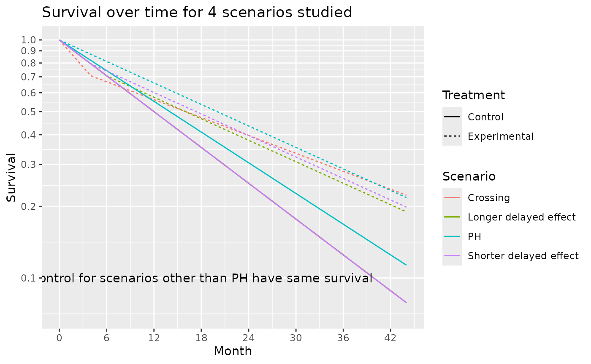
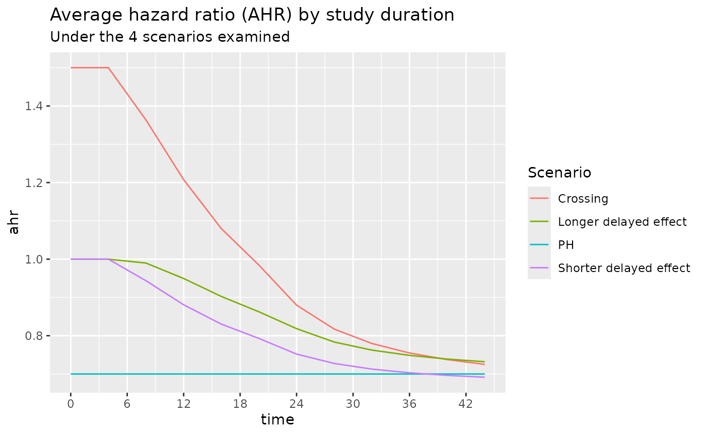

# Design using average hazard ratio

## Introduction

We consider fixed and group sequential design under non-proportional
hazards when testing with the logrank test. We focus primarily on the
average hazard ratio approach, expanding the asymptotic approach of
Mukhopadhyay et al. (2020) to both group sequential design and more
complex enrollment assumptions. The theoretical background for this is
provided in other vignettes in this package. We provide a few basic
examples along the lines of Lin et al. (2020) for illustration of design
considerations under the following assumptions:

1.  Proportional hazards
2.  Short delayed effect
3.  Longer delayed effect
4.  Crossing survival

Illustrations include

1.  Expected average hazard ratio (AHR) over time.
2.  Expected event accumulation over time.
3.  The impact of planned study duration on required number of events.
4.  Power across scenarios when a trial is designed under the assumption
    of a short delayed effect.
5.  Timing of interim analyses.
6.  \\\alpha\\-spending considerations.

We focus on results rather than code, but hidden code can be revealed
for all examples.

## Packages used

The primary packages needed is **gsDesign2**. Other packages used are
supportive.

``` r
library(gsDesign)
library(gsDesign2)
library(ggplot2)
library(dplyr)
library(gt)
library(tidyr)
library(tibble)
```

## Scenarios

Expected enrollment duration is 18 months with piecewise constant
enrollment rates escalating every 2 months until month 6 where
enrollment is assumed to have reached steady state. We will later assume
a similar ramp-up period with 24 months expected enrollment duration.

``` r
# Set the enrollment table of totally 24 month
enroll24 <- define_enroll_rate(
  duration = c(rep(2, 3), 18), # 6 month ramp-up of enrollment, 24 months enrollment time target
  rate = 1:4 # ratio of the enrollment rate
)
# Adjust enrollment rates to enroll 100 subjects
enroll24$rate <- enroll24$rate * 100 / sum(enroll24$duration * enroll24$rate)

# Set the enrollment table for 18 month expected enrollment
enroll18 <- define_enroll_rate(
  duration = c(rep(2, 3), 12), # 6 month ramp-up of enrollment, 18 months enrollment time target
  rate = 1:4 # ratio of the enrollment rate
)
# Adjust enrollment rates to enroll 100 subjects
enroll18$rate <- enroll18$rate * 100 / sum(enroll18$duration * enroll18$rate)

# Put these in a single tibble by scenario
# We will use 18 month enrollment for delayed effect and crossing hazards scenarios
enroll_rate <- rbind(
  enroll18 |> mutate(Scenario = "PH"),
  enroll18 |> mutate(Scenario = "Shorter delayed effect"),
  enroll18 |> mutate(Scenario = "Longer delayed effect"),
  enroll18 |> mutate(Scenario = "Crossing")
)
```

We will consider the following failure rate assumptions:

- PH: Proportional hazards is assumed.
  - Control group has exponential failure rate with a median of 14
    months.
  - Constant hazard ratio of 0.7 (experimental/control).
- Shorter delayed effect
  - Control group has exponential failure rate with a median of 10
    months.
  - Hazard ratio of 1 for 6 months followed by a hazard ratio of 0.6.
- Longer delayed effect
  - Control group has exponential failure rate with a median of 10
    months.
  - Hazard ratio of 1 for 6 months followed by a hazard ratio of 0.6.
- Crossing hazards
  - Control group has exponential failure rate with a median of 10
    months.
  - Hazard ratio of 1.5 for 4 months followed by a hazard ratio of 0.5.

``` r
month <- c(0, 4, 6, 44)
duration <- month - c(0, month[1:3])
control_rate <- log(2) / c(rep(16, 4), rep(14, 4), rep(14, 4))
s <- tibble(
  Scenario = c(rep("PH", 4), rep("Delayed effect", 4), rep("Crossing", 4)),
  Treatment = rep("Control", 12),
  Month = rep(month, 3),
  duration = rep(duration, 3),
  rate = control_rate,
  hr = c(rep(.7, 4), c(1, 1, 1, .575), c(1.5, 1.5, .5, .5))
)

s <- rbind(
  s,
  s |> mutate(Treatment = "Experimental", rate = rate * hr)
) |>
  group_by(Scenario, Treatment) |>
  mutate(Survival = exp(-cumsum(duration * rate)))
ggplot(s, aes(x = Month, y = Survival, col = Scenario, lty = Treatment)) +
  geom_line() +
  scale_y_log10(breaks = (1:10) / 10, lim = c(.1, 1)) +
  scale_x_continuous(breaks = seq(0, 42, 6))
```


``` r
# get 4 scenarios
control_median <- c(14, 12, 12, 12)
month <- c(0, 4, 6, 44)
duration <- month - c(0, month[1:3])
# HR by time period for each scenario
hr <- c(
  rep(.7, 4), # constant hazard ratio of 0.7
  1, 1, .6, .6, # hazard ratio of 1 for 4 months followed by a hazard ratio of 0.6.
  1, 1, 1, .6, # hr = 1 for 6 months followed by hr = .6
  1.5, 1.5, .5, .5
) # hazard ratio of 1.5 for 4 months followed by a hazard ratio of 0.5.
```

The survival curves for these 4 scenarios are shown below:

``` r
# Put parameters together in a tibble
s <- tibble(
  Scenario = c(rep("PH", 4), rep("Shorter delayed effect", 4), rep("Longer delayed effect", 4), rep("Crossing", 4)),
  Treatment = rep("Control", 16),
  Month = rep(month, 4), # Periods for constant HR
  duration = rep(duration, 4),
  rate = log(2) / c(
    rep(control_median[1], 4),
    rep(control_median[2], 4),
    rep(control_median[3], 4),
    rep(control_median[4], 4)
  ),
  hr = hr
)

# calculate the survival at each change point for each scenario
s <- rbind(
  s,
  s |> mutate(Treatment = "Experimental", rate = rate * hr)
) |>
  group_by(Scenario, Treatment) |>
  mutate(Survival = exp(-cumsum(duration * rate)))
```

``` r
# plot the survival curve
ggplot(s, aes(x = Month, y = Survival, col = Scenario, lty = Treatment, shape = Treatment)) +
  geom_line() +
  annotate("text", x = 18, y = .1, label = "Control for scenarios other than PH have same survival") +
  scale_y_log10(breaks = (1:10) / 10, lim = c(.07, 1)) +
  scale_x_continuous(breaks = seq(0, 42, 6)) +
  ggtitle("Survival over time for 4 scenarios studied")
```



The average hazard ratio for these 4 scenarios are shown below. We note
that under the *Shorter delayed effect* scenario, the average hazard
ratio approaches that of the *PH* scenario after a study duration of
about 36 months.

``` r
# Durations to be used in common for all failure rate scenarios
dur <- month[2:4] - month[1:3]

# Set the failure table
# We use exponential failure, proportional hazards
fail_rate <- rbind(
  tibble(
    Scenario = "PH", stratum = "All",
    duration = dur, fail_rate = log(2) / 14,
    hr = hr[1], dropout_rate = .001
  ),
  tibble(
    Scenario = "Shorter delayed effect", stratum = "All",
    duration = dur, fail_rate = log(2) / 11,
    hr = hr[6:8], dropout_rate = .001
  ),
  tibble(
    Scenario = "Longer delayed effect", stratum = "All",
    duration = dur, fail_rate = log(2) / 11,
    hr = hr[10:12], dropout_rate = .001
  ),
  tibble(
    Scenario = "Crossing", stratum = "All",
    duration = dur, fail_rate = log(2) / 11,
    hr = hr[14:16], dropout_rate = .001
  )
)

hr <- do.call(
  rbind,
  lapply(
    c("PH", "Shorter delayed effect", "Longer delayed effect", "Crossing"),
    function(x) {
      ahr(
        enroll_rate = enroll_rate |> filter(Scenario == x),
        fail_rate = fail_rate |> filter(Scenario == x),
        total_duration = c(.001, seq(4, 44, 4))
      ) |>
        mutate(Scenario = x)
    }
  )
)
```

``` r
ggplot(hr, aes(x = time, y = ahr, col = Scenario)) +
  geom_line() +
  scale_x_continuous(breaks = seq(0, 42, 6)) +
  ggtitle("Average hazard ratio (AHR) by study duration",
    subtitle = "Under the 4 scenarios examined"
  )
```



The number of events for these 4 scenarios are shown below. Under the 3
NPH scenarios events accumulate faster than under the PH scenario both
due to a lower control median and/or a delayed effect.

``` r
ggplot(hr, aes(x = time, y = event, col = Scenario)) +
  geom_line() +
  scale_x_continuous(breaks = seq(0, 42, 6)) +
  ylab("Expected events per 100 enrolled") +
  ggtitle("Expected event accumulation under the 4 scenarios studied")
```


From the above, we see that slight variations in control failure rates
and the potential for a delayed effect can substantially accelerate the
accumulation of events. If doing an event-based cutoff for analysis
these slight variations can lead to earlier analyses than anticipated
when the average hazard ratio that is expected with longer follow-up
would never be achieved. We examine the implications further below.

## Sample Size and Events by Scenarios

### Fixed Design using AHR and Logrank

We power a fixed design at 90% with 2.5% one-sided Type I error under
the different scenarios under consideration. We now assume the 18 month
enrollment pattern for all scenarios. For the *PH* and *Shorter delayed
effect* scenarios we need a similar AHR, number of events and sample
size for a 36 month study. The other two scenarios with crossing
survival curves or a large effect delay would require substantially
larger sample sizes due to not achieving a similar AHR by month 36.

``` r
ss_ahr_fixed <- do.call(
  rbind,
  lapply(
    c("PH", "Shorter delayed effect", "Longer delayed effect", "Crossing"),
    function(x) {
      xx <- gs_design_ahr(
        enroll_rate = enroll_rate |> filter(Scenario == x),
        fail_rate = fail_rate |> filter(Scenario == x),
        analysis_time = 36,
        upper = gs_b,
        upar = qnorm(.975),
        lower = gs_b,
        lpar = -Inf,
        alpha = .025,
        beta = .1
      )
      ans <- xx$analysis |>
        select(time, n, event, ahr) |>
        mutate(Scenario = x)
      return(ans)
    }
  )
)

ss_ahr_fixed |>
  gt() |>
  fmt_number(columns = 1:3, decimals = 0) |>
  fmt_number(columns = 4, decimals = 3) |>
  tab_header(
    title = "Sample Size and Events Required by Scenario",
    subtitle = "36 Month Trial duration, 2.5% One-sided Type 1 Error, 90% Power"
  )
```

| Sample Size and Events Required by Scenario                     |     |       |       |                        |
|-----------------------------------------------------------------|-----|-------|-------|------------------------|
| 36 Month Trial duration, 2.5% One-sided Type 1 Error, 90% Power |     |       |       |                        |
| time                                                            | n   | event | ahr   | Scenario               |
| 36                                                              | 518 | 332   | 0.700 | PH                     |
| 36                                                              | 476 | 341   | 0.703 | Shorter delayed effect |
| 36                                                              | 696 | 504   | 0.749 | Longer delayed effect  |
| 36                                                              | 760 | 544   | 0.755 | Crossing               |

Assuming the shorter delayed effect is the primary scenario for which we
wish to protect power, how long should the trial be to optimize the
tradeoffs between sample size, AHR and events required? We will inform
this tradeoff by looking sizing the trial for different assumed trial
durations with the same failure rates and assumed relative enrollment
rates. The counts of events required is perhaps the most interesting
here in that a 24 month trial requires almost twice the events to be
powered at 90% compared to a trial of 42 months duration. For further
study, we will consider the 36 month trial duration as a reasonable
tradeoff between time, sample size and power under a presumed delayed
effect of 4 months followed by a hazard ratio of 0.6 thereafter.

``` r
do.call(
  rbind,
  lapply(
    c(24, 30, 36, 42),
    function(x) {
      ans <- gs_design_ahr(
        enroll_rate = enroll_rate |> filter(Scenario == "Shorter delayed effect"),
        fail_rate = fail_rate |> filter(Scenario == "Shorter delayed effect"),
        analysis_time = x,
        upper = gs_b, upar = qnorm(.975),
        lower = gs_b, lpar = -Inf,
        alpha = .025,
        beta = .1
      )$analysis |>
        select(time, n, event, ahr) |>
        mutate(Scenario = "Shorter delayed effect")
      return(ans)
    }
  )
) |>
  gt() |>
  fmt_number(columns = 1:3, decimals = 0) |>
  fmt_number(columns = 4, decimals = 3) |>
  tab_header(
    title = "Sample Size and Events Required by Trial Duration",
    subtitle = "Delayed Effect of 4 Months, HR = 0.6 Thereafter; 90% Power"
  )
```

| Sample Size and Events Required by Trial Duration          |       |       |       |                        |
|------------------------------------------------------------|-------|-------|-------|------------------------|
| Delayed Effect of 4 Months, HR = 0.6 Thereafter; 90% Power |       |       |       |                        |
| time                                                       | n     | event | ahr   | Scenario               |
| 24                                                         | 1,037 | 522   | 0.752 | Shorter delayed effect |
| 30                                                         | 623   | 390   | 0.719 | Shorter delayed effect |
| 36                                                         | 476   | 341   | 0.703 | Shorter delayed effect |
| 42                                                         | 404   | 316   | 0.694 | Shorter delayed effect |

### Alternate Hypothesis Mapping

Under the different scenarios of interest, we can examine the expected
number of events in time periods of interest.

``` r
events_by_time_period <- NULL

for (g in c("PH", "Shorter delayed effect", "Longer delayed effect", "Crossing")) {
  events_by_time_period <- rbind(
    events_by_time_period,
    pw_info(
      enroll_rate = enroll_rate |> filter(Scenario == g),
      fail_rate = fail_rate |> filter(Scenario == g),
      total_duration = c(12, 20, 28, 36)
    ) |>
      mutate(Scenario = g)
  )
}
```

Recall that our alternate hypothesis assumes no treatment effect (HR=1)
for 4 months and then HR = 0.6 thereafter. For any of the above
scenarios, if we wish to base a futility bound on this assumption plus
the above number of events in the first 4 months and after 4 months,
then we can compute the average hazard ratio under the alternate hazard
ratio for each scenario at 20 months as follows. You can see that an
interim futility spending bound based on the alternate hypothesis can
depend fairly heavily on enrollment and the control failure rate. Note
also that at the time of interim analysis, the alternate hypothesis AHR
can be computed in this same fashion based on observed events by time
period. Note that this can be quite different than the scenario HR;
e.g., for PH, we assume HR=0.7 throughout, but for the futility bound
comparison, we compute blinded AHR that decreases with each analysis
under the alternate hypothesis.

``` r
# Time periods for each scenario were 0-4, 4-6, and 6+
# Thus H1 has HR as follows
hr1 <- tibble(t = c(0, 4, 6), hr1 = c(1, .6, .6))

ahr_by_analysis <- events_by_time_period |>
  full_join(hr1) |>
  group_by(Scenario, time) |>
  summarize(AHR1 = exp(sum(event * log(hr1)) / sum(event)))

ahr_by_analysis |>
  pivot_wider(names_from = Scenario, values_from = AHR1) |>
  gt() |>
  fmt_number(columns = 2:5, decimals = 3)
```

| time | Crossing | Longer delayed effect | PH    | Shorter delayed effect |
|------|----------|-----------------------|-------|------------------------|
| 12   | 0.904    | 0.870                 | 0.855 | 0.881                  |
| 20   | 0.822    | 0.787                 | 0.763 | 0.793                  |
| 28   | 0.754    | 0.725                 | 0.701 | 0.728                  |
| 36   | 0.727    | 0.702                 | 0.678 | 0.703                  |

### Group Sequential Design

Here we assume the design is under a delayed effect model where the
delay is not too long and the long-term average hazard ratio benefit is
strong. proportional hazards scenario, but we look at power under the
alternate scenarios. We will plan a 36 month group sequential design
under the Shorter delayed effect scenario. Interim analyses are planned
after 12, 20, and 28 months.

#### AHR method

``` r
analysis_time <- c(12, 20, 28, 36)
upar <- list(sf = gsDesign::sfLDOF, total_spend = 0.025, param = NULL, timing = NULL, theta = 0)
lpar <- list(sf = gsDesign::sfHSD, total_spend = .1, param = -2, timing = NULL, theta = NULL)

nph_asymmetric <- gs_design_ahr(
  enroll_rate = enroll_rate |> filter(Scenario == "Shorter delayed effect"),
  fail_rate = fail_rate |> filter(Scenario == "Shorter delayed effect"),
  ratio = 1, alpha = .025, beta = 0.1,
  # Information fraction not required (but available!)
  analysis_time = analysis_time,
  # Function to enable spending bound
  upper = gs_spending_bound,
  lower = gs_spending_bound,
  # Spending function and parameters used
  upar = upar,
  lpar = lpar
)

summary(nph_asymmetric) |> as_gt()
```

[TABLE]

By scenario, we now wish to compute the adjusted expected futility
bounds and the power implied.

``` r
do.call(
  rbind,
  lapply(
    c("PH", "Shorter delayed effect", "Longer delayed effect", "Crossing"),
    function(x) {
      ahr1 <- (ahr_by_analysis |> filter(Scenario == x))$AHR1

      lparx <- lpar
      lparx$theta1 <- -log(ahr1)

      yy <- gs_power_ahr(
        enroll_rate = enroll_rate |> filter(Scenario == x),
        fail_rate = fail_rate |> filter(Scenario == x),
        event = NULL,
        analysis_time = c(12, 20, 28, 36),
        upper = gs_spending_bound,
        upar = upar,
        lower = gs_spending_bound,
        lpar = lparx
      )$analysis |>
        mutate(Scenario = x)
    }
  )
) |>
  gt() |>
  fmt_number(columns = "event", decimals = 1) |>
  fmt_number(columns = 5:10, decimals = 4)
```

| analysis | time | n   | event | ahr    | theta   | info    | info0   | info_frac | info_frac0 | Scenario               |
|----------|------|-----|-------|--------|---------|---------|---------|-----------|------------|------------------------|
| 1        | 12   | 60  | 10.5  | 0.7000 | 0.3567  | 2.5533  | 2.6161  | 0.1611    | 0.1632     | PH                     |
| 2        | 20   | 100 | 31.8  | 0.7000 | 0.3567  | 7.7993  | 7.9576  | 0.4922    | 0.4964     | PH                     |
| 3        | 28   | 100 | 50.8  | 0.7000 | 0.3567  | 12.4964 | 12.6892 | 0.7887    | 0.7916     | PH                     |
| 4        | 36   | 100 | 64.1  | 0.7000 | 0.3567  | 15.8446 | 16.0303 | 1.0000    | 1.0000     | PH                     |
| 1        | 12   | 60  | 14.0  | 0.8808 | 0.1269  | 3.4499  | 3.4942  | 0.1957    | 0.1952     | Shorter delayed effect |
| 2        | 20   | 100 | 39.5  | 0.7929 | 0.2321  | 9.6905  | 9.8760  | 0.5497    | 0.5518     | Shorter delayed effect |
| 3        | 28   | 100 | 58.9  | 0.7275 | 0.3181  | 14.4480 | 14.7332 | 0.8195    | 0.8232     | Shorter delayed effect |
| 4        | 36   | 100 | 71.6  | 0.7032 | 0.3522  | 17.6301 | 17.8976 | 1.0000    | 1.0000     | Shorter delayed effect |
| 1        | 12   | 60  | 14.4  | 0.9495 | 0.0518  | 3.5860  | 3.6055  | 0.2005    | 0.1991     | Longer delayed effect  |
| 2        | 20   | 100 | 40.7  | 0.8625 | 0.1479  | 10.0422 | 10.1692 | 0.5615    | 0.5614     | Longer delayed effect  |
| 3        | 28   | 100 | 60.1  | 0.7835 | 0.2439  | 14.7861 | 15.0221 | 0.8268    | 0.8294     | Longer delayed effect  |
| 4        | 36   | 100 | 72.4  | 0.7487 | 0.2895  | 17.8840 | 18.1125 | 1.0000    | 1.0000     | Longer delayed effect  |
| 1        | 12   | 60  | 15.8  | 1.2074 | −0.1885 | 3.7638  | 3.9617  | 0.2226    | 0.2215     | Crossing               |
| 2        | 20   | 100 | 42.2  | 0.9844 | 0.0157  | 9.9118  | 10.5546 | 0.5863    | 0.5902     | Crossing               |
| 3        | 28   | 100 | 60.0  | 0.8173 | 0.2017  | 14.0482 | 14.9960 | 0.8310    | 0.8385     | Crossing               |
| 4        | 36   | 100 | 71.5  | 0.7549 | 0.2811  | 16.9053 | 17.8842 | 1.0000    | 1.0000     | Crossing               |

#### Weighted Logrank Method

We investigate two types of the weighting scheme for weight logrank
method.

The fixed design under the first weighting scheme for four scenario are
summarized as follows.

``` r
do.call(
  rbind,
  lapply(
    c("PH", "Shorter delayed effect", "Longer delayed effect", "Crossing"),
    function(x) {
      gs_design_wlr(
        enroll_rate = enroll_rate |> filter(Scenario == x),
        fail_rate = fail_rate |> filter(Scenario == x),
        weight = list(method = "fh", param = list(rho = 0, gamma = 0.5, tau = 4)),
        alpha = .025,
        beta = .1,
        upar = qnorm(.975),
        lpar = -Inf,
        analysis_time = 44
      )$analysis |>
        mutate(Scenario = x)
    }
  )
) |>
  gt() |>
  fmt_number(columns = 3:6, decimals = 4)
```

The fixed design under the second weighting scheme for four scenario are
summarized as follows.

``` r
# Ignore tau or (tau can be -1)
do.call(
  rbind,
  lapply(
    c("PH", "Shorter delayed effect", "Longer delayed effect", "Crossing"),
    function(x) {
      gs_design_wlr(
        enroll_rate = enroll_rate |> filter(Scenario == x),
        fail_rate = fail_rate |> filter(Scenario == x),
        weight = list(method = "fh", param = list(rho = 0, gamma = 0.5)),
        alpha = .025,
        beta = .1,
        upar = qnorm(.975),
        lpar = -Inf,
        analysis_time = 44
      )$analysis |>
        mutate(Scenario = x)
    }
  )
) |>
  gt() |>
  fmt_number(columns = 3:6, decimals = 4)
```

| analysis | time | n        | event    | ahr    | theta  | info     | info0    | info_frac | info_frac0 | Scenario               |
|----------|------|----------|----------|--------|--------|----------|----------|-----------|------------|------------------------|
| 1        | 44   | 490.0869 | 360.6618 | 0.6974 | 0.5587 | 32.80428 | 34.23109 | 1         | 1          | PH                     |
| 1        | 44   | 298.0746 | 238.4018 | 0.6430 | 0.6602 | 23.15996 | 24.75957 | 1         | 1          | Shorter delayed effect |
| 1        | 44   | 380.2982 | 306.6089 | 0.6772 | 0.5797 | 30.26797 | 31.94557 | 1         | 1          | Longer delayed effect  |
| 1        | 44   | 258.3378 | 204.8707 | 0.6216 | 0.7138 | 19.76247 | 21.21076 | 1         | 1          | Crossing               |

## References

Lin, Ray S, Ji Lin, Satrajit Roychoudhury, Keaven M Anderson, Tianle Hu,
Bo Huang, Larry F Leon, et al. 2020. “Alternative Analysis Methods for
Time to Event Endpoints Under Nonproportional Hazards: A Comparative
Analysis.” *Statistics in Biopharmaceutical Research* 12 (2): 187–98.

Mukhopadhyay, Pralay, Wenmei Huang, Paul Metcalfe, Fredrik Öhrn, Mary
Jenner, and Andrew Stone. 2020. “Statistical and Practical
Considerations in Designing of Immuno-Oncology Trials.” *Journal of
Biopharmaceutical Statistics* 30 (6): 1130–46.
