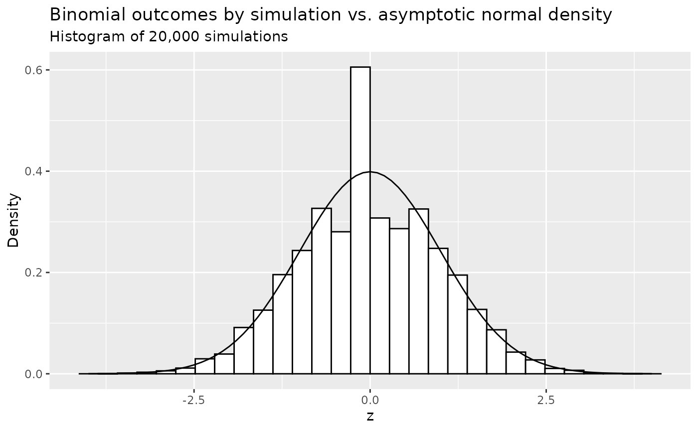
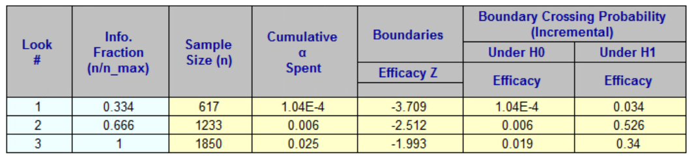

# Group sequential design for binary outcomes

``` r
library(tibble)
library(dplyr)
library(knitr)
library(gsDesign)
library(gsDesign2)
library(gt)
```

## Overview

We consider group sequential design examining the risk difference
between two treatment groups for a binary outcome. There are several
issues to consider:

- The measure of treatment difference or natural parameter; we focus on
  risk difference.
- Incorporation of both null and alternate hypothesis variances.
- Superiority, non-inferiority and super-superiority designs.
- Stratified populations.
- Fixed and group sequential designs.

For single stratum designs, we focus on sample size or power using the
method of Farrington and Manning (1990) for a trial to test the
difference between two binomial event rates. The routine can be used for
a test of superiority, non-inferiority or super-superiority. For a
design that tests for superiority, the methods are consistent with those
of Fleiss, Tytun, and Ury (1980), but without the continuity correction.
Methods for sample size and power are the same as
[`gsDesign::nBinomial()`](https://keaven.github.io/gsDesign/reference/varBinomial.html)
when testing on the risk-difference scale for a single stratum. This is
also consistent with the **Hmisc** R package routines `bsamsize()` and
`bpower()` for superiority designs.

For trials with multiple strata, testing for a risk difference is often
done by weighting each stratum according to the inverse of the variance
(Mantel and Haenszel (1959)). Since risk differences may also be assumed
to be different for different strata, we will also explore weighting by
strata sample sizes as in Mehrotra and Railkar (2000).

The focus here is for sample sizes that are large enough for asymptotic
theory to work well without continuity corrections. The concepts are
incorporated in the following functions intended for use in fixed and
group sequential designs:

- [`gs_info_rd()`](https://merck.github.io/gsDesign2/reference/gs_info_rd.md)
  to support asymptotic variance and statistical information
  calculation.
- [`gs_power_rd()`](https://merck.github.io/gsDesign2/reference/gs_power_rd.md)
  to support power calculations.
- [`gs_design_rd()`](https://merck.github.io/gsDesign2/reference/gs_design_rd.md)
  to support sample size calculations.

Simulation is used throughout to check the examples presented.

## Notation

- \\K\\: total number of analyses (including the final analysis) in the
  group sequential design. For fixed design, \\K= 1\\.

- \\S\\: total number of strata. If the population is un-stratified
  population, then \\S=1\\.

- \\w\_{s,k}\\: the **underlying** weight assigned for the \\s\\-th
  strata at the \\k\\-th analysis. WHY SWITCH ORDER OF s, k FROM w?

- \\\widehat w\_{s,k}\\: the **estimated** weight assigned for the
  \\s\\-th strata at the \\k\\-th analysis.

- \\N\_{C,k,s}, N\_{E,k,s}\\: the **planned** sample size in the
  control/treatment group at the \\k\\-th analysis of the \\s\\-th
  strata.

- \\\widehat N\_{C,k,s}, \widehat N\_{E,k,s}\\: the **observed** sample
  size in the control/treatment group at the \\k\\-th analysis of the
  \\s\\-th strata.

- \\r\\: **planned** randomization ratio, i.e., \\ r = N\_{E,k,s} /
  N\_{C,k,s} \\\\ \forall k = 1, \ldots, K \\\\ \text{and} \\\\ s = 1,
  \ldots, S. \\

- \\p\_{C,s}, p\_{E,s}\\: the **planned** rate of the control/treatment
  arm, i.e., the independent observations in the control/treatment group
  with a binary outcome that is observed with probability \\p\_{C,s}\\
  at any \\k\\-th analysis of the \\s\\-th strata.

- \\d\\: an indicator whether is an outcome is failure (bad outcome) or
  response (good outcome), i.e., \\ d = \left\\ \begin{array}{lll} -1 &
  \text{if } p\_{C,s} \< p\_{E,s} & \text{the control arm is better}\\ 1
  & \text{if } p\_{C,s} \> p\_{E,s} & \text{the treatment arm is
  better}\\ \end{array} \right. \\ Here we assume if \\\exists s^\* \in
  \\1, \ldots, S\\\\, s.t., \\p\_{C,s^\*} \< p\_{E,s^\*}\\, then
  \\p\_{C,s} \< p\_{E,s}, \forall s \in \\1, \ldots, S\\\\, and vice
  versa.

- \\X\_{C,k,s}, X\_{E,k,s}\\: random variables indicating the number of
  subjects failed in control/treatment arm, i.e., \\X\_{C,k,s} \sim
  \text{Binomial}(N\_{C,k,s}, p\_{C,k,s})\\, \\X\_{E,k,s} \sim
  \text{Binomial}(N\_{E,k,s}, p\_{E,k,s})\\ at the \\k\\-th analysis of
  the \\s\\-th strata.

- \\x\_{C,k,s}, x\_{E,k,s}\\: the observed outcome of \\X\_{C, k, s},
  X\_{E, k, s}\\ at the \\k\\-th analysis of the \\s\\-th strata,
  respectively.

- \\\widehat p\_{C,k,s}, \widehat p\_{E,k,s}\\: observed rates of the
  control/treatment group at the \\k\\-th analysis of the \\s\\-th
  strata, i.e., \\ \widehat p\_{C,k,s} = x\_{C,k,s} / \widehat
  N\_{C,k,s}.\\ \widehat p\_{E,k,s} = x\_{E,k,s} / \widehat N\_{E,k,s}.
  \\

- \\\delta\_{s}^{null}\\: the **planned** risk difference under \\H_0\\
  at any \\k\\-th analysis of the \\s\\-th strata.

- \\\delta\_{s}\\: the **planned** risk difference under \\H_1\\ at any
  \\k\\-th analysis of the \\s\\-th strata is denoted by \\ \delta\_{s}
  = \|p\_{C,s} - p\_{E,s}\|. \\

- \\\hat\delta\_{s}\\: estimation of risk difference with \\
  \widehat\theta\_{k,s} = \|\widehat p\_{C,k,s} - \widehat p\_{E,k,s}\|
  \\ We have \\E(\widehat\theta\_{k,s}) = \theta\_{s}, \\\forall k = 1,
  \ldots, K\\.

## Testing

The test statistics at the \\k\\-th analysis is \\ Z\_{k} = \frac{
\sum\_{s=1}^S \widehat w\_{s,k} \\ \|\widehat \delta\_{k,s} -
\delta\_{s}^{null} \| }{ \sqrt{\sum\_{s=1}^S \widehat w\_{s,k}^2
\widehat\sigma\_{H_0,k,s}^2} } \\ where \\\widehat\sigma^2\_{k,s} =
\widehat{\text{Var}}(\widehat p_C -\widehat p_E)\\. And the value of
\\\widehat\sigma^2\_{k,s}\\ depends on the hypothesis and design, i.e.,
whether it is a superiority design, or non-inferiority design, or
super-superiority design. We will discuss \\\widehat\sigma^2\_{k,s}\\ in
the following 3 subsections.

### Superiority Design

A superiority design (\\\delta\_{s}^{null} = 0\\) is to show that
experimental group is superior to the control group above some
thresholds. Its hypothesis is \\ H_0: \delta\_{s} = 0 \text{ vs. } H_1:
\delta\_{s} \> 0, \\ \forall k = 1, \ldots, K, s = 1, \ldots, S \\

- **Variance per strata per analysis:**

  - Under the null hypothesis, we have \\ \begin{array}{ll}
    \sigma^2\_{H_0,k,s} & = \text{Var}(p_C - p_E \| H_0) =
    p\_{k,s}^{pool} \left(1 - p^{pool}\_{k,s} \right)
    \left(\frac{1}{N\_{C,k,s}} + \frac{1}{N\_{E,k,s}} \right), \\
    \widehat\sigma^2\_{H_0,k,s} & = \widehat{\text{Var}}(\hat p_C - \hat
    p_E \| H_0) = \widehat p\_{k,s}^{pool} \left(1 - \widehat
    p^{pool}\_{k,s} \right) \left(\frac{1}{N\_{C,k,s}} +
    \frac{1}{N\_{E,k,s}} \right), \end{array} \\ where \\p\_{k,s}^{pool}
    = (p\_{C,s} N\_{C,k,s} + p\_{E,s} N\_{E,k,s}) / (N\_{C,k,s} +
    N\_{E,k,s})\\ and \\\widehat p\_{k,s}^{pool} = (x\_{C,k,s} +
    x\_{E,k,s}) / (\widehat N\_{C,k,s} + \widehat N\_{E,k,s}).\\

  - Under the alternative hypothesis, we have \\ \begin{array}{ll}
    \sigma\_{H_1,k,s}^2 & = \text{Var}(p_C - p_E \| H_1) =
    \frac{p\_{C,s} (1- p\_{C,s})}{N\_{C,k,s}} + \frac{p\_{E,s} (1 -
    p\_{E,s})}{N\_{E,k,s}} \\ \widehat\sigma\_{H_1,k,s}^2 & =
    \widehat{\text{Var}}(\hat p_C - \hat p_E \| H_1) = \frac{\widehat
    p\_{C,k,s} (1- \widehat p\_{C,k,s})}{N\_{C,k,s}} + \frac{\widehat
    p\_{E,k,s} (1 - \widehat p\_{E,k,s})}{N\_{E,k,s}} \end{array} \\
    where \\\widehat p\_{C,k,s} = x\_{C,k,s} / N\_{C,k,s} \text{ and }
    \widehat p\_{E,k,s} = x\_{E,k,s} / N\_{E,k,s}\\. Testing will be
    one-sided at level \\\alpha \in (0, 1)\\ and the null hypothesis
    will be rejected if \\Z_k\\ cross the upper boundary. And the upper
    boundary can be either fixed or derived from spending functions.

- **Standardized treatment effect per analysis:**

  - Under the null hypothesis, we have \\ \theta\_{H_0,k} = 0 \\
    \widehat \theta\_{H_0,k} = 0 \\

  - Under the alternative hypothesis, we have \\ \begin{array}{ll}
    \theta\_{H_1,k} & = \frac{\sum\_{s=1}^S w\_{k,s} (p\_{C,s} -
    p\_{E,s})}{\sqrt{\sum\_{s=1}^S w\_{k,s}^2 \sigma\_{H_1, k,s}^2}}\\
    \widehat\theta\_{H_1,k} & = \frac{ \sum\_{s=1}^S \widehat w\_{k,s}
    (\widehat p_C - \widehat p_E) }{ \sqrt{\sum\_{s=1}^S \widehat
    w\_{k,s}^2 \widehat\sigma\_{H_1, k,s}^2} }. \end{array} \\

- **Standardized information per analysis:**

  Lachin (2009) or Lachin (1981) provide fixed sample size calculations
  based on the values \\\psi_0\\ under the null hypothesis and
  \\\psi_1\\ under the alternate hypothesis. Here we propose using the
  same variance calculations to compute statistical information for a
  group sequential design and apply the formulation for power and sample
  size calculation in the vignette *Computing Bounds Under Non-Constant
  Treatment Effect*.

  - Under the null hypothesis, we have \\ \begin{array}{ll} \mathcal
    I\_{H0,k} & = \left\[ \sum\_{s=1}^S w\_{k,s}^2 \frac{p\_{k,s}^{pool}
    (1 - p\_{k,s}^{pool})}{N\_{C, k, s}} + w\_{k,s}^2
    \frac{p\_{k,s}^{pool} (1 - p\_{k,s}^{pool})}{N\_{E, k, s}}
    \right\]^{-1} \\ \widehat{\mathcal I}\_{H0,k} & = \left\[
    \sum\_{s=1}^S \widehat w\_{k,s}^2 \frac{\widehat p\_{k,s}^{pool}
    (1 - \widehat p\_{k,s}^{pool})}{\widehat N\_{C,k,s}} + \widehat
    w\_{k,s}^2 \frac{\widehat p\_{k,s}^{pool} (1 - \widehat
    p\_{k,s}^{pool})}{\widehat N\_{C,k,s}} \right\]^{-1} \end{array} \\

  - Under the alternative hypothesis, we have \\ \begin{array}{ll}
    \mathcal I\_{H1,k} = \left\[ \sum\_{s=1}^S w\_{k,s}^2
    \frac{p\_{C,k,s} (1 - p\_{C,k,s})}{N\_{C,k,s}} + \sum\_{s=1}^S
    w\_{k,s}^2 \frac{p\_{E,k,s} (1 - p\_{E,k,s})}{N\_{E,k,s}}
    \right\]^{-1}\\ \widehat{\mathcal I}\_{H1,k} = \left\[ \sum\_{s=1}^S
    \widehat w\_{k,s}^2 \frac{\widehat p\_{C,k,s} (1 - \widehat
    p\_{C,k,s})}{\widehat N\_{C,k,s}} + \sum\_{s=1}^S \widehat
    w\_{k,s}^2 \frac{\widehat p\_{E,k,s} (1 - \widehat
    p\_{E,k,s})}{\widehat N\_{E,k,s}} \right\]^{-1} \end{array} \\

### Super-Superiority Design

The hypothesis of the super-superiority design is

\\ H_0: \delta\_{k,s} = \delta\_{k,s}^{null} \\\\ vs. \\\\ H_1: \delta
\> \delta\_{k,s}^{null} \text{ with } \delta\_{k,s}^{null} \> 0. \\ Here
\\\theta\_{k,s_1}^{null} = \theta\_{k,s_2}^{null}\\ or
\\\theta\_{k,s_1}^{null} \neq \theta\_{k,s_2}^{null}\\ for \\s_1 \neq
s_2\\.

Under the null hypothesis \\\theta\_{0,k,s} \neq 0\\, the estimation of
rates \\\widehat p\_{C0,k,s}, \widehat p\_{E0,k,s}\\ satisfy \\ \left\\
\begin{array}{l} \widehat p\_{C0,k,s} = \widehat p\_{E0,k,s} + d\_{k,s}
\times \delta\_{k,s}^{null} \\ \widehat p\_{C0,k,s} + r\widehat
p\_{E0,k,s} = \widehat p\_{C,k,s} + r\widehat p\_{E,k,s} . \end{array}
\right. \\ Solving these 2 equations with 2 unknowns yields \\ \left\\
\begin{array}{l} \widehat p\_{E0,k,s} & = (\widehat p\_{C,k,s} + r
\widehat p\_{E,k,s} - d\_{k,s} \delta\_{k,s}^{null}) / (r + 1)\\
\widehat p\_{C0,k,s} & = \widehat p\_{E0,k,s} + d\_{k,s}
\delta\_{k,s}^{null}. \end{array} \right. \\

- **Variance per strata per analysis:**

  - Under \\H_0\\, we have

\\ \hat\sigma^2\_{H_0,k,s} = \frac{\widehat p\_{C0,k,s}(1- \widehat
p\_{C0,k,s})}{N\_{C,k,s}} + \frac{ \widehat p\_{E0,k,s} (1 - \widehat
p\_{E0,k,s})}{N\_{E,k,s}}. \\

- Under \\H_1\\, we have

\\ \widehat\sigma\_{H_1,k,s}^2 = \frac{\widehat p\_{C,k,s} (1- \widehat
p\_{C,k,s})}{N\_{C,k,s}} + \frac{\widehat p\_{E,k,s} (1 - \widehat
p\_{E,k,s})}{N\_{E,k,s}}. \\

- **Standardized treatment effect per analysis:**

  - Under the null hypothesis, we have

\\ \widehat \theta\_{H_0,k} = \frac{ \sum\_{s=1}^S w\_{k,s}
\delta\_{s,k}^{null} }{ \sqrt{\sum\_{s=1}^S w\_{k,s}^2 \widehat
\sigma\_{H_0,k,s}}^2 }. \\

- Under the alternative hypothesis, we have

\\ \widehat \theta\_{H_1} = \frac{ \sum\_{s=1}^S w\_{k,s} d\_{k,s}
\times (\widehat p\_{C,k,s} - \widehat p\_{E,k,s}) }{
\sqrt{\sum\_{s=1}^S w\_{k,s}^2 \widehat \sigma\_{H_1,k,s}^2} }. \\

- **Standardized information per analysis:**

  - Under the null hypothesis, we have

\\ \widehat{\mathcal I}\_{H0,k} = \left\[ \sum\_{s=1}^S w\_{k,s}^2
\frac{\bar p\_{C0,s} (1 - \bar p\_{C0,s})}{N\_{C,s}} +
w\_{k,s}^2\frac{\bar p\_{E0,s} (1 - \bar p\_{E0,s})}{N\_{E,s}}
\right\]^{-1}. \\

- Under the alternative hypothesis, we have

\\ \widehat{\mathcal I}\_{H1,k} = \left\[ \sum\_{s=1}^S \left(
w\_{k,s}^2 \frac{\bar p\_{C,k,s} (1 - \bar p\_{C,k,s})}{N\_{C,k,s}} +
w\_{k,s}^2 \frac{\bar p\_{E,k,s} (1 - \bar p\_{E,k,s})}{N\_{E,k,s}}
\right) \right\]^{-1}. \\

### Non-inferiority Design

The non-inferiority Design means that, while the treatment group is
definitely not better than the control group, it is not unacceptably
worse. Its hypothesis is \\H_0: \delta\_{k,s} = \delta\_{k,s}^{null}
\\\\ vs. \\\\ H_1: \delta\_{k,s} \> \delta\_{k,s}^{null}\\ with
\\\delta\_{k,s}^{null} \<0\\. Its variance, standardized treatment
effect and statistical information is the same as that from
super-superiority design by setting \\\delta\_{k,s}^{null}\\ as negative
numbers.

## Weighting Options

As previously noted, we will consider weighting based on either
inverse-variance weights (Mantel and Haenszel (1959)) or strata sample
size weights (Mehrotra and Railkar (2000)).

- **Inverse-variance weights (INVAR):** \\ w\_{s,k} =
  \frac{1/\sigma^2\_{s,k}}{\sum\_{s=1}^S 1/\sigma^2\_{s,k}}. \\ \widehat
  w\_{s,k} = \frac{1/\widehat\sigma^2\_{s,k}}{\sum\_{s=1}^S
  1/\widehat\sigma^2\_{s,k}}. \\ where \\\widehat\sigma\_{s,k}^2 \in
  \\\widehat\sigma\_{H_0, k,s}^2, \widehat\sigma\_{H_1, k,s}^2 \\\\
  depending on the information scale `info_scale = ...` in
  [`gs_info_rd()`](https://merck.github.io/gsDesign2/reference/gs_info_rd.md),
  [`gs_power_rd()`](https://merck.github.io/gsDesign2/reference/gs_power_rd.md)
  and
  [`gs_design_rd()`](https://merck.github.io/gsDesign2/reference/gs_design_rd.md).

- **Sample-Size Weights (SS):** \\ w\_{s,k} = \frac{ (N\_{C, s, k} \\
  N\_{E, s, k}) / (N\_{C, s, k} + N\_{E, s, k}) }{ \sum\_{s=1}^S (N\_{C,
  s, k} \\ N\_{E, s, k}) / (N\_{C, s, k} + N\_{E, s, k}) },\\ \widehat
  w\_{s,k} = \frac{ (\widehat N\_{C, s, k} \\ \widehat N\_{E, s, k}) /
  (\widehat N\_{C, s, k} + \widehat N\_{E, s, k}) }{ \sum\_{s=1}^S
  (\widehat N\_{C, s, k} \\ \widehat N\_{E, s, k}) / (\widehat N\_{C, s,
  k} + \widehat N\_{E, s, k}) }, \\ where \\N\_{C,s,k}, N\_{E,s,k}\\ are
  the planned sample size of the \\s\\-th strata and \\k\\-th analysis
  of the control group and experimental group, respectively. And
  \\\widehat N\_{C,s,k}, \widehat N\_{E,s,k}\\ are the observed sample
  size of the \\s\\-th strata and \\k\\-th analysis of the control group
  and experimental group, respectively.

## Simulations

We do a quick 20,000 simulations and compare the density histogram of
outcomes to the standard normal density. Assume \\r=1, d = 1,
p_C=p_E=0.125, N=200\\. We then compute \\\sigma\\ as 0.047. Even for
this *not huge* sample size the normal density fits quite well other
than some flatness in the middle.

``` r
# Hypothesized failure rate
p <- .125
#  Other parameters
set.seed(123)
r <- 1
n <- 200
n_c <- n / (r + 1)
n_e <- r * n / (r + 1)
library(ggplot2)
# Generate random counts of events for each treatment
x_c <- rbinom(n = 20000, size = n_c, prob = p)
x_e <- rbinom(n = 20000, size = n_e, prob = p)
# Treatment difference estimate
thetahat <- x_c / n_c - x_e / n_e
# Standard error under H0
pbar <- (x_c + x_e) / n
se0 <- sqrt(pbar * (1 - pbar) * (1 / n_c + 1 / n_e))
# Z to test H0
z <- thetahat / se0
x <- seq(-4, 4, .1)
se0a <- sqrt(p * (1 - p) * (1 / n_c + 1 / n_e))
y <- data.frame(z = x, Density = dnorm(x = x, mean = 0, sd = 1))

ggplot() +
  geom_histogram(data = data.frame(z), aes(x = z, y = ..density..), color = 1, fill = "white") +
  geom_line(data = y, aes(x = z, y = Density), linetype = 1) +
  ylab("Density") +
  ggtitle("Binomial outcomes by simulation vs. asymptotic normal density",
    subtitle = "Histogram of 20,000 simulations"
  )
#> Warning: The dot-dot notation (`..density..`) was deprecated in ggplot2 3.4.0.
#> ℹ Please use `after_stat(density)` instead.
#> This warning is displayed once per session.
#> Call `lifecycle::last_lifecycle_warnings()` to see where this warning was
#> generated.
```



## Examples

### Unstratified Fixed Design

The example discussed in this section is an unstratified fixed design
with equal sized groups to detect a 30% reduction in mortality
associated with congestive heart failure, where the 1-year mortality in
the control group is assumed to be no greater than 0.4. So \\p_C=0.4,
p_E = .28\\. Under the null hypothesis, we assume \\p_C=p_E =0.34\\. We
desire 90% power for a two-sided test for two proportions at \\\alpha =
0.05\\. And we would like to calculate the sample size to achieve the
90% power.

#### `gsDesign2`

First, we set the parameters.

``` r
p_c <- .28
p_e <- .4
p_pool <- (p_c + p_e) / 2

n <- 1
ratio <- 1
n_c <- n / (1 + ratio)
n_e <- n_c * ratio
```

Then we calculate the variance under \\H_0\\ and \\H_1\\. Their
mathematical formulation are shown as follows. \\ \begin{array}{ll}
\sigma^2\_{H_0} = p^{pool} \left(1 - p^{pool} \right)
\left(\frac{1}{N_C} + \frac{1}{N\_{E}} \right) = p^{pool} \left(1 -
p^{pool} \right) \left(\frac{1}{N \xi_C} + \frac{1}{N \xi_E} \right)
\overset{r=1}{=} p^{pool} \left(1 - p^{pool} \right) \frac{4}{N} \\
\sigma^2\_{H_1} = \frac{p_C \left(1 - p_C \right)}{N_C} + \frac{p_E
\left(1 - p_E \right)}{N_E} = \frac{p_C \left(1 - p_C \right)}{N
\xi_C} + \frac{p_E \left(1 - p_E \right)}{N \xi_E} \overset{r=1}{=}
\left\[ p_C \left(1 - p_C \right) + p_E \left(1 - p_E \right) \right\]
\frac{2}{N} \end{array} \\ And their calculation results are

``` r
sigma_h0 <- sqrt(p_pool * (1 - p_pool) * 4 / n)
sigma_h1 <- sqrt((p_c * (1 - p_c) + p_e * (1 - p_e)) * 2 / n)

info_h0 <- 1 / (sigma_h0^2)
info_h1 <- 1 / (sigma_h1^2)
```

Next, we calculate the standardized treatment effect under \\H_0\\ and
\\H_1\\, whose mathematical formulation are \\ \begin{array}{ll}
\theta\_{H_0} = 0; \\ \theta\_{H_1} = \frac{\|p_c -
p_e\|}{\sigma\_{H_1}} \end{array}. \\

And their calculation results are

``` r
theta_h0 <- 0
theta_h1 <- abs(p_c - p_e) / sigma_h1

tibble::tribble(
  ~n_c, ~n_e, ~p_c, ~p_e, ~theta_h1, ~theta_h0, ~info_h1, ~info_h0,
  n_c, n_e, p_c, p_e, theta_h1, theta_h0, info_h1, info_h0,
) |> gt::gt()
```

| n_c | n_e | p_c  | p_e | theta_h1  | theta_h0 | info_h1  | info_h0  |
|-----|-----|------|-----|-----------|----------|----------|----------|
| 0.5 | 0.5 | 0.28 | 0.4 | 0.1276885 | 0        | 1.132246 | 1.114082 |

The above logic is implemented in the function
[`gs_info_rd()`](https://merck.github.io/gsDesign2/reference/gs_info_rd.md).

``` r
x <- gs_info_rd(
  p_c = tibble::tibble(stratum = "All", rate = .28),
  p_e = tibble::tibble(stratum = "All", rate = .4),
  n = tibble::tibble(stratum = "All", n = 1, analysis = 1),
  rd0 = 0,
  ratio = 1,
  weight = "unstratified"
)

x |>
  gt::gt() |>
  gt::fmt_number(columns = 5:8, decimals = 6)
```

| analysis | n   | rd   | rd0 | theta1   | theta0   | info1    | info0    |
|----------|-----|------|-----|----------|----------|----------|----------|
| 1        | 1   | 0.12 | 0   | 0.120000 | 0.000000 | 1.132246 | 1.114082 |

By plugging the `theta` and `info` above into
[`gs_design_npe()`](https://merck.github.io/gsDesign2/reference/gs_power_design_npe.md),
one can calculate the sample size to achieve the 90% power.

``` r
# under info_scale = "h0_info"
y_0 <- gs_design_npe(
  theta = .4 - .28,
  info = x$info0,
  info0 = x$info0,
  info_scale = "h0_info",
  alpha = .025,
  beta = .1,
  upper = gs_b,
  lower = gs_b,
  upar = list(par = -qnorm(.025)),
  lpar = list(par = -Inf)
)

# under info_scale = "h1_info"
y_1 <- gs_design_npe(
  theta = .4 - .28,
  info = x$info1,
  info0 = x$info0,
  info_scale = "h1_info",
  alpha = .025,
  beta = .1,
  upper = gs_b,
  lower = gs_b,
  upar = list(par = -qnorm(.025)),
  lpar = list(par = -Inf)
)

# under info_scale = "h0_h1_info"
y_2 <- gs_design_npe(
  theta = .4 - .28,
  info = x$info1,
  info0 = x$info0,
  info_scale = "h0_h1_info",
  alpha = .025,
  beta = .1,
  upper = gs_b,
  lower = gs_b,
  upar = list(par = -qnorm(.025)),
  lpar = list(par = -Inf)
)

tibble(
  `info_scale = "h0_info"` = y_0$info0[1] / x$info0[1],
  `info_scale = "h1_info"` = y_1$info1[1] / x$info1[1],
  `info_scale = "h0_h1_info"` = y_2$info[1] / x$info1[1]
) |>
  gt::gt() |>
  gt::tab_header(title = "The sample size calculated by gsDesign2 under 3 info_scale")
```

| The sample size calculated by gsDesign2 under 3 info_scale |                        |                           |
|------------------------------------------------------------|------------------------|---------------------------|
| info_scale = "h0_info"                                     | info_scale = "h1_info" | info_scale = "h0_h1_info" |
| 654.9627                                                   | 644.4553               | 650.7984                  |

The above logic is implement in
[`gs_design_rd()`](https://merck.github.io/gsDesign2/reference/gs_design_rd.md)
to calculate the sample size given fixed power in one-step.

``` r
z_info_scale_0 <- gs_design_rd(
  p_c = tibble::tibble(stratum = "All", rate = .28),
  p_e = tibble::tibble(stratum = "All", rate = .4),
  rd0 = 0,
  alpha = 0.025,
  beta = 0.1,
  ratio = 1,
  weight = "unstratified",
  upper = gs_b,
  lower = gs_b,
  upar = -qnorm(.025),
  lpar = -Inf,
  info_scale = "h0_info"
)

z_info_scale_1 <- gs_design_rd(
  p_c = tibble::tibble(stratum = "All", rate = .28),
  p_e = tibble::tibble(stratum = "All", rate = .4),
  rd0 = 0,
  alpha = 0.025,
  beta = 0.1,
  ratio = 1,
  weight = "unstratified",
  upper = gs_b,
  lower = gs_b,
  upar = -qnorm(.025),
  lpar = -Inf,
  info_scale = "h1_info"
)

z_info_scale_2 <- gs_design_rd(
  p_c = tibble::tibble(stratum = "All", rate = .28),
  p_e = tibble::tibble(stratum = "All", rate = .4),
  rd0 = 0,
  alpha = 0.025,
  beta = 0.1,
  ratio = 1,
  weight = "unstratified",
  upper = gs_b,
  lower = gs_b,
  upar = -qnorm(.025),
  lpar = -Inf,
  info_scale = "h0_h1_info"
)
```

#### `gsDesign`

#### EAST


Sample size calculated by EAST

#### Summary

``` r
tibble::tibble(
  gsDesign2_info_scale_0 = z_info_scale_0$analysis$n,
  gsDesign2_info_scale_1 = z_info_scale_1$analysis$n,
  gsDesign2_info_scale_2 = z_info_scale_2$analysis$n,
  gsDesign = x_gsdesign$n,
  EAST_unpool = 645,
  EAST_pool = 651
) |>
  gt::gt() |>
  gt::tab_spanner(
    label = "gsDesign2",
    columns = c(gsDesign2_info_scale_0, gsDesign2_info_scale_1, gsDesign2_info_scale_2)
  ) |>
  gt::tab_spanner(
    label = "EAST",
    columns = c(EAST_unpool, EAST_pool)
  ) |>
  cols_label(
    gsDesign2_info_scale_0 = "info_scale = \"h0_info\"",
    gsDesign2_info_scale_1 = "info_scale = \"h1_info\"",
    gsDesign2_info_scale_2 = "info_scale = \"h0_h1_info\"",
    EAST_unpool = "un-pooled",
    EAST_pool = "pooled"
  )
```

[TABLE]

### Unstratified Group Sequential Design

The example discussed in this section is an unstratified group
sequential design with equal sized groups to detect \\p_C = 0.15, p_E =
.1\\.  
Under the null hypothesis, we assume \\p_C = p_E = 0.125\\. We desire
90% power for a two-sided test for two proportions at \\\alpha = 0.05\\.
And we would like to calculate the sample size to achieve the 90% power.

#### `gsDesign2`

To calculate the sample size, one can use
[`gs_design_rd()`](https://merck.github.io/gsDesign2/reference/gs_design_rd.md).
The logic of
[`gs_design_rd()`](https://merck.github.io/gsDesign2/reference/gs_design_rd.md)
is to calculate the sample size of fixed design first.

``` r
x_gs <- gs_info_rd(
  p_c = tibble::tibble(stratum = "All", rate = .15),
  p_e = tibble::tibble(stratum = "All", rate = .1),
  n = tibble::tibble(stratum = "All", n = 1:3 / 3, analysis = 1:3),
  rd0 = 0,
  ratio = 1,
  weight = "unstratified"
)

x_gs |>
  gt::gt() |>
  gt::tab_header(title = "The statistical information of the group sequential design")
```

| The statistical information of the group sequential design |           |      |     |        |        |           |           |
|------------------------------------------------------------|-----------|------|-----|--------|--------|-----------|-----------|
| analysis                                                   | n         | rd   | rd0 | theta1 | theta0 | info1     | info0     |
| 1                                                          | 0.3333333 | 0.05 | 0   | 0.05   | 0      | 0.7662835 | 0.7619048 |
| 2                                                          | 0.6666667 | 0.05 | 0   | 0.05   | 0      | 1.5325670 | 1.5238095 |
| 3                                                          | 1.0000000 | 0.05 | 0   | 0.05   | 0      | 2.2988506 | 2.2857143 |

``` r
y_gs0 <- gs_design_npe(
  theta = .05,
  info = x_gs$info0,
  info0 = x_gs$info0,
  info_scale = "h0_info",
  alpha = .025, beta = .1, binding = FALSE,
  upper = gs_b,
  lower = gs_b,
  upar = gsDesign(k = 3, test.type = 1, sfu = sfLDOF, sfupar = NULL)$upper$bound,
  lpar = rep(-Inf, 3),
  test_lower = FALSE
)

y_gs1 <- gs_design_npe(
  theta = .05,
  info = x_gs$info1,
  info0 = x_gs$info1,
  info_scale = "h0_h1_info",
  alpha = .025, beta = .1, binding = FALSE,
  upper = gs_b,
  lower = gs_b,
  upar = gsDesign(k = 3, test.type = 1, sfu = sfLDOF, sfupar = NULL)$upper$bound,
  lpar = rep(-Inf, 3),
  test_lower = FALSE
)

y_gs2 <- gs_design_npe(
  theta = .05,
  info = x_gs$info1,
  info0 = x_gs$info0,
  info_scale = "h0_h1_info",
  alpha = .025, beta = .1, binding = FALSE,
  upper = gs_b,
  lower = gs_b,
  upar = gsDesign(k = 3, test.type = 1, sfu = sfLDOF, sfupar = NULL)$upper$bound,
  lpar = rep(-Inf, 3),
  test_lower = FALSE
)

tibble(
  `info_scale = "h0_info"` = y_gs0$info0 / x_gs$info0[3],
  `info_scale = "h1_info"` = y_gs1$info1 / x_gs$info1[3],
  `info_scale = "h0_h1_info"` = y_gs2$info / x_gs$info1[3]
) |>
  gt::gt() |>
  gt::tab_header(
    title = "The sample size calculated by `gsDesign2` under 3 info_scale",
    subtitle = "under group sequential design"
  )
```

| The sample size calculated by \`gsDesign2\` under 3 info_scale |                        |                           |
|----------------------------------------------------------------|------------------------|---------------------------|
| under group sequential design                                  |                        |                           |
| info_scale = "h0_info"                                         | info_scale = "h1_info" | info_scale = "h0_h1_info" |
| 620.1976                                                       | 616.6536               | 618.3786                  |
| 620.1976                                                       | 616.6536               | 618.3786                  |
| 1240.3952                                                      | 1233.3072              | 1236.7572                 |
| 1240.3952                                                      | 1233.3072              | 1236.7572                 |
| 1860.5927                                                      | 1849.9608              | 1855.1358                 |
| 1860.5927                                                      | 1849.9608              | 1855.1358                 |

The above logic is implemented in
[`gs_design_rd()`](https://merck.github.io/gsDesign2/reference/gs_design_rd.md).

``` r
x_gsdesign2_info_scale_0 <- gs_design_rd(
  p_c = tibble::tibble(stratum = "All", rate = .15),
  p_e = tibble::tibble(stratum = "All", rate = .1),
  info_frac = 1:3 / 3,
  rd0 = 0,
  alpha = .025,
  beta = .1,
  ratio = 1,
  weight = "unstratified",
  upper = gs_b,
  lower = gs_b,
  upar = gsDesign(k = 3, test.type = 1, sfu = sfLDOF, sfupar = NULL)$upper$bound,
  lpar = rep(-Inf, 3),
  test_lower = FALSE,
  info_scale = "h0_info"
)

x_gsdesign2_info_scale_1 <- gs_design_rd(
  p_c = tibble::tibble(stratum = "All", rate = .15),
  p_e = tibble::tibble(stratum = "All", rate = .1),
  info_frac = 1:3 / 3,
  rd0 = 0,
  alpha = .025,
  beta = .1,
  ratio = 1,
  weight = "unstratified",
  upper = gs_b,
  lower = gs_b,
  upar = gsDesign(k = 3, test.type = 1, sfu = sfLDOF, sfupar = NULL)$upper$bound,
  lpar = rep(-Inf, 3),
  test_lower = FALSE,
  info_scale = "h1_info"
)

x_gsdesign2_info_scale_2 <- gs_design_rd(
  p_c = tibble::tibble(stratum = "All", rate = .15),
  p_e = tibble::tibble(stratum = "All", rate = .1),
  info_frac = 1:3 / 3,
  rd0 = 0,
  alpha = .025,
  beta = .1,
  ratio = 1,
  weight = "unstratified",
  upper = gs_b,
  lower = gs_b,
  upar = gsDesign(k = 3, test.type = 1, sfu = sfLDOF, sfupar = NULL)$upper$bound,
  lpar = rep(-Inf, 3),
  test_lower = FALSE,
  info_scale = "h0_h1_info"
)
```

#### `gsDesign`

``` r
n_fix <- nBinomial(
  # Control event rate
  p1 = .15,
  # Experimental event rate
  p2 = .1,
  # Null hypothesis event rate difference (control - experimental)
  delta0 = 0,
  # 1-sided Type I error
  alpha = .025,
  # Type II error (1 - Power)
  beta = .1,
  # Experimental/Control randomization ratio
  ratio = 1
)

cat("The sample size of fixed-design calculated by `gsDesign` is ", n_fix, ".\n")
#> The sample size of fixed-design calculated by `gsDesign` is  1834.641 .

x_gsdesign <- gsDesign(
  k = 3,
  test.type = 1,
  # 1-sided Type I error
  alpha = .025,
  # Type II error (1 - Power)
  beta = .1,
  # If test.type = 5 or 6, this sets maximum spending for futility
  # under the null hypothesis. Otherwise, this is ignored.
  astar = 0,
  timing = 1:3 / 3,
  sfu = sfLDOF,
  sfupar = NULL,
  sfl = sfLDOF,
  sflpar = NULL,
  # Difference in event rates under alternate hypothesis
  delta = 0,
  # Difference in rates under H1
  delta1 = .05,
  # Difference in rates under H0
  delta0 = 0,
  endpoint = "Binomial",
  # Fixed design sample size from nBinomial above
  n.fix = n_fix
)

cat("The sample size calcuated by `gsDesign` is ", x_gsdesign$n.I, ".\n")
#> The sample size calcuated by `gsDesign` is  618.7954 1237.591 1856.386 .

gsBoundSummary(x_gsdesign, digits = 4, ddigits = 2, tdigits = 1)
#>   Analysis                  Value Efficacy
#>  IA 1: 33%                      Z   3.7103
#>     N: 619            p (1-sided)   0.0001
#>                   ~delta at bound   0.0985
#>               P(Cross) if delta=0   0.0001
#>            P(Cross) if delta=0.05   0.0338
#>  IA 2: 67%                      Z   2.5114
#>    N: 1238            p (1-sided)   0.0060
#>                   ~delta at bound   0.0472
#>               P(Cross) if delta=0   0.0060
#>            P(Cross) if delta=0.05   0.5603
#>      Final                      Z   1.9930
#>    N: 1857            p (1-sided)   0.0231
#>                   ~delta at bound   0.0306
#>               P(Cross) if delta=0   0.0250
#>            P(Cross) if delta=0.05   0.9000
```

#### EAST


Sample size calculated by EAST



Sample size calculated by EAST


Sample size calculated by EAST

#### Summary

``` r
tibble::tibble(
  gsDesign2_info_scale_0 = x_gsdesign2_info_scale_0$analysis$n,
  gsDesign2_info_scale_1 = x_gsdesign2_info_scale_1$analysis$n,
  gsDesign2_info_scale_2 = x_gsdesign2_info_scale_2$analysis$n,
  gsDesign = x_gsdesign$n.I,
  EAST_unpool = c(617, 1233, 1850),
  EAST_pool = c(619, 1238, 1857)
) |>
  gt::gt() |>
  gt::tab_spanner(
    label = "gsDesign2",
    columns = c(gsDesign2_info_scale_0, gsDesign2_info_scale_1, gsDesign2_info_scale_2)
  ) |>
  gt::tab_spanner(
    label = "EAST",
    columns = c(EAST_unpool, EAST_pool)
  ) |>
  cols_label(
    gsDesign2_info_scale_0 = "info_scale = \"h0_info\"",
    gsDesign2_info_scale_1 = "info_scale = \"h1_info\"",
    gsDesign2_info_scale_2 = "info_scale = \"h0_h1_info\"",
    EAST_unpool = "un-pooled",
    EAST_pool = "pooled"
  )
```

[TABLE]

### Stratified Group Sequential Design

In this example, we consider 3 strata in a group sequential design with
3 analyses.

``` r
ratio <- 1
prevalence_ratio <- c(4, 5, 6)
p_c_by_stratum <- c(.3, .37, .6)
p_e_by_stratum <- c(.25, .3, .5)

p_c <- tibble::tibble(stratum = c("S1", "S2", "S3"), rate = p_c_by_stratum)
p_e <- tibble::tibble(stratum = c("S1", "S2", "S3"), rate = p_e_by_stratum)
ratio_strata_c <- tibble::tibble(stratum = c("S1", "S2", "S3"), ratio = prevalence_ratio)
ratio_strata_e <- ratio_strata_c

n <- 1
info_frac <- 1:3 / 3
n_c <- n / (1 + ratio)
n_e <- ratio * n_c

x <- p_c |>
  rename(p_c = rate) |>
  left_join(p_e) |>
  rename(p_e = rate) |>
  mutate(p_pool = (p_c + p_e) / 2) |>
  mutate(
    xi_c = (
      ratio_strata_c |> mutate(prop = ratio / sum(ratio))
    )$prop
  ) |>
  mutate(
    xi_e = (
      ratio_strata_e |> mutate(prop = ratio / sum(ratio))
    )$prop
  ) |>
  mutate(n_c = n_c * xi_c, n_e = n_e * xi_e)

x |>
  gt::gt() |>
  gt::fmt_number(columns = 4:8, decimals = 4) |>
  gt::tab_footnote(
    footnote = "p_pool = (p_c * n_c + p_e * n_e) / (n_c * n_e).",
    locations = gt::cells_column_labels(columns = p_pool)
  ) |>
  gt::tab_footnote(
    footnote = "xi_c = sample size of a strata / sample size of the control arm.",
    locations = gt::cells_column_labels(columns = xi_c)
  ) |>
  gt::tab_footnote(
    footnote = "xi_e = sample size of a strata / sample size of the experimental arm.",
    locations = gt::cells_column_labels(columns = xi_e)
  ) |>
  gt::tab_footnote(
    footnote = "n_c = total sample size of the control arm.",
    locations = gt::cells_column_labels(columns = n_c)
  ) |>
  gt::tab_footnote(
    footnote = "n_e = total size of the experimental arm.",
    locations = gt::cells_column_labels(columns = n_e)
  ) |>
  gt::tab_header(title = "Stratified Example")
```

| Stratified Example                                                      |      |      |         |        |        |        |        |
|-------------------------------------------------------------------------|------|------|---------|--------|--------|--------|--------|
| stratum                                                                 | p_c  | p_e  | p_pool¹ | xi_c²  | xi_e³  | n_c⁴   | n_e⁵   |
| S1                                                                      | 0.30 | 0.25 | 0.2750  | 0.2667 | 0.2667 | 0.1333 | 0.1333 |
| S2                                                                      | 0.37 | 0.30 | 0.3350  | 0.3333 | 0.3333 | 0.1667 | 0.1667 |
| S3                                                                      | 0.60 | 0.50 | 0.5500  | 0.4000 | 0.4000 | 0.2000 | 0.2000 |
| ¹ p_pool = (p_c \* n_c + p_e \* n_e) / (n_c \* n_e).                    |      |      |         |        |        |        |        |
| ² xi_c = sample size of a strata / sample size of the control arm.      |      |      |         |        |        |        |        |
| ³ xi_e = sample size of a strata / sample size of the experimental arm. |      |      |         |        |        |        |        |
| ⁴ n_c = total sample size of the control arm.                           |      |      |         |        |        |        |        |
| ⁵ n_e = total size of the experimental arm.                             |      |      |         |        |        |        |        |

First, we calculate the variance \\ \left\\ \begin{array}{ll}
\sigma^2\_{H_0,k,s} & = p\_{k,s}^{pool} \left(1 - p^{pool}\_{k,s}
\right) \left(\frac{1}{N\_{C,k,s}} + \frac{1}{N\_{E,k,s}} \right) =
p\_{k,s}^{pool} \left(1 - p^{pool}\_{k,s} \right) \left(\frac{1}{
\frac{\xi_s}{1+r} N\_{k}} + \frac{1}{ \frac{r \xi_s}{1+r} N\_{k}}
\right) \\ \sigma\_{H_1,k,s}^2 & = \frac{p\_{C,s} (1-
p\_{C,s})}{N\_{C,k,s}} + \frac{p\_{E,s} (1 - p\_{E,s})}{N\_{E,k,s}} =
\frac{p\_{C,s} (1- p\_{C,s})}{\frac{\xi_s}{1+r} N\_{k}} + \frac{p\_{E,s}
(1 - p\_{E,s})}{\frac{r \xi_s}{1+r} N\_{k}} \end{array} \right. \\

``` r
x <- x |>
  union_all(x) |>
  union_all(x) |>
  mutate(Analysis = rep(1:3, each = 3)) |>
  left_join(tibble(Analysis = 1:3, IF = info_frac)) |>
  mutate(n_c = n_c * IF, n_e = n_e * IF) |>
  select(Analysis, stratum, p_c, p_pool, p_e, n_c, n_e, xi_c, xi_e) |>
  mutate(
    sigma_h0 = sqrt(p_pool * (1 - p_pool) * (1 / n_c + 1 / n_e)),
    sigma_h1 = sqrt(p_c * (1 - p_c) / n_c + p_e * (1 - p_e) / n_e)
  )

x |>
  gt() |>
  gt::fmt_number(6:11, decimals = 4) |>
  gt::tab_footnote(
    footnote = "sigma_h0 = the H0 sd per stratum per analysis.",
    locations = gt::cells_column_labels(columns = sigma_h0)
  ) |>
  gt::tab_footnote(
    footnote = "sigma_h1 = the H0 sd per stratum per analysis.",
    locations = gt::cells_column_labels(columns = sigma_h1)
  )
```

| Analysis                                         | stratum | p_c  | p_pool | p_e  | n_c    | n_e    | xi_c   | xi_e   | sigma_h0¹ | sigma_h1² |
|--------------------------------------------------|---------|------|--------|------|--------|--------|--------|--------|-----------|-----------|
| 1                                                | S1      | 0.30 | 0.275  | 0.25 | 0.0444 | 0.0444 | 0.2667 | 0.2667 | 2.9953    | 2.9906    |
| 1                                                | S2      | 0.37 | 0.335  | 0.30 | 0.0556 | 0.0556 | 0.3333 | 0.3333 | 2.8319    | 2.8241    |
| 1                                                | S3      | 0.60 | 0.550  | 0.50 | 0.0667 | 0.0667 | 0.4000 | 0.4000 | 2.7249    | 2.7111    |
| 2                                                | S1      | 0.30 | 0.275  | 0.25 | 0.0889 | 0.0889 | 0.2667 | 0.2667 | 2.1180    | 2.1147    |
| 2                                                | S2      | 0.37 | 0.335  | 0.30 | 0.1111 | 0.1111 | 0.3333 | 0.3333 | 2.0025    | 1.9970    |
| 2                                                | S3      | 0.60 | 0.550  | 0.50 | 0.1333 | 0.1333 | 0.4000 | 0.4000 | 1.9268    | 1.9170    |
| 3                                                | S1      | 0.30 | 0.275  | 0.25 | 0.1333 | 0.1333 | 0.2667 | 0.2667 | 1.7293    | 1.7266    |
| 3                                                | S2      | 0.37 | 0.335  | 0.30 | 0.1667 | 0.1667 | 0.3333 | 0.3333 | 1.6350    | 1.6305    |
| 3                                                | S3      | 0.60 | 0.550  | 0.50 | 0.2000 | 0.2000 | 0.4000 | 0.4000 | 1.5732    | 1.5652    |
| ¹ sigma_h0 = the H0 sd per stratum per analysis. |         |      |        |      |        |        |        |        |           |           |
| ² sigma_h1 = the H0 sd per stratum per analysis. |         |      |        |      |        |        |        |        |           |           |

Second, we calculate the weight by using inverse variance

\\ w\_{s,k} = \frac{1/\sigma^2\_{s,k}}{\sum\_{s=1}^S 1/\sigma^2\_{s,k}}.
\\

``` r
temp <- x |>
  group_by(Analysis) |>
  summarise(
    sum_invar_H0 = sum(1 / sigma_h0^2),
    sum_invar_H1 = sum(1 / sigma_h1^2),
    sum_ss = sum((n_c * n_e) / (n_c + n_e))
  )

x <- x |>
  left_join(temp) |>
  mutate(
    weight_invar_H0 = 1 / sigma_h0^2 / sum_invar_H0,
    weight_invar_H1 = 1 / sigma_h1^2 / sum_invar_H1,
    weight_ss = (n_c * n_e) / (n_c + n_e) / sum_ss
  ) |>
  select(-c(sum_invar_H0, sum_invar_H1, sum_ss))

x |>
  gt() |>
  fmt_number(6:14, decimals = 4) |>
  gt::tab_footnote(
    footnote = "weight_invar_H0 = the weight per stratum per analysis calculated by INVAR by using variance under H0.",
    locations = gt::cells_column_labels(columns = weight_invar_H0)
  ) |>
  gt::tab_footnote(
    footnote = "weight_invar_H1 = the weight per stratum per analysis calculated by INVAR by using variance under H1.",
    locations = gt::cells_column_labels(columns = weight_invar_H1)
  ) |>
  gt::tab_footnote(
    footnote = "weight_ss = the weight per stratum per analysis calculated by SS.",
    locations = gt::cells_column_labels(columns = weight_ss)
  )
```

| Analysis                                                                                                | stratum | p_c  | p_pool | p_e  | n_c    | n_e    | xi_c   | xi_e   | sigma_h0 | sigma_h1 | weight_invar_H0¹ | weight_invar_H1² | weight_ss³ |
|---------------------------------------------------------------------------------------------------------|---------|------|--------|------|--------|--------|--------|--------|----------|----------|------------------|------------------|------------|
| 1                                                                                                       | S1      | 0.30 | 0.275  | 0.25 | 0.0444 | 0.0444 | 0.2667 | 0.2667 | 2.9953   | 2.9906   | 0.3006           | 0.2996           | 0.2667     |
| 1                                                                                                       | S2      | 0.37 | 0.335  | 0.30 | 0.0556 | 0.0556 | 0.3333 | 0.3333 | 2.8319   | 2.8241   | 0.3362           | 0.3359           | 0.3333     |
| 1                                                                                                       | S3      | 0.60 | 0.550  | 0.50 | 0.0667 | 0.0667 | 0.4000 | 0.4000 | 2.7249   | 2.7111   | 0.3632           | 0.3645           | 0.4000     |
| 2                                                                                                       | S1      | 0.30 | 0.275  | 0.25 | 0.0889 | 0.0889 | 0.2667 | 0.2667 | 2.1180   | 2.1147   | 0.3006           | 0.2996           | 0.2667     |
| 2                                                                                                       | S2      | 0.37 | 0.335  | 0.30 | 0.1111 | 0.1111 | 0.3333 | 0.3333 | 2.0025   | 1.9970   | 0.3362           | 0.3359           | 0.3333     |
| 2                                                                                                       | S3      | 0.60 | 0.550  | 0.50 | 0.1333 | 0.1333 | 0.4000 | 0.4000 | 1.9268   | 1.9170   | 0.3632           | 0.3645           | 0.4000     |
| 3                                                                                                       | S1      | 0.30 | 0.275  | 0.25 | 0.1333 | 0.1333 | 0.2667 | 0.2667 | 1.7293   | 1.7266   | 0.3006           | 0.2996           | 0.2667     |
| 3                                                                                                       | S2      | 0.37 | 0.335  | 0.30 | 0.1667 | 0.1667 | 0.3333 | 0.3333 | 1.6350   | 1.6305   | 0.3362           | 0.3359           | 0.3333     |
| 3                                                                                                       | S3      | 0.60 | 0.550  | 0.50 | 0.2000 | 0.2000 | 0.4000 | 0.4000 | 1.5732   | 1.5652   | 0.3632           | 0.3645           | 0.4000     |
| ¹ weight_invar_H0 = the weight per stratum per analysis calculated by INVAR by using variance under H0. |         |      |        |      |        |        |        |        |          |          |                  |                  |            |
| ² weight_invar_H1 = the weight per stratum per analysis calculated by INVAR by using variance under H1. |         |      |        |      |        |        |        |        |          |          |                  |                  |            |
| ³ weight_ss = the weight per stratum per analysis calculated by SS.                                     |         |      |        |      |        |        |        |        |          |          |                  |                  |            |

Third, we calculate the weighted risk difference and weighted
statistical information. \\ \left\\ \begin{array}{ll} \delta\_{H_0,k} &
= 0\\ \delta\_{H_1,k} & = \sum\_{s=1}^S w\_{k,s} \|p\_{C,s} - p\_{E,s}\|
\end{array} \right. \\ \left\\ \begin{array}{ll} \mathcal I\_{H_0,k} & =
\left\[ \sum\_{s=1}^S w\_{k,s}^2 \frac{p\_{k,s}^{pool} (1 -
p\_{k,s}^{pool})}{N\_{C, k, s}} + w\_{k,s}^2 \frac{p\_{k,s}^{pool} (1 -
p\_{k,s}^{pool})}{N\_{E, k, s}} \right\]^{-1}\\ \mathcal I\_{H_1,k} & =
\left\[ \sum\_{s=1}^S w\_{k,s}^2 \frac{p\_{C,k,s} (1 -
p\_{C,k,s})}{N\_{C,k,s}} + \sum\_{s=1}^S w\_{k,s}^2 \frac{p\_{E,k,s}
(1 - p\_{E,k,s})}{N\_{E,k,s}} \right\]^{-1} \end{array} \right. \\ \\

``` r
x <- x |>
  group_by(Analysis) |>
  summarise(
    rd_invar_H0 = sum(weight_invar_H0 * abs(p_c - p_e)),
    rd_invar_H1 = sum(weight_invar_H1 * abs(p_c - p_e)),
    rd_ss = sum(weight_ss * abs(p_c - p_e)),
    rd0 = 0,
    info_invar_H0 = 1 /
      sum(
        weight_invar_H0^2 * p_c * (1 - p_c) /
          n_c + weight_invar_H0^2 * p_e * (1 - p_e) / n_e
      ),
    info_invar_H1 = 1 /
      sum(
        weight_invar_H1^2 * p_c * (1 - p_c) /
          n_c + weight_invar_H1^2 * p_e * (1 - p_e) / n_e
      ),
    info_ss = 1 /
      sum(
        weight_ss^2 * p_c * (1 - p_c) / n_c + weight_ss^2 * p_e * (1 - p_e) / n_e
      ),
    info0_invar_H0 = 1 /
      sum(
        weight_invar_H0^2 * p_pool * (1 - p_pool) / n_c +
          weight_invar_H0^2 * p_pool * (1 - p_pool) / n_e
      ),
    info0_invar_H1 = 1 /
      sum(
        weight_invar_H1^2 * p_pool * (1 - p_pool) /
          n_c + weight_invar_H1^2 * p_pool * (1 - p_pool) / n_e
      ),
    info0_ss = 1 /
      sum(
        weight_ss^2 * p_pool * (1 - p_pool) / n_c +
          weight_ss^2 * p_pool * (1 - p_pool) / n_e
      )
  )
```

``` r
x |>
  gt::gt() |>
  fmt_number(c(2:4, 6:11), decimals = 6) |>
  gt::tab_footnote(
    footnote = "info_invar_H0 = the statistical information under H1
    per stratum per analysis calculated by INVAR by using variance under H0.",
    locations = gt::cells_column_labels(columns = info_invar_H0)
  ) |>
  gt::tab_footnote(
    footnote = "info_invar_H1 = the statistical information under H1
    per stratum per analysis calculated by INVAR by using variance under H0.",
    locations = gt::cells_column_labels(columns = info_invar_H1)
  ) |>
  gt::tab_footnote(
    footnote = "info_ss = the statistical information under H1
    per stratum per analysis calculated by SS.",
    locations = gt::cells_column_labels(columns = info_ss)
  ) |>
  gt::tab_footnote(
    footnote = "info0_invar_H0 = the statistical information under H0
    per stratum per analysis calculated by INVAR by using variance under H0.",
    locations = gt::cells_column_labels(columns = info0_invar_H0)
  ) |>
  gt::tab_footnote(
    footnote = "info0_invar_H1 = the statistical information under H0
    per stratum per analysis calculated by INVAR by using variance under H0.",
    locations = gt::cells_column_labels(columns = info0_invar_H1)
  ) |>
  gt::tab_footnote(
    footnote = "info0_ss = the statistical information under H0
    per stratum per analysis calculated by SS.",
    locations = gt::cells_column_labels(columns = info0_ss)
  )
```

| Analysis                                                                                                                         | rd_invar_H0 | rd_invar_H1 | rd_ss    | rd0 | info_invar_H0¹ | info_invar_H1² | info_ss³ | info0_invar_H0⁴ | info0_invar_H1⁵ | info0_ss⁶ |
|----------------------------------------------------------------------------------------------------------------------------------|-------------|-------------|----------|-----|----------------|----------------|----------|-----------------|-----------------|-----------|
| 1                                                                                                                                | 0.074884    | 0.074944    | 0.076667 | 0   | 0.373240       | 0.373244       | 0.370617 | 0.370829        | 0.370826        | 0.368039  |
| 2                                                                                                                                | 0.074884    | 0.074944    | 0.076667 | 0   | 0.746481       | 0.746487       | 0.741235 | 0.741659        | 0.741652        | 0.736079  |
| 3                                                                                                                                | 0.074884    | 0.074944    | 0.076667 | 0   | 1.119721       | 1.119731       | 1.111852 | 1.112488        | 1.112479        | 1.104118  |
| ¹ info_invar_H0 = the statistical information under H1 per stratum per analysis calculated by INVAR by using variance under H0.  |             |             |          |     |                |                |          |                 |                 |           |
| ² info_invar_H1 = the statistical information under H1 per stratum per analysis calculated by INVAR by using variance under H0.  |             |             |          |     |                |                |          |                 |                 |           |
| ³ info_ss = the statistical information under H1 per stratum per analysis calculated by SS.                                      |             |             |          |     |                |                |          |                 |                 |           |
| ⁴ info0_invar_H0 = the statistical information under H0 per stratum per analysis calculated by INVAR by using variance under H0. |             |             |          |     |                |                |          |                 |                 |           |
| ⁵ info0_invar_H1 = the statistical information under H0 per stratum per analysis calculated by INVAR by using variance under H0. |             |             |          |     |                |                |          |                 |                 |           |
| ⁶ info0_ss = the statistical information under H0 per stratum per analysis calculated by SS.                                     |             |             |          |     |                |                |          |                 |                 |           |

``` r
# Sample size under H0 ----
y_invar_h0 <- gs_design_npe(
  theta = x$rd_invar_H0,
  info = x$info0_invar_H0,
  info0 = x$info0_invar_H0,
  info_scale = "h0_h1_info",
  alpha = 0.025,
  beta = 0.2,
  upper = gs_b,
  lower = gs_b,
  upar = gsDesign(k = 3, test.type = 1, sfu = sfLDOF, sfupar = NULL)$upper$bound,
  lpar = rep(-Inf, 3),
  test_lower = FALSE,
)

y_invar_h1 <- gs_design_npe(
  theta = x$rd_invar_H1,
  info = x$info0_invar_H1,
  info0 = x$info0_invar_H1,
  info_scale = "h0_h1_info",
  alpha = 0.025,
  beta = 0.2,
  upper = gs_b,
  lower = gs_b,
  upar = gsDesign(k = 3, test.type = 1, sfu = sfLDOF, sfupar = NULL)$upper$bound,
  lpar = rep(-Inf, 3),
  test_lower = FALSE,
)

y_ss <- gs_design_npe(
  theta = x$rd_ss,
  info = x$info0_ss,
  info0 = x$info0_ss,
  info_scale = "h0_h1_info",
  alpha = 0.025,
  beta = 0.2,
  upper = gs_b,
  lower = gs_b,
  upar = gsDesign(k = 3, test.type = 1, sfu = sfLDOF, sfupar = NULL)$upper$bound,
  lpar = rep(-Inf, 3),
  test_lower = FALSE,
)

# Sample size under H1 ----
yy_invar_h0 <- gs_design_npe(
  theta = x$rd_invar_H0,
  info = x$info_invar_H0,
  info0 = x$info0_invar_H0,
  info_scale = "h0_h1_info",
  alpha = 0.025,
  beta = 0.2,
  upper = gs_b,
  lower = gs_b,
  upar = gsDesign(k = 3, test.type = 1, sfu = sfLDOF, sfupar = NULL)$upper$bound,
  lpar = rep(-Inf, 3),
  test_lower = FALSE,
)

yy_invar_h1 <- gs_design_npe(
  theta = x$rd_invar_H1,
  info = x$info_invar_H1,
  info0 = x$info0_invar_H1,
  info_scale = "h0_h1_info",
  alpha = 0.025,
  beta = 0.2,
  upper = gs_b,
  lower = gs_b,
  upar = gsDesign(k = 3, test.type = 1, sfu = sfLDOF, sfupar = NULL)$upper$bound,
  lpar = rep(-Inf, 3),
  test_lower = FALSE,
)

yy_ss <- gs_design_npe(
  theta = x$rd_ss,
  info = x$info_ss,
  info0 = x$info0_ss,
  info_scale = "h0_h1_info",
  alpha = 0.025,
  beta = 0.2,
  upper = gs_b,
  lower = gs_b,
  upar = gsDesign(k = 3, test.type = 1, sfu = sfLDOF, sfupar = NULL)$upper$bound,
  lpar = rep(-Inf, 3),
  test_lower = FALSE,
)

ans_math <- tibble::tibble(
  `Weighting method` = rep(c("INVAR-H0", "INVAR-H1", "Sample Size"), 2),
  `Calculated under` = c(rep("H0", 3), rep("H1", 3)),
  `Sample size` = c(
    y_invar_h0$info[3] / x$info0_invar_H0[3],
    y_invar_h1$info[3] / x$info0_invar_H1[3],
    y_ss$info[3] / x$info0_ss[3],
    yy_invar_h0$info[3] / x$info_invar_H0[3],
    yy_invar_h1$info[3] / x$info_invar_H1[3],
    yy_ss$info[3] / x$info_ss[3]
  )
)

ans_math |>
  gt::gt() |>
  gt::tab_header(title = "Sample size calculated by INVAR and SS")
```

| Sample size calculated by INVAR and SS |                  |             |
|----------------------------------------|------------------|-------------|
| Weighting method                       | Calculated under | Sample size |
| INVAR-H0                               | H0               | 849.4965    |
| INVAR-H1                               | H0               | 848.1421    |
| Sample Size                            | H0               | 816.5992    |
| INVAR-H0                               | H1               | 845.1771    |
| INVAR-H1                               | H1               | 843.8182    |
| Sample Size                            | H1               | 812.1270    |

The above logic is implemented in
[`gs_design_rd()`](https://merck.github.io/gsDesign2/reference/gs_design_rd.md).

``` r
## sample size weighting + information scale = "h0_info"
x_ss0 <- gs_design_rd(
  p_c = p_c,
  p_e = p_e,
  info_frac = 1:3 / 3,
  rd0 = 0,
  alpha = .025,
  beta = .2,
  ratio = 1,
  stratum_prev = tibble::tibble(stratum = c("S1", "S2", "S3"), prevalence = 4:6),
  weight = "ss",
  upper = gs_b,
  lower = gs_b,
  upar = gsDesign(k = 3, test.type = 1, sfu = sfLDOF, sfupar = NULL)$upper$bound,
  lpar = c(qnorm(.1), rep(-Inf, 2)),
  info_scale = "h0_info",
  binding = FALSE
)
```

``` r
## sample size weighting + information scale = "h1_info"
x_ss1 <- gs_design_rd(
  p_c = p_c,
  p_e = p_e,
  info_frac = 1:3 / 3,
  rd0 = 0,
  alpha = .025,
  beta = .2,
  ratio = 1,
  stratum_prev = tibble::tibble(stratum = c("S1", "S2", "S3"), prevalence = 4:6),
  weight = "ss",
  upper = gs_b,
  lower = gs_b,
  upar = gsDesign(k = 3, test.type = 1, sfu = sfLDOF, sfupar = NULL)$upper$bound,
  lpar = c(qnorm(.1), rep(-Inf, 2)),
  info_scale = "h1_info",
  binding = FALSE
)
```

``` r
## sample size weighting + information scale = "h0_h1_info"
x_ss2 <- gs_design_rd(
  p_c = p_c,
  p_e = p_e,
  info_frac = 1:3 / 3,
  rd0 = 0,
  alpha = .025,
  beta = .2,
  ratio = 1,
  stratum_prev = tibble::tibble(stratum = c("S1", "S2", "S3"), prevalence = 4:6),
  weight = "ss",
  upper = gs_b,
  lower = gs_b,
  upar = gsDesign(k = 3, test.type = 1, sfu = sfLDOF, sfupar = NULL)$upper$bound,
  lpar = c(qnorm(.1), rep(-Inf, 2)),
  info_scale = "h0_h1_info",
  binding = FALSE
)
```

``` r
## inverse variance weighting + information scale = "h0_info"
x_invar0 <- gs_design_rd(
  p_c = p_c,
  p_e = p_e,
  info_frac = 1:3 / 3,
  rd0 = 0,
  alpha = .025,
  beta = .2,
  ratio = 1,
  stratum_prev = tibble::tibble(stratum = c("S1", "S2", "S3"), prevalence = 1:3),
  weight = "invar",
  upper = gs_b,
  lower = gs_b,
  upar = gsDesign(k = 3, test.type = 1, sfu = sfLDOF, sfupar = NULL)$upper$bound,
  lpar = c(qnorm(.1), rep(-Inf, 2)),
  info_scale = "h0_info",
  binding = FALSE
)
```

``` r
## inverse variance weighting + information scale = "h1_info"
x_invar1 <- gs_design_rd(
  p_c = p_c,
  p_e = p_e,
  info_frac = 1:3 / 3,
  rd0 = 0,
  alpha = .025,
  beta = .2,
  ratio = 1,
  stratum_prev = tibble::tibble(stratum = c("S1", "S2", "S3"), prevalence = 1:3),
  weight = "invar",
  upper = gs_b,
  lower = gs_b,
  upar = gsDesign(k = 3, test.type = 1, sfu = sfLDOF, sfupar = NULL)$upper$bound,
  lpar = c(qnorm(.1), rep(-Inf, 2)),
  info_scale = "h1_info",
  binding = FALSE
)
```

``` r
## inverse variance weighting + information scale = "h0_h1_info"
x_invar2 <- gs_design_rd(
  p_c = p_c,
  p_e = p_e,
  info_frac = 1:3 / 3,
  rd0 = 0,
  alpha = .025,
  beta = .2,
  ratio = 1,
  stratum_prev = tibble::tibble(stratum = c("S1", "S2", "S3"), prevalence = 1:3),
  weight = "invar",
  upper = gs_b,
  lower = gs_b,
  upar = gsDesign(k = 3, test.type = 1, sfu = sfLDOF, sfupar = NULL)$upper$bound,
  lpar = c(qnorm(.1), rep(-Inf, 2)),
  info_scale = "h0_h1_info",
  binding = FALSE
)
```

``` r
## inverse variance weighting + information scale = "h0_info"
x_invar_h1_0 <- gs_design_rd(
  p_c = p_c,
  p_e = p_e,
  info_frac = 1:3 / 3,
  rd0 = 0,
  alpha = .025,
  beta = .2,
  ratio = 1,
  stratum_prev = tibble::tibble(stratum = c("S1", "S2", "S3"), prevalence = 1:3),
  weight = "invar",
  upper = gs_b,
  lower = gs_b,
  upar = gsDesign(k = 3, test.type = 1, sfu = sfLDOF, sfupar = NULL)$upper$bound,
  lpar = c(qnorm(.1), rep(-Inf, 2)),
  info_scale = "h0_info",
  binding = FALSE
)
```

``` r
## inverse variance weighting + information scale = "h1_info"
x_invar_h1_1 <- gs_design_rd(
  p_c = p_c,
  p_e = p_e,
  info_frac = 1:3 / 3,
  rd0 = 0,
  alpha = .025,
  beta = .2,
  ratio = 1,
  stratum_prev = tibble::tibble(stratum = c("S1", "S2", "S3"), prevalence = 1:3),
  weight = "invar",
  upper = gs_b,
  lower = gs_b,
  upar = gsDesign(k = 3, test.type = 1, sfu = sfLDOF, sfupar = NULL)$upper$bound,
  lpar = c(qnorm(.1), rep(-Inf, 2)),
  info_scale = "h1_info",
  binding = FALSE
)
```

``` r
## inverse variance weighting + information scale = "h0_h1_info"
x_invar_h1_2 <- gs_design_rd(
  p_c = p_c,
  p_e = p_e,
  info_frac = 1:3 / 3,
  rd0 = 0,
  alpha = .025,
  beta = .2,
  ratio = 1,
  stratum_prev = tibble::tibble(stratum = c("S1", "S2", "S3"), prevalence = 1:3),
  weight = "invar",
  upper = gs_b,
  lower = gs_b,
  upar = gsDesign(k = 3, test.type = 1, sfu = sfLDOF, sfupar = NULL)$upper$bound,
  lpar = c(qnorm(.1), rep(-Inf, 2)),
  info_scale = "h0_h1_info",
  binding = FALSE
)
```

``` r
ans <- tibble::tibble(
  INVAR0 = x_invar0$analysis$n[1:3],
  INVAR1 = x_invar1$analysis$n[1:3],
  INVAR2 = x_invar2$analysis$n[1:3],
  SS0 = x_ss0$analysis$n[1:3],
  SS1 = x_ss1$analysis$n[1:3],
  SS2 = x_ss2$analysis$n[1:3]
)

ans |>
  gt::gt() |>
  gt::tab_header(title = "Sample size calculated by INVAR and SS") |>
  gt::tab_spanner(
    label = "Inverse variance weighting ",
    columns = c(
      "INVAR0",
      "INVAR1",
      "INVAR2"
    )
  ) |>
  gt::tab_spanner(
    label = "Sample size weighting",
    columns = c(SS0, SS1, SS2)
  ) |>
  cols_label(
    INVAR0 = "info_scale = \"h0_info\"",
    INVAR1 = "info_scale = \"h1_info\"",
    INVAR2 = "info_scale = \"h0_h1_info\"",
    SS0 = "info_scale = \"h0_info\"",
    SS1 = "info_scale = \"h1_info\"",
    SS2 = "info_scale = \"h0_h1_info\""
  )
```

[TABLE]

## Summary

[TABLE]

## References

Farrington, Conor P, and Godfrey Manning. 1990. “Test Statistics and
Sample Size Formulae for Comparative Binomial Trials with Null
Hypothesis of Non-Zero Risk Difference or Non-Unity Relative Risk.”
*Statistics in Medicine* 9 (12): 1447–54.

Fleiss, Joseph L, Alex Tytun, and Hans K Ury. 1980. “A Simple
Approximation for Calculating Sample Sizes for Comparing Independent
Proportions.” *Biometrics* 36 (2): 343–46.

Lachin, John M. 1981. “Introduction to Sample Size Determination and
Power Analysis for Clinical Trials.” *Controlled Clinical Trials* 2 (2):
93–113.

———. 2009. *Biostatistical Methods: The Assessment of Relative Risks*.
John Wiley & Sons.

Mantel, Nathan, and William Haenszel. 1959. “Statistical Aspects of the
Analysis of Data from Retrospective Studies of Disease.” *Journal of the
National Cancer Institute* 22 (4): 719–48.

Mehrotra, Devan V, and Radha Railkar. 2000. “Minimum Risk Weights for
Comparing Treatments in Stratified Binomial Trials.” *Statistics in
Medicine* 19 (6): 811–25.
