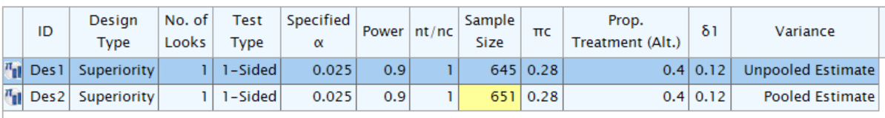

```{r, include = FALSE}
knitr::opts_chunk$set(
  collapse = TRUE,
  comment = "#>"
)

library(tibble)
library(dplyr)
library(knitr)
devtools::load_all()
library(gsDesign)
library(gt)
library(mvtnorm)
```

# Overview

We consider group sequential design examining the risk difference
between two treatment groups for a binary outcome. There are several
issues to consider:

-   The measure of treatment difference or natural parameter; we focus
    on risk difference.
-   Incorporation of both null and alternate hypothesis variances.
-   Superiority, non-inferiority and super-superiority designs.
-   Stratified populations.
-   Fixed and group sequential designs.

For single stratum designs, we focus on sample size or power using the
method of @FarringtonManning for a trial to test the difference between
two binomial event rates. The routine can be used for a test of
superiority, non-inferiority or super-superiority. For a design that
tests for superiority, the methods are consistent with those of @FTU,
but without the continuity correction. Methods for sample size and power
are the same as `gsDesign::nBinomial()` when testing on the
risk-difference scale for a single stratum. This is also consistent with
the **Hmisc** R package routines `bsamsize()` and `bpower()` for
superiority designs.

For trials with multiple strata, testing for a risk difference is often
done by weighting each stratum according to the inverse of the variance
(@MantelHaenszel). Since risk differences may also be assumed to be
different for different strata, we will also explore weighting by strata
sample sizes as in @Mehrotra2000.

The focus here is for sample sizes that are large enough for asymptotic
theory to work well without continuity corrections. The concepts are
incorporated in the following functions intended for use in fixed and
group sequential designs:

-   `gs_info_rd()` to support asymptotic variance and statistical
    information calculation.
-   `gs_power_rd()` to support power calculations.
-   `gs_design_rd()` to support sample size calculations.

Simulation is used throughout to check the examples presented.

# Notation

-   $K$: total number of analyses (including the final analysis) in the
    group sequential design. For fixed design, $K= 1$.

-   $S$: total number of strata. If the population is un-stratified
    population, then $S=1$.

-   $w_{s,k}$: the **underlying** weight assigned for the $s$-th strata
    at the $k$-th analysis. WHY SWITH ORDER OF s, k FROM w?

-   $\widehat w_{s,k}$: the **estimated** weight assigned for the $s$-th
    strata at the $k$-th analysis.

-   $N_{C,k,s}, N_{E,k,s}$: the **planned** sample size in the
    control/treatment group at the $k$-th analysis of the $s$-th strata.

-   $\widehat N_{C,k,s}, \widehat N_{E,k,s}$: the **observed** sample
    size in the control/treatment group at the $k$-th analysis of the
    $s$-th strata.

-   $r$: **planned** randomization ratio, i.e., $$
    r = N_{E,k,s} / N_{C,k,s} \;\; \forall k = 1, \ldots, K \;\; \text{and} \;\; s = 1, \ldots, S.
    $$

-   $p_{C,s}, p_{E,s}$: the **planned** rate of the control/treatment
    arm, i.e., the independent observations in the control/treatment
    group with a binary outcome that is observed with probability
    $p_{C,s}$ at any $k$-th analysis of the $s$-th strata.

-   $d$: an indicator whether is an outcome is failure (bad outcome) or
    response (good outcome), i.e., $$
    d
    = 
    \left\{
    \begin{array}{lll}
      -1 & \text{if } p_{C,s} < p_{E,s} & \text{the control arm is better}\\
       1 & \text{if } p_{C,s} > p_{E,s} & \text{the treatment arm is better}\\
    \end{array}
    \right.
    $$ Here we assume if $\exists s^* \in \{1, \ldots, S\}$, s.t.,
    $p_{C,s^*} < p_{E,s^*}$, then
    $p_{C,s} < p_{E,s}, \forall s \in \{1, \ldots, S\}$, and vice versa.

-   $X_{C,k,s}, X_{E,k,s}$: random variables indicating the number of
    subjects failed in control/treatment arm, i.e.,
    $X_{C,k,s} \sim \hbox{Binomial}(N_{C,k,s}, p_{C,k,s})$,
    $X_{E,k,s} \sim \hbox{Binomial}(N_{E,k,s}, p_{E,k,s})$ at the $k$-th
    analysis of the $s$-th strata.

-   $x_{C,k,s}, x_{E,k,s}$: the observed outcome of
    $X_{C, k, s}, X_{E, k, s}$ at the $k$-th analysis of the $s$-th
    strata, respectively.

-   $\widehat p_{C,k,s}, \widehat p_{E,k,s}$: observed rates of the
    control/treatment group at the $k$-th analysis of the $s$-th strata,
    i.e., $$
    \widehat p_{C,k,s} = x_{C,k,s} / \widehat N_{C,k,s}.\\
    \widehat p_{E,k,s} = x_{E,k,s} / \widehat N_{E,k,s}.
    $$

-   $\delta_{s}^{null}$: the **planned** risk difference under $H_0$ at
    any $k$-th analysis of the $s$-th strata.

-   $\delta_{s}$: the **planned** risk difference under $H_1$ at any
    $k$-th analysis of the $s$-th strata is denoted by $$
    \delta_{s} = |p_{C,s} - p_{E,s}|. 
    $$

-   $\hat\delta_{s}$: estimation of risk difference with $$
    \widehat\theta_{k,s} = |\widehat p_{C,k,s} - \widehat p_{E,k,s}|
    $$ We have
    $E(\widehat\theta_{k,s}) = \theta_{s}, \;\forall k = 1, \ldots, K$.

# Testing

The test statistics at the $k$-th analysis is $$
  Z_{k} 
  = 
  \frac{ 
    \sum_{s=1}^S \widehat w_{s,k} \; |\widehat \delta_{k,s} - \delta_{s}^{null} |
  }{
    \sqrt{\sum_{s=1}^S \widehat w_{s,k}^2 \widehat\sigma_{H_0,k,s}^2}
  }
$$ where
$\widehat\sigma^2_{k,s} = \widehat{\hbox{Var}}(\widehat p_C -\widehat p_E)$.
And the value of $\widehat\sigma^2_{k,s}$ depends on the hypothesis and
design, i.e., whether it is a superiority design, or non-inferiority
design, or super-superiority design. We will discuss
$\widehat\sigma^2_{k,s}$ in the following 3 subsections.

## Superiority Design

A superiority design ($\delta_{s}^{null} = 0$) is to show that
experimental group is superior to the control group above some
thresholds. Its hypothesis is 
$$
  H_0: \delta_{s} = 0 \text{ vs. } H_1: \delta_{s} > 0, \; \forall k = 1, \ldots, K, s = 1, \ldots, S
$$

-   **Variance per strata per analysis:**

    -   Under the null hypothesis, we have $$
        \begin{array}{ll}
        \sigma^2_{H_0,k,s} 
        & = 
        \text{Var}(p_C - p_E | H_0)
        =
        p_{k,s}^{pool} \left(1 - p^{pool}_{k,s} \right) \left(\frac{1}{N_{C,k,s}} + \frac{1}{N_{E,k,s}} \right), \\
        \widehat\sigma^2_{H_0,k,s} 
        & = 
        \widehat{\text{Var}}(\hat p_C - \hat p_E | H_0)
        =
        \widehat p_{k,s}^{pool} \left(1 - \widehat p^{pool}_{k,s} \right) \left(\frac{1}{N_{C,k,s}} + \frac{1}{N_{E,k,s}} \right),
        \end{array}
        $$ where
        $p_{k,s}^{pool} = (p_{C,s} N_{C,k,s} + p_{E,s} N_{E,k,s}) / (N_{C,k,s} + N_{E,k,s})$
        and
        $\widehat p_{k,s}^{pool} = (x_{C,k,s} + x_{E,k,s}) / (\widehat N_{C,k,s} + \widehat N_{E,k,s}).$

    -   Under the alternative hypothesis, we have $$
        \begin{array}{ll}
        \sigma_{H_1,k,s}^2 
        & = 
        \text{Var}(p_C - p_E | H_1)
        = 
        \frac{p_{C,s} (1- p_{C,s})}{N_{C,k,s}} + \frac{p_{E,s} (1 - p_{E,s})}{N_{E,k,s}} \\
        \widehat\sigma_{H_1,k,s}^2 
        & = 
        \widehat{\text{Var}}(\hat p_C - \hat p_E | H_1)
        = 
        \frac{\widehat p_{C,k,s} (1- \widehat p_{C,k,s})}{N_{C,k,s}} + \frac{\widehat p_{E,k,s} (1 - \widehat p_{E,k,s})}{N_{E,k,s}}
        \end{array}
        $$ where
        $\widehat p_{C,k,s} = x_{C,k,s} / N_{C,k,s} \text{ and } \widehat p_{E,k,s} = x_{E,k,s} / N_{E,k,s}$.
        Testing will be one-sided at level $\alpha \in (0, 1)$ and the
        null hypothesis will be rejected if $Z_k$ cross the upper
        boundary. And the upper boundary can be either fixed or derived
        from spending functions.

-   **Standardized treatment effect per analysis:**

    -   Under the null hypothesis, we have $$
        \theta_{H_0,k} = 0 \\
        \widehat \theta_{H_0,k} = 0
        $$

    -   Under the alternative hypothesis, we have $$
        \begin{array}{ll}
        \theta_{H_1,k} 
        & = \frac{\sum_{s=1}^S w_{k,s} (p_{C,s} - p_{E,s})}{\sqrt{\sum_{s=1}^S w_{k,s}^2 \sigma_{H_1, k,s}^2}}\\
        \widehat\theta_{H_1,k} 
        & = 
        \frac{
        \sum_{s=1}^S \widehat w_{k,s} (\widehat p_C - \widehat p_E)
        }{
        \sqrt{\sum_{s=1}^S \widehat w_{k,s}^2 \widehat\sigma_{H_1, k,s}^2}
        }.
        \end{array}
        $$

-   **Standardized information per analysis:**

    @LachinBook or @Lachin1981 provide fixed sample size calculations
    based on the values $\psi_0$ under the null hypothesis and $\psi_1$
    under the alternate hypothesis. Here we propose using the same
    variance calculations to compute statistical information for a group
    sequential design and apply the formulation for power and sample
    size calculation in the vignette *Computing Bounds Under
    Non-Constant Treatment Effect*.

    -   Under the null hypothesis, we have $$
        \begin{array}{ll}
        \mathcal I_{H0,k} 
        & = 
        \left[ 
        \sum_{s=1}^S 
        w_{k,s}^2 \frac{p_{k,s}^{pool} (1 - p_{k,s}^{pool})}{N_{C, k, s}} + 
        w_{k,s}^2 \frac{p_{k,s}^{pool} (1 - p_{k,s}^{pool})}{N_{E, k, s}} 
        \right]^{-1} \\
        \widehat{\mathcal I}_{H0,k} 
        & = 
        \left[ 
        \sum_{s=1}^S 
        \widehat w_{k,s}^2 \frac{\widehat p_{k,s}^{pool} (1 - \widehat p_{k,s}^{pool})}{\widehat N_{C,k,s}} +
        \widehat w_{k,s}^2 \frac{\widehat p_{k,s}^{pool} (1 - \widehat p_{k,s}^{pool})}{\widehat N_{C,k,s}} 
        \right]^{-1}
        \end{array}
        $$

    -   Under the alternative hypothesis, we have $$
        \begin{array}{ll}
        \mathcal I_{H1,k}
        = 
        \left[ 
        \sum_{s=1}^S w_{k,s}^2 \frac{p_{C,k,s} (1 - p_{C,k,s})}{N_{C,k,s}}
        +
        \sum_{s=1}^S w_{k,s}^2 \frac{p_{E,k,s} (1 - p_{E,k,s})}{N_{E,k,s}} 
        \right]^{-1}\\
        \widehat{\mathcal I}_{H1,k} 
        = 
        \left[ 
        \sum_{s=1}^S \widehat w_{k,s}^2 \frac{\widehat p_{C,k,s} (1 - \widehat p_{C,k,s})}{\widehat N_{C,k,s}}
        +
        \sum_{s=1}^S \widehat w_{k,s}^2 \frac{\widehat p_{E,k,s} (1 - \widehat p_{E,k,s})}{\widehat N_{E,k,s}} 
        \right]^{-1}
        \end{array}
        $$

## Super-Superiority Design

The hypothesis of the super-superiority design is

$$
  H_0: \delta_{k,s} = \delta_{k,s}^{null} 
  \;\; vs. \;\; 
  H_1: \delta > \delta_{k,s}^{null} \text{ with } \delta_{k,s}^{null} > 0.
$$ 
Here $\theta_{k,s_1}^{null} = \theta_{k,s_2}^{null}$ or
$\theta_{k,s_1}^{null} \neq \theta_{k,s_2}^{null}$ for $s_1 \neq s_2$.

Under the null hypothesis $\theta_{0,k,s} \neq 0$, the estimation of
rates $\widehat p_{C0,k,s}, \widehat p_{E0,k,s}$ satisfy 
$$
  \left\{
  \begin{array}{l}
    \widehat p_{C0,k,s} = \widehat p_{E0,k,s} + d_{k,s} \times \delta_{k,s}^{null} \\
    \widehat p_{C0,k,s} + r\widehat p_{E0,k,s} = \widehat p_{C,k,s} + r\widehat p_{E,k,s} .
  \end{array}
  \right.
$$ 
Solving these 2 equations with 2 unknowns yields 
$$
  \left\{
  \begin{array}{l}
  \widehat p_{E0,k,s} & = (\widehat p_{C,k,s} + r \widehat p_{E,k,s} - d_{k,s} \delta_{k,s}^{null}) / (r + 1)\\
  \widehat p_{C0,k,s} & =  \widehat p_{E0,k,s} + d_{k,s} \delta_{k,s}^{null}.
  \end{array}
  \right.
$$

-   **Variance per strata per analysis:**

    -   Under $H_0$, we have

$$
  \hat\sigma^2_{H_0,k,s}
  = 
  \frac{\widehat p_{C0,k,s}(1- \widehat p_{C0,k,s})}{N_{C,k,s}} + \frac{ \widehat p_{E0,k,s} (1 - \widehat p_{E0,k,s})}{N_{E,k,s}}.
$$

-   Under $H_1$, we have

$$
  \widehat\sigma_{H_1,k,s}^2 
  = 
  \frac{\widehat p_{C,k,s} (1- \widehat p_{C,k,s})}{N_{C,k,s}} + \frac{\widehat p_{E,k,s} (1 - \widehat p_{E,k,s})}{N_{E,k,s}}.
$$

-   **Standardized treatment effect per analysis:**

    -   Under the null hypothesis, we have

$$
  \widehat \theta_{H_0,k} 
  = 
  \frac{
    \sum_{s=1}^S w_{k,s} \delta_{s,k}^{null}
  }{
    \sqrt{\sum_{s=1}^S w_{k,s}^2 \widehat \sigma_{H_0,k,s}}^2
  }.
$$

-   Under the alternative hypothesis, we have

$$
  \widehat \theta_{H_1} 
  = 
  \frac{
    \sum_{s=1}^S w_{k,s} d_{k,s} \times (\widehat p_{C,k,s} - \widehat p_{E,k,s})
  }{
    \sqrt{\sum_{s=1}^S w_{k,s}^2 \widehat \sigma_{H_1,k,s}^2}
  }.
$$

-   **Standardized information per analysis:**

    -   Under the null hypothesis, we have

$$
  \widehat{\mathcal I}_{H0,k} 
  = 
  \left[ 
  \sum_{s=1}^S w_{k,s}^2 \frac{\bar p_{C0,s} (1 - \bar p_{C0,s})}{N_{C,s}} + w_{k,s}^2\frac{\bar p_{E0,s} (1 - \bar p_{E0,s})}{N_{E,s}} 
  \right]^{-1}.
$$

-   Under the alternative hypothesis, we have

$$
  \widehat{\mathcal I}_{H1,k} 
  = 
  \left[
  \sum_{s=1}^S \left( w_{k,s}^2 \frac{\bar p_{C,k,s} (1 - \bar p_{C,k,s})}{N_{C,k,s}} + w_{k,s}^2 \frac{\bar p_{E,k,s} (1 - \bar p_{E,k,s})}{N_{E,k,s}} \right)
  \right]^{-1}.
$$

## Non-inferiority Design

The non-inferiority Design means that, while the treatment group is
definitely not better than the control group, it is not unacceptably
worse. Its hypothesis is
$H_0: \delta_{k,s} = \delta_{k,s}^{null} \;\; vs. \;\; H_1: \delta_{k,s} > \delta_{k,s}^{null}$
with $\delta_{k,s}^{null} <0$. Its variance, standardized treatment
effect and statistical information is the same as that from
super-superiority design by setting $\delta_{k,s}^{null}$ as negative
numbers.

# Weighting Options

As previously noted, we will consider weighting based on either
inverse-variance weights (@MantelHaenszel) or strata sample size weights
(@mehrotra2000minimum).

-   **Inverse-variance weights (INVAR):** 
$$
    w_{s,k} = \frac{1/\sigma^2_{s,k}}{\sum_{s=1}^S 1/\sigma^2_{s,k}}. \\
    \widehat w_{s,k} = \frac{1/\widehat\sigma^2_{s,k}}{\sum_{s=1}^S 1/\widehat\sigma^2_{s,k}}.
$$ 
where
    $\widehat\sigma_{s,k}^2 \in \{\widehat\sigma_{H_0, k,s}^2, \widehat\sigma_{H_1, k,s}^2 \}$
    depending on the infomation scale `info_scale = ...` in
    `gs_info_rd()`, `gs_power_rd()` and `gs_design_rd()`.

-   **Sample-Size Weights (SS):** 
$$
    w_{s,k} 
    =
    \frac{
      (N_{C, s, k} \; N_{E, s, k}) / (N_{C, s, k} + N_{E, s, k})
    }{
      \sum_{s=1}^S (N_{C, s, k} \; N_{E, s, k}) / (N_{C, s, k} + N_{E, s, k})
    },\\
    \widehat w_{s,k} 
    =
    \frac{
      (\widehat N_{C, s, k} \; \widehat N_{E, s, k}) / (\widehat N_{C, s, k} + \widehat N_{E, s, k})
    }{
      \sum_{s=1}^S (\widehat N_{C, s, k} \; \widehat N_{E, s, k}) / (\widehat N_{C, s, k} + \widehat N_{E, s, k})
    },
$$ 
where $N_{C,s,k}, N_{E,s,k}$ are the planned sample size of the $s$-th strata and $k$-th analysis of the control group and experimental group, respectively. And $\widehat N_{C,s,k}, \widehat N_{E,s,k}$ are the observed sample size of the $s$-th strata and $k$-th analysis of the control group and experimental group, respectively.

# Simulations

We do a quick 20,000 simulations and compare the density histogram of
outcomes to the standard normal density. Assume
$r=1, d = 1, p_C=p_E=0.125, N=200$. We then compute $\sigma$ as
`r round(sqrt(.125 * .875/200 * 4), 3)`. Even for this *not huge* sample
size the normal density fits quite well other than some flatness in the
middle.

```{r, message = FALSE}
# Hypothesized failure rate
p <- .125
#  Other parameters
set.seed(123)
r <- 1
N <- 200
NC <- N / (r + 1)
NE <- r * N / (r + 1)
library(ggplot2)
# Generate random counts of events for each treatment
xC <- rbinom(n = 20000, size = NC, prob = p)
xE <- rbinom(n = 20000, size = NE, prob = p)
# Treatment difference estimate
thetahat <- xC / NC - xE / NE
# Standard error under H0
pbar <- (xC + xE) / N
se0 <- sqrt(pbar * (1 - pbar)*(1 / NC + 1 / NE))
# Z to test H0
Z <- thetahat / se0
x <- seq(-4, 4, .1)
se0a <- sqrt(p * (1 - p) * (1 / NC + 1 / NE))
y <- data.frame(Z = x, Density = dnorm(x = x, mean = 0, sd = 1)) 

ggplot() + 
  geom_histogram(data = data.frame(Z), aes(x = Z, y = ..density..), color = 1, fill = "white") +
  geom_line(data = y, aes(x = Z, y = Density), linetype = 1) +
  ylab("Density") +
  ggtitle("Binomial outcomes by simulation vs. asymptotic normal density",
          subtitle = "Histogram of 20,000 simulations")
```

# Examples

## Unstratified Fixed Design {.tabset}

The example discussed in this section is an unstratified fixed design
with equal sized groups to detect a 30% reduction in mortality
associated with congestive heart failure, where the 1-year mortality in
the control group is assumed to be no greater than 0.4. So
$p_C=0.4, p_E = .28$. Under the null hypothesis, we assume
$p_C=p_E =0.34$. We desire 90% power for a two-sided test for two
proportions at $\alpha = 0.05$. And we would like to calculate the
sample size to achieve the 90% power.

### `gsDesign2`

First, we set the parameters.

```{r}
p_c <- .28
p_e <- .4
p_pool <- (p_c + p_e) / 2

N <- 1
ratio <- 1
N_c <- N / (1 + ratio)
N_e <- N_c * ratio
```

Then we calculate the variance under $H_0$ and $H_1$. Their mathmatical
formulation are shown as follows. 
$$
  \begin{array}{ll}
  \sigma^2_{H_0} 
  =
  p^{pool} \left(1 - p^{pool} \right) \left(\frac{1}{N_C} + \frac{1}{N_{E}} \right)
  =
  p^{pool} \left(1 - p^{pool} \right) \left(\frac{1}{N \xi_C} + \frac{1}{N \xi_E} \right)
  \overset{r=1}{=}
  p^{pool} \left(1 - p^{pool} \right) \frac{4}{N} \\
  \sigma^2_{H_1} 
  =
  \frac{p_C \left(1 - p_C \right)}{N_C} +
  \frac{p_E \left(1 - p_E \right)}{N_E}
  =
  \frac{p_C \left(1 - p_C \right)}{N \xi_C} +
  \frac{p_E \left(1 - p_E \right)}{N \xi_E} 
  \overset{r=1}{=}
  \left[
    p_C \left(1 - p_C \right) +
    p_E \left(1 - p_E \right)
  \right] \frac{2}{N}
  \end{array}
$$ 
And their calculation results are

```{r}
sigma_H0 <-  sqrt(p_pool*(1 - p_pool) * 4 / N)
sigma_H1 <-  sqrt((p_c*(1 - p_c) + p_e*(1 - p_e)) * 2 / N)

info_H0 <- 1/(sigma_H0^2)
info_H1 <- 1/(sigma_H1^2)
```

Next, we calculate the standarized treatment effect under $H_0$ and
$H_1$, whose mathmatical formulation are 
$$
  \begin{array}{ll}
  \theta_{H_0} = 0; \\
  \theta_{H_1} = \frac{|p_c - p_e|}{\sigma_{H_1}}
  \end{array}.
$$ 

And their calculation results are

```{r}
theta_H0 <- 0
theta_H1 <- abs(p_c - p_e)/sigma_H1

tibble::tribble(
  ~N_c, ~N_e, ~p_c,    ~p_e,   ~theta_H1,    ~theta_H0,    ~info_H1,    ~info_H0,
   N_c,  N_e,  p_c,     p_e,    theta_H1,     theta_H0,     info_H1,     info_H0,
) %>% gt::gt()
```

The above logic is implemented in teh function `gs_info_rd()`.

```{r}
x <- gs_info_rd(
  p_c = tibble::tibble(Stratum = "All", Rate = .28),
  p_e = tibble::tibble(Stratum = "All", Rate = .4),
  N = tibble::tibble(Stratum = "All", N = 1, Analysis = 1),
  rd0 = 0, 
  ratio = 1,
  weight = "un-stratified") 

x %>% 
  gt::gt() %>% 
  gt::fmt_number(columns = 5:8, decimals = 6)
```

By plugging the `theta` and `info` above into `gs_design_npe()`, one can
calculate the sample size to achieve the 90% power.

```{r}
# under info_scale = 0
y_0 <- gs_design_npe(
  theta = .4 - .28, 
  info = x$info0, 
  info0 = x$info0, 
  info_scale = 0,
  alpha = .025, 
  beta = .1,
  upper = gs_b, 
  lower = gs_b,
  upar = list(par = -qnorm(.025)),
  lpar = list(par = -Inf))

# under info_scale = 1
y_1 <- gs_design_npe(
  theta = .4 - .28, 
  info = x$info1, 
  info0 = x$info0, 
  info_scale = 1,
  alpha = .025, 
  beta = .1,
  upper = gs_b, 
  lower = gs_b,
  upar = list(par = -qnorm(.025)),
  lpar = list(par = -Inf))

# under info_scale = 2
y_2 <- gs_design_npe(
  theta = .4 - .28, 
  info = x$info1, 
  info0 = x$info0, 
  info_scale = 2,
  alpha = .025, 
  beta = .1,
  upper = gs_b, 
  lower = gs_b,
  upar = list(par = -qnorm(.025)),
  lpar = list(par = -Inf))

tibble(`info_scale = 0` = y_0$info0[1] / x$info0[1],
       `info_scale = 1` = y_1$info1[1] / x$info1[1],
       `info_scale = 2` = y_2$info[1] / x$info1[1]) %>% 
  gt::gt() %>% 
  gt::tab_header(title = "The sample size calculated by gsDesign2 under 3 info_scale")
```

The above logic is implement in `gs_design_rd()` to calculate the sample
size given fixed power in one-step.

```{r}
z_info_scale_0 <- gs_design_rd(
  p_c = tibble::tibble(Stratum = "All", Rate = .28),
  p_e = tibble::tibble(Stratum = "All", Rate = .4),
  rd0 = 0, 
  alpha = 0.025,   
  beta = 0.1,   
  ratio = 1,
  weight = "un-stratified",
  upper = gs_b,
  lower = gs_b,
  upar = -qnorm(.025),
  lpar = -Inf,
  info_scale = 0)  

z_info_scale_1 <- gs_design_rd(
  p_c = tibble::tibble(Stratum = "All", Rate = .28),
  p_e = tibble::tibble(Stratum = "All", Rate = .4),
  rd0 = 0, 
  alpha = 0.025,   
  beta = 0.1,   
  ratio = 1,
  weight = "un-stratified",
  upper = gs_b,
  lower = gs_b,
  upar = -qnorm(.025),
  lpar = -Inf,
  info_scale = 1)

z_info_scale_2 <- gs_design_rd(
  p_c = tibble::tibble(Stratum = "All", Rate = .28),
  p_e = tibble::tibble(Stratum = "All", Rate = .4),
  rd0 = 0, 
  alpha = 0.025,   
  beta = 0.1,   
  ratio = 1,
  weight = "un-stratified",
  upper = gs_b,
  lower = gs_b,
  upar = -qnorm(.025),
  lpar = -Inf,
  info_scale = 2)
```

### `gsDesign`

```{r, echo=FALSE}
x_gsDesign <- gsDesign::nBinomial(p1 = .28, p2 = .4, delta0 = 0, alpha = .025, sided = 1, beta = .1, outtype = 3)
```

### EAST

```{r label = EastFix, echo = FALSE, fig.cap = "Sample size calculated by EAST", out.width = '90%'}

```

### Summary
```{r}
tibble::tibble(gsDesign2_info_scale_0 = z_info_scale_0$analysis$N,
               gsDesign2_info_scale_1 = z_info_scale_1$analysis$N,
               gsDesign2_info_scale_2 = z_info_scale_2$analysis$N,
               gsDesign = x_gsDesign$n, 
               EAST_unpool = 645, 
               EAST_pool = 651) %>% 
  gt::gt() %>% 
  gt::tab_spanner(label = "gsDesign2",
                  columns = c(gsDesign2_info_scale_0, gsDesign2_info_scale_1, gsDesign2_info_scale_2)) %>% 
  gt::tab_spanner(label = "EAST",
                  columns = c(EAST_unpool, EAST_pool)) %>% 
  cols_label(gsDesign2_info_scale_0 = "info_scale = 0",
             gsDesign2_info_scale_1 = "info_scale = 1",
             gsDesign2_info_scale_2 = "info_scale = 2",
             EAST_unpool = "un-pooled",
             EAST_pool = "pooled")
```

## Unstratified Group Sequential Design {.tabset}

The example discussed in this section is an unstratified group
sequential design with equal sized groups to detect
$p_C = 0.15, p_E = .1$.\
Under the null hypothesis, we assume $p_C = p_E = 0.125$. We desire 90%
power for a two-sided test for two proportions at $\alpha = 0.05$. And
we would like to calculate the sample size to achieve the 90% power.

### `gsDesign2`

To calculate the sample size, one can use `gs_design_rd()`. The logic of
`gs_design_rd()` is to calculate the sample size of fixed design first.

```{r}
x_gs <- gs_info_rd(
  p_c = tibble::tibble(Stratum = "All", Rate = .15),
  p_e = tibble::tibble(Stratum = "All", Rate = .1),
  N = tibble::tibble(Stratum = "All", N = 1:3/3, Analysis = 1:3),
  rd0 = 0, 
  ratio = 1,
  weight = "un-stratified"
)

x_gs %>% 
  gt::gt() %>%
  gt::tab_header(title = "The statistical information of the group sequential design")
```

```{r}
# info_scale = 0
y_gs0 <- gs_design_npe(
  theta = .05, 
  info = x_gs$info0, 
  info0 = x_gs$info0, 
  info_scale = 0,
  alpha = .025, beta = .1, binding = FALSE,
  upper = gs_b,
  lower = gs_b,
  upar = gsDesign(k = 3, test.type = 1, sfu = sfLDOF, sfupar = NULL)$upper$bound,
  lpar = rep(-Inf, 3),
  test_lower = FALSE)

# info_scale = 1
y_gs1 <- gs_design_npe(
  theta = .05, 
  info = x_gs$info1, 
  info0 = x_gs$info1, 
  info_scale = 2,
  alpha = .025, beta = .1, binding = FALSE,
  upper = gs_b,
  lower = gs_b,
  upar = gsDesign(k = 3, test.type = 1, sfu = sfLDOF, sfupar = NULL)$upper$bound,
  lpar = rep(-Inf, 3),
  test_lower = FALSE)

# info_scale = 2
y_gs2 <- gs_design_npe(
  theta = .05, 
  info = x_gs$info1, 
  info0 = x_gs$info0, 
  info_scale = 2,
  alpha = .025, beta = .1, binding = FALSE,
  upper = gs_b,
  lower = gs_b,
  upar = gsDesign(k = 3, test.type = 1, sfu = sfLDOF, sfupar = NULL)$upper$bound,
  lpar = rep(-Inf, 3),
  test_lower = FALSE)

tibble(`info_scale = 0` = y_gs0$info0 / x_gs$info0[3],
       `info_scale = 1` = y_gs1$info1 / x_gs$info1[3],
       `info_scale = 2` = y_gs2$info / x_gs$info1[3]) %>% 
  gt::gt() %>% 
  gt::tab_header(title = "The sample size calculated by `gsDesign2` under 3 info_scale", subtitle = "under group sequential design")
```

The above logic is implemented in `gs_design_rd()`.

```{r}
x_gsDesign2_info_scale_0 <- gs_design_rd(
  p_c = tibble::tibble(Stratum = "All", Rate = .15),
  p_e = tibble::tibble(Stratum = "All", Rate = .1),
  IF = 1:3/3,
  rd0 = 0, 
  alpha = .025,                  
  beta = .1,                
  ratio = 1,
  weight = "un-stratified",
  upper = gs_b,
  lower = gs_b,
  upar = gsDesign(k = 3, test.type = 1, sfu = sfLDOF, sfupar = NULL)$upper$bound,
  lpar = rep(-Inf, 3),
  test_lower = FALSE,
  info_scale = 0
)

x_gsDesign2_info_scale_1 <- gs_design_rd(
  p_c = tibble::tibble(Stratum = "All", Rate = .15),
  p_e = tibble::tibble(Stratum = "All", Rate = .1),
  IF = 1:3/3,
  rd0 = 0, 
  alpha = .025,                  
  beta = .1,                
  ratio = 1,
  weight = "un-stratified",
  upper = gs_b,
  lower = gs_b,
  upar = gsDesign(k = 3, test.type = 1, sfu = sfLDOF, sfupar = NULL)$upper$bound,
  lpar = rep(-Inf, 3),
  test_lower = FALSE,
  info_scale = 1
)

x_gsDesign2_info_scale_2 <- gs_design_rd(
  p_c = tibble::tibble(Stratum = "All", Rate = .15),
  p_e = tibble::tibble(Stratum = "All", Rate = .1),
  IF = 1:3/3,
  rd0 = 0, 
  alpha = .025,                  
  beta = .1,                
  ratio = 1,
  weight = "un-stratified",
  upper = gs_b,
  lower = gs_b,
  upar = gsDesign(k = 3, test.type = 1, sfu = sfLDOF, sfupar = NULL)$upper$bound,
  lpar = rep(-Inf, 3),
  test_lower = FALSE,
  info_scale = 2
)
```

### `gsDesign`

```{r}
n_fix <- nBinomial(
  # Control event rate
  p1 = .15, 
  # Experimental event rate
  p2 = .1, 
  # Null hypothesis event rate difference (control - experimental)
  delta0 = 0, 
  # 1-sided Type I error
  alpha = .025, 
  # Type II error (1 - Power)
  beta = .1, 
  # Experimental/Control randomization ratio
  ratio = 1) 

cat("The sample size of fixed-design calculated by `gsDesign` is ", n_fix, ".\n")

x_gsDesign <- gsDesign(
  k = 3,
  test.type = 1,
  # 1-sided Type I error
  alpha = .025, 
  # Type II error (1 - Power)
  beta = .1,    
  # If test.type = 5 or 6, this sets maximum spending for futility
  # under the null hypothesis. Otherwise, this is ignored.
  astar = 0,
  timing = 1:3/3,
  sfu = sfLDOF,
  sfupar = NULL,
  sfl = sfLDOF,
  sflpar = NULL,
  # Difference in event rates under alternate hypothesis
  delta = 0,
  # Difference in rates under H1
  delta1 = .05,
  # Difference in rates under H0
  delta0 = 0,
  endpoint = "Binomial",
  # Fixed design sample size from nBinomial above
  n.fix = n_fix)

cat("The sample size calcuated by `gsDesign` is ", x_gsDesign$n.I, ".\n")

gsBoundSummary(x_gsDesign, digits = 4, ddigits = 2, tdigits = 1)
```

### EAST

```{r label = EastGs, echo = FALSE, fig.cap = "Sample size calculated by EAST", out.width = '90%'}
knitr::include_graphics("./figures/east_n_gs.png")
```

```{r label = EastGsUnpool, echo = FALSE, fig.cap = "Sample size calculated by EAST", out.width = '90%'}
knitr::include_graphics("./figures/east_n_gs_unpool.png")
```

```{r label = EastGsPool, echo = FALSE, fig.cap = "Sample size calculated by EAST", out.width = '90%'}
knitr::include_graphics("./figures/east_n_gs_pool.png")
```


### Summary

```{r}
tibble::tibble(gsDesign2_info_scale_0 = x_gsDesign2_info_scale_0$analysis$N,
               gsDesign2_info_scale_1 = x_gsDesign2_info_scale_1$analysis$N,
               gsDesign2_info_scale_2 = x_gsDesign2_info_scale_2$analysis$N,
               gsDesign = x_gsDesign$n.I,
               EAST_unpool = c(617, 1233, 1850),
               EAST_pool = c(619, 1238, 1857)) %>% 
  gt::gt() %>% 
  gt::tab_spanner(label = "gsDesign2",
                  columns = c(gsDesign2_info_scale_0, gsDesign2_info_scale_1, gsDesign2_info_scale_2)) %>% 
  gt::tab_spanner(label = "EAST",
                  columns = c(EAST_unpool, EAST_pool)) %>% 
  cols_label(gsDesign2_info_scale_0 = "info_scale = 0",
             gsDesign2_info_scale_1 = "info_scale = 1",
             gsDesign2_info_scale_2 = "info_scale = 2",
             EAST_unpool = "un-pooled",
             EAST_pool = "pooled")
```

## Stratified Group Sequential Design {.tabset}

In this example, we consider 3 strata in a group sequential design with
3 analyses.

### `gsDesign2`

```{r, message=FALSE}
ratio <- 1
prevalence_ratio <- c(4, 5, 6) 
p_c_by_stratum <- c(.3, .37, .6)
p_e_by_stratum <- c(.25, .3, .5)
  
p_c <- tibble::tibble(Stratum = c("S1", "S2", "S3"), Rate = p_c_by_stratum)
p_e <- tibble::tibble(Stratum = c("S1", "S2", "S3"), Rate = p_e_by_stratum)
ratio_strata_c <- tibble::tibble(Stratum = c("S1", "S2", "S3"), ratio = prevalence_ratio)
ratio_strata_e <- ratio_strata_c

N <- 1
IF <- 1:3/3
N_c <- N / (1 + ratio) 
N_e <- ratio * N_c 

x <- p_c %>% 
  rename(p_c = Rate) %>% 
  left_join(p_e) %>% 
  rename(p_e = Rate) %>% 
  mutate(p_pool = (p_c + p_e) / 2) %>% 
  mutate(xi_c = (ratio_strata_c %>% mutate(prop = ratio / sum(ratio)))$prop) %>% 
  mutate(xi_e = (ratio_strata_e %>% mutate(prop = ratio / sum(ratio)))$prop) %>% 
  mutate(N_c = N_c * xi_c, N_e = N_e * xi_e)

x %>% 
  gt::gt() %>% 
  gt::fmt_number(columns = 4:8, decimals = 4) %>% 
  gt::tab_footnote(footnote = "p_pool = (p_c * N_c + p_e * N_e) / (N_c * N_e).",
                   locations = gt::cells_column_labels(columns = p_pool)) %>% 
  gt::tab_footnote(footnote = "xi_c = sample size of a strata / sample size of the control arm.",
                   locations = gt::cells_column_labels(columns = xi_c)) %>% 
  gt::tab_footnote(footnote = "xi_e = sample size of a strata / sample size of the experimental arm.",
                   locations = gt::cells_column_labels(columns = xi_e)) %>% 
  gt::tab_footnote(footnote = "N_c = total sample size of the control arm.",
                   locations = gt::cells_column_labels(columns = N_c)) %>% 
  gt::tab_footnote(footnote = "N_e = total size of the experimental arm.",
                   locations = gt::cells_column_labels(columns = N_e)) %>% 
  gt::tab_header(title = "Stratified Example")
```

First, we calculate the variance 
$$
  \left\{
  \begin{array}{ll}
  \sigma^2_{H_0,k,s} 
  & =
  p_{k,s}^{pool} \left(1 - p^{pool}_{k,s} \right) 
  \left(\frac{1}{N_{C,k,s}} + \frac{1}{N_{E,k,s}} \right) 
  =
  p_{k,s}^{pool} \left(1 - p^{pool}_{k,s} \right) 
  \left(\frac{1}{ \frac{\xi_s}{1+r} N_{k}} + \frac{1}{ \frac{r \xi_s}{1+r} N_{k}} \right) \\
  \sigma_{H_1,k,s}^2 
  & = 
  \frac{p_{C,s} (1- p_{C,s})}{N_{C,k,s}} + \frac{p_{E,s} (1 - p_{E,s})}{N_{E,k,s}} 
  = 
  \frac{p_{C,s} (1- p_{C,s})}{\frac{\xi_s}{1+r} N_{k}} + \frac{p_{E,s} (1 - p_{E,s})}{\frac{r \xi_s}{1+r} N_{k}} 
  \end{array}
  \right.
$$

```{r, message=FALSE}
x <- x %>% 
  union_all(x) %>% 
  union_all(x) %>% 
  mutate(Analysis = rep(1:3, each = 3)) %>% 
  left_join(tibble(Analysis = 1:3, IF = IF)) %>% 
  mutate(N_c = N_c * IF, N_e = N_e * IF) %>% 
  select(Analysis, Stratum, p_c, p_pool, p_e, N_c, N_e, xi_c, xi_e) %>% 
  mutate(sigma_H0 = sqrt(p_pool * (1 - p_pool) * (1 / N_c + 1 / N_e)),
         sigma_H1 = sqrt(p_c * (1 - p_c) / N_c + p_e * (1 - p_e) / N_e))

x %>% 
  gt() %>% 
  gt::fmt_number(6:11, decimals = 4) %>% 
  gt::tab_footnote(footnote = "sigma_H0 = the H0 sd per stratum per analysis.",
                   locations = gt::cells_column_labels(columns = sigma_H0)) %>% 
  gt::tab_footnote(footnote = "sigma_H1 = the H0 sd per stratum per analysis.",
                   locations = gt::cells_column_labels(columns = sigma_H1))
```

Second, we calculate the weight by using inverse variance

$$
  w_{s,k} = \frac{1/\sigma^2_{s,k}}{\sum_{s=1}^S 1/\sigma^2_{s,k}}. 
$$

```{r, message=FALSE}
temp <- x %>% 
  group_by(Analysis) %>% 
  summarise(sum_invar_H0 = sum(1/sigma_H0^2),
            sum_invar_H1 = sum(1/sigma_H1^2),
            sum_ss = sum((N_c * N_e) / (N_c + N_e)))

x <- x %>% 
  left_join(temp) %>% 
  mutate(weight_invar_H0 = 1/sigma_H0^2 / sum_invar_H0,
         weight_invar_H1 = 1/sigma_H1^2 / sum_invar_H1,
         weight_ss = (N_c * N_e) / (N_c + N_e) / sum_ss) %>% 
  select(-c(sum_invar_H0, sum_invar_H1, sum_ss))

x %>% 
  gt() %>% 
  fmt_number(6:14, decimals = 4) %>% 
  gt::tab_footnote(footnote = "weight_invar_H0 = the weight per stratum per analysis calculated by INVAR by using variance under H0.",
                   locations = gt::cells_column_labels(columns = weight_invar_H0)) %>% 
  gt::tab_footnote(footnote = "weight_invar_H1 = the weight per stratum per analysis calculated by INVAR by using variance under H1.",
                   locations = gt::cells_column_labels(columns = weight_invar_H1)) %>% 
  gt::tab_footnote(footnote = "weight_ss = the weight per stratum per analysis calculated by SS.",
                   locations = gt::cells_column_labels(columns = weight_ss))
```

Third, we calculate the weighted risk difference and weighted
statistical information. 
$$
  \left\{
  \begin{array}{ll}
    \delta_{H_0,k} 
    & = 0\\
    \delta_{H_1,k} 
    & = \sum_{s=1}^S w_{k,s} |p_{C,s} - p_{E,s}|
  \end{array}
  \right. \\
  \left\{
  \begin{array}{ll}
    \mathcal I_{H_0,k} 
    & = 
    \left[ 
      \sum_{s=1}^S 
      w_{k,s}^2 \frac{p_{k,s}^{pool} (1 - p_{k,s}^{pool})}{N_{C, k, s}} + 
      w_{k,s}^2 \frac{p_{k,s}^{pool} (1 - p_{k,s}^{pool})}{N_{E, k, s}} 
    \right]^{-1}\\
    \mathcal I_{H_1,k}  
    & = 
    \left[ 
      \sum_{s=1}^S w_{k,s}^2 \frac{p_{C,k,s} (1 - p_{C,k,s})}{N_{C,k,s}}
      +
      \sum_{s=1}^S w_{k,s}^2 \frac{p_{E,k,s} (1 - p_{E,k,s})}{N_{E,k,s}} 
    \right]^{-1}
  \end{array}
  \right. \\
$$

```{r}
x <- x %>% 
  group_by(Analysis) %>% 
  summarise(rd_invar_H0 = sum(weight_invar_H0 * abs(p_c - p_e)),
            rd_invar_H1 = sum(weight_invar_H1 * abs(p_c - p_e)),
            rd_ss = sum(weight_ss * abs(p_c - p_e)),
            rd0 = 0,
            info_invar_H0 = 1 / sum(weight_invar_H0^2*p_c*(1-p_c)/N_c + weight_invar_H0^2*p_e*(1-p_e)/N_e),
            info_invar_H1 = 1 / sum(weight_invar_H1^2*p_c*(1-p_c)/N_c + weight_invar_H1^2*p_e*(1-p_e)/N_e),
            info_ss = 1 / sum(weight_ss^2*p_c*(1-p_c)/N_c + weight_ss^2*p_e*(1-p_e)/N_e),
            info0_invar_H0 = 1 / sum(weight_invar_H0^2*p_pool*(1-p_pool)/N_c + weight_invar_H0^2*p_pool*(1-p_pool)/N_e),
            info0_invar_H1 = 1 / sum(weight_invar_H1^2*p_pool*(1-p_pool)/N_c + weight_invar_H1^2*p_pool*(1-p_pool)/N_e),
            info0_ss = 1 / sum(weight_ss^2*p_pool*(1-p_pool)/N_c + weight_ss^2*p_pool*(1-p_pool)/N_e)
            ) 
```


```{r}
x %>% 
  gt::gt() %>% 
  fmt_number(c(2:4, 6:11), decimals = 6) %>% 
  gt::tab_footnote(footnote = "info_invar_H0 = the statistical information under H1 per stratum per analysis calculated by INVAR by using variance under H0.",
                   locations = gt::cells_column_labels(columns = info_invar_H0)) %>% 
  gt::tab_footnote(footnote = "info_invar_H1 = the statistical information under H1 per stratum per analysis calculated by INVAR by using variance under H0.",
                   locations = gt::cells_column_labels(columns = info_invar_H1)) %>% 
  gt::tab_footnote(footnote = "info_ss = the statistical information under H1 per stratum per analysis calculated by SS.",
                   locations = gt::cells_column_labels(columns = info_ss)) %>% 
  gt::tab_footnote(footnote = "info0_invar_H0 = the statistical information under H0 per stratum per analysis calculated by INVAR by using variance under H0.",
                   locations = gt::cells_column_labels(columns = info0_invar_H0)) %>% 
  gt::tab_footnote(footnote = "info0_invar_H1 = the statistical information under H0 per stratum per analysis calculated by INVAR by using variance under H0.",
                   locations = gt::cells_column_labels(columns = info0_invar_H1)) %>% 
  gt::tab_footnote(footnote = "info0_ss = the statistical information under H0 per stratum per analysis calculated by SS.",
                   locations = gt::cells_column_labels(columns = info0_ss))
```

```{r}
# ----------------------------------- # 
#     sample size under H0            #
# ----------------------------------- # 
y_invar_H0 <- gs_design_npe(
  theta = x$rd_invar_H0,
  info = x$info0_invar_H0, 
  info0 = x$info0_invar_H0, 
  info_scale = 2,
  alpha = 0.025,                  
  beta = 0.2,                
  upper = gs_b,
  lower = gs_b,
  upar = gsDesign(k = 3, test.type = 1, sfu = sfLDOF, sfupar = NULL)$upper$bound,
  lpar = rep(-Inf, 3),
  test_lower = FALSE,
)

y_invar_H1 <- gs_design_npe(
  theta = x$rd_invar_H1,
  info = x$info0_invar_H1, 
  info0 = x$info0_invar_H1, 
  info_scale = 2,
  alpha = 0.025,                  
  beta = 0.2,                
  upper = gs_b,
  lower = gs_b,
  upar = gsDesign(k = 3, test.type = 1, sfu = sfLDOF, sfupar = NULL)$upper$bound,
  lpar = rep(-Inf, 3),
  test_lower = FALSE,
)

y_ss <- gs_design_npe(
  theta = x$rd_ss,
  info = x$info0_ss, 
  info0 = x$info0_ss, 
  info_scale = 2,
  alpha = 0.025,                  
  beta = 0.2,                
  upper = gs_b,
  lower = gs_b,
  upar = gsDesign(k = 3, test.type = 1, sfu = sfLDOF, sfupar = NULL)$upper$bound,
  lpar = rep(-Inf, 3),
  test_lower = FALSE,
)

# ----------------------------------- # 
#     sample size under H1            #
# ----------------------------------- # 
yy_invar_H0 <- gs_design_npe(
  theta = x$rd_invar_H0,
  info = x$info_invar_H0, 
  info0 = x$info0_invar_H0, 
  info_scale = 2,
  alpha = 0.025,                  
  beta = 0.2,                
  upper = gs_b,
  lower = gs_b,
  upar = gsDesign(k = 3, test.type = 1, sfu = sfLDOF, sfupar = NULL)$upper$bound,
  lpar = rep(-Inf, 3),
  test_lower = FALSE,
)

yy_invar_H1 <- gs_design_npe(
  theta = x$rd_invar_H1,
  info = x$info_invar_H1, 
  info0 = x$info0_invar_H1, 
  info_scale = 2,
  alpha = 0.025,                  
  beta = 0.2,                
  upper = gs_b,
  lower = gs_b,
  upar = gsDesign(k = 3, test.type = 1, sfu = sfLDOF, sfupar = NULL)$upper$bound,
  lpar = rep(-Inf, 3),
  test_lower = FALSE,
)

yy_ss <- gs_design_npe(
  theta = x$rd_ss,
  info = x$info_ss, 
  info0 = x$info0_ss, 
  info_scale = 2,
  alpha = 0.025,                  
  beta = 0.2,                
  upper = gs_b,
  lower = gs_b,
  upar = gsDesign(k = 3, test.type = 1, sfu = sfLDOF, sfupar = NULL)$upper$bound,
  lpar = rep(-Inf, 3),
  test_lower = FALSE,
)

ans_math <- tibble::tibble(`Weighting method` = rep(c("INVAR-H0", "INVAR-H1", "Sample Size"), 2),
                           `Calculated under` = c(rep("H0", 3), rep("H1", 3)),
                           `Sample size` = c(y_invar_H0$info[3] / x$info0_invar_H0[3], 
                                             y_invar_H1$info[3] / x$info0_invar_H1[3], 
                                             y_ss$info[3] / x$info0_ss[3],
                                             yy_invar_H0$info[3] / x$info_invar_H0[3], 
                                             yy_invar_H1$info[3] / x$info_invar_H1[3], 
                                             yy_ss$info[3] / x$info_ss[3])) 

ans_math %>% 
  gt::gt() %>% 
  gt::tab_header(title = "Sample size calculated by INVAR and SS")
```

The above logic is implemented in `gs_design_rd()`.

```{r}
## sample size weighting + information scale = 0
x_ss0 <- gs_design_rd(
  p_c = p_c,
  p_e = p_e,
  IF = 1:3/3,
  rd0 = 0, 
  alpha = .025,                  
  beta = .2,                    
  ratio = 1,
  stratum_prev = tibble::tibble(Stratum = c("S1", "S2", "S3"), prevalence = 4:6),
  weight = "ss",
  upper = gs_b,
  lower = gs_b,
  upar = gsDesign(k = 3, test.type = 1, sfu = sfLDOF, sfupar = NULL)$upper$bound,
  lpar = c(qnorm(.1), rep(-Inf, 2)),
  info_scale = 0,
  binding = FALSE) 
```

```{r}
## sample size weighting + information scale = 1
x_ss1 <- gs_design_rd(
  p_c = p_c,
  p_e = p_e,
  IF = 1:3/3,
  rd0 = 0, 
  alpha = .025,                  
  beta = .2,                    
  ratio = 1,
  stratum_prev = tibble::tibble(Stratum = c("S1", "S2", "S3"), prevalence = 4:6),
  weight = "ss",
  upper = gs_b,
  lower = gs_b,
  upar = gsDesign(k = 3, test.type = 1, sfu = sfLDOF, sfupar = NULL)$upper$bound,
  lpar = c(qnorm(.1), rep(-Inf, 2)),
  info_scale = 1,
  binding = FALSE) 
```

```{r}
## sample size weighting + information scale = 2
x_ss2 <- gs_design_rd(
  p_c = p_c,
  p_e = p_e,
  IF = 1:3/3,
  rd0 = 0, 
  alpha = .025,                  
  beta = .2,                    
  ratio = 1,
  stratum_prev = tibble::tibble(Stratum = c("S1", "S2", "S3"), prevalence = 4:6),
  weight = "ss",
  upper = gs_b,
  lower = gs_b,
  upar = gsDesign(k = 3, test.type = 1, sfu = sfLDOF, sfupar = NULL)$upper$bound,
  lpar = c(qnorm(.1), rep(-Inf, 2)),
  info_scale = 2,
  binding = FALSE) 
```

```{r}
## inverse variance weighting + information scale = 0
x_invar0 <- gs_design_rd(
  p_c = p_c,
  p_e = p_e,
  IF = 1:3/3,
  rd0 = 0, 
  alpha = .025,                  
  beta = .2,                    
  ratio = 1,
  stratum_prev = tibble::tibble(Stratum = c("S1", "S2", "S3"), prevalence = 1:3),
  weight = "invar",
  upper = gs_b,
  lower = gs_b,
  upar = gsDesign(k = 3, test.type = 1, sfu = sfLDOF, sfupar = NULL)$upper$bound,
  lpar = c(qnorm(.1), rep(-Inf, 2)),
  info_scale = 0,
  binding = FALSE) 
```

```{r}
## inverse variance weighting + information scale = 1
x_invar1 <- gs_design_rd(
  p_c = p_c,
  p_e = p_e,
  IF = 1:3/3,
  rd0 = 0, 
  alpha = .025,                  
  beta = .2,                    
  ratio = 1,
  stratum_prev = tibble::tibble(Stratum = c("S1", "S2", "S3"), prevalence = 1:3),
  weight = "invar",
  upper = gs_b,
  lower = gs_b,
  upar = gsDesign(k = 3, test.type = 1, sfu = sfLDOF, sfupar = NULL)$upper$bound,
  lpar = c(qnorm(.1), rep(-Inf, 2)),
  info_scale = 1,
  binding = FALSE) 
```

```{r}
## inverse variance weighting + information scale = 2
x_invar2 <- gs_design_rd(
  p_c = p_c,
  p_e = p_e,
  IF = 1:3/3,
  rd0 = 0, 
  alpha = .025,                  
  beta = .2,                    
  ratio = 1,
  stratum_prev = tibble::tibble(Stratum = c("S1", "S2", "S3"), prevalence = 1:3),
  weight = "invar",
  upper = gs_b,
  lower = gs_b,
  upar = gsDesign(k = 3, test.type = 1, sfu = sfLDOF, sfupar = NULL)$upper$bound,
  lpar = c(qnorm(.1), rep(-Inf, 2)),
  info_scale = 2,
  binding = FALSE) 
```

```{r}
ans <- tibble::tibble(INVAR0 = x_invar0$analysis$N[1:3],
               INVAR1 = x_invar1$analysis$N[1:3],
               INVAR2 = x_invar2$analysis$N[1:3],
               SS0 = x_ss0$analysis$N[1:3],
               SS1 = x_ss1$analysis$N[1:3],
               SS2 = x_ss2$analysis$N[1:3]) 
ans %>% 
  gt::gt() %>% 
  gt::tab_header(title = "Sample size calculated by INVAR and SS") %>% 
  gt::tab_spanner(label = "Inverse variance weighting",
                  columns = c(INVAR0, INVAR1, INVAR2)) %>% 
  gt::tab_spanner(label = "Sample size wighting",
                  columns = c(SS0, SS1, SS2)) %>% 
  cols_label(INVAR0 = "info_scale = 0",
             INVAR1 = "info_scale = 1",
             INVAR2 = "info_scale = 2",
             SS0 = "info_scale = 0",
             SS1 = "info_scale = 1",
             SS2 = "info_scale = 2")
```

### Simulations


```{r}
run_simulation <- function(N, weight_method, n_sim, prevalence_ratio, IF, under_H0 = TRUE, integration = "gs_power_npe"){
  
  ans <- NULL
  
  N_S1 <- ceiling(N * prevalence_ratio[1] / sum(prevalence_ratio)) * IF
  N_S2 <- ceiling(N * prevalence_ratio[2] / sum(prevalence_ratio)) * IF 
  N_S3 <- ceiling(N * prevalence_ratio[3] / sum(prevalence_ratio)) * IF 
  
  # begin the simulations
  for (simu in 1:n_sim) {
    
    # set the random seed
    set.seed(simu)
  
    # observations of 3 strata in FA
    x_e_S1 <- lapply(diff(c(0, ceiling(N_S1/2))), function(x){rbinom(n = x, size = 1, prob = p_e$Rate[1])})
    x_e_S2 <- lapply(diff(c(0, ceiling(N_S2/2))), function(x){rbinom(n = x, size = 1, prob = p_e$Rate[2])})
    x_e_S3 <- lapply(diff(c(0, ceiling(N_S3/2))), function(x){rbinom(n = x, size = 1, prob = p_e$Rate[3])})
    x_c_S1 <- lapply(diff(c(0, ceiling(N_S1/2))), function(x){rbinom(n = x, size = 1, prob = p_c$Rate[1])})
    x_c_S2 <- lapply(diff(c(0, ceiling(N_S2/2))), function(x){rbinom(n = x, size = 1, prob = p_c$Rate[2])})
    x_c_S3 <- lapply(diff(c(0, ceiling(N_S3/2))), function(x){rbinom(n = x, size = 1, prob = p_c$Rate[3])})

    # calculate the number of events at FA
    n_e_S1 <- cumsum(do.call(c, lapply(x_e_S1, sum)))
    n_e_S2 <- cumsum(do.call(c, lapply(x_e_S2, sum)))
    n_e_S3 <- cumsum(do.call(c, lapply(x_e_S3, sum)))
    n_c_S1 <- cumsum(do.call(c, lapply(x_c_S1, sum)))
    n_c_S2 <- cumsum(do.call(c, lapply(x_c_S2, sum)))
    n_c_S3 <- cumsum(do.call(c, lapply(x_c_S3, sum)))

    # calculate the events rates
    p_e_S1 <- n_e_S1 / (N_S1/2)
    p_e_S2 <- n_e_S2 / (N_S2/2)
    p_e_S3 <- n_e_S3 / (N_S3/2)
    p_c_S1 <- n_c_S1 / (N_S1/2)
    p_c_S2 <- n_c_S2 / (N_S2/2)
    p_c_S3 <- n_c_S3 / (N_S3/2)
  
    # calculate the variance per stratum per analysis
    x <- tibble::tibble(analysis = rep(1:3, 3),
                        statum = rep(c("S1", "S2", "S3"), each = 3),
                        IF = rep(IF, 3),
                        N_e = c(N_S1/2, N_S2/2, N_S3/2),
                        N_c = N_e,
                        n_e = c(n_e_S1, n_e_S2, n_e_S3),
                        n_c = c(n_c_S1, n_c_S2, n_c_S3),
                        p_e = c(p_e_S1, p_e_S2, p_e_S3),
                        p_c = c(p_c_S1, p_c_S2, p_c_S3)
                        )%>% 
      mutate(p_pool = (n_c + n_e) / (N_c + N_e),
             sigma_H0 = sqrt(p_pool * (1 - p_pool) * (1 / N_c + 1 / N_e)),
             sigma_H1 = sqrt(p_c * (1 - p_c) / N_c + p_e * (1 - p_e) / N_e))
    # calculate the sum of weights
    sum_weight <- x %>% 
      group_by(analysis) %>% 
      summarize(sum_invar_H0 = sum(1/sigma_H0^2),
                sum_invar_H1 = sum(1/sigma_H1^2),
                sum_ss = sum((N_c * N_e) / (N_c + N_e))) %>% 
      ungroup()
    # calculate the weight per stratum
    suppressMessages(
    x <- x %>% 
      left_join(sum_weight) %>% 
      mutate(weight_invar_H0 = 1/sigma_H0^2 / sum_invar_H0,
            weight_invar_H1 = 1/sigma_H1^2 / sum_invar_H1,
            weight_ss = (N_c * N_e) / (N_c + N_e) / sum_ss) %>% 
      select(-c(sum_invar_H0, sum_invar_H1, sum_ss)) %>% 
      # calculated the weighted rd and info
      group_by(analysis) %>% 
      summarise(# weighted risk difference
                rd_invar_H0 = sum(weight_invar_H0 * abs(p_c - p_e)),
                rd_invar_H1 = sum(weight_invar_H1 * abs(p_c - p_e)),
                rd_ss = sum(weight_ss * abs(p_c - p_e)),
                rd0 = 0,
                # weighted statistical information under H1
                info_invar_H0 = 1 / sum(weight_invar_H0^2*p_c*(1-p_c)/N_c + weight_invar_H0^2*p_e*(1-p_e)/N_e),
                info_invar_H1 = 1 / sum(weight_invar_H1^2*p_c*(1-p_c)/N_c + weight_invar_H1^2*p_e*(1-p_e)/N_e),
                info_ss       = 1 / sum(weight_ss^2      *p_c*(1-p_c)/N_c + weight_ss^2      *p_e*(1-p_e)/N_e),
                # weighted statistical information under H0
                info0_invar_H0 = 1 / sum(weight_invar_H0^2*p_pool*(1-p_pool) * (1/N_c + 1/N_e)),
                info0_invar_H1 = 1 / sum(weight_invar_H1^2*p_pool*(1-p_pool) * (1/N_c + 1/N_e)),
                info0_ss       = 1 / sum(weight_ss^2      *p_pool*(1-p_pool) * (1/N_c + 1/N_e))) %>% 
      ungroup()
    )
    
    
    # calculate the power
    if(integration == "gs_power_npe"){
      res <- switch (weight_method,
      "invar_H0" = {
        gs_power_npe(theta = x$rd_invar_H0, 
                     info = x$info_invar_H0, 
                     info_scale = 2,
                     binding = FALSE,
                     upper = gs_b, 
                     lower = gs_b, 
                     upar = gsDesign(k = 3, test.type = 1, sfu = sfLDOF, sfupar = NULL)$upper$bound,
                     lpar = c(qnorm(.1), rep(-Inf, 2)),
                     test_upper = TRUE,
                     test_lower = TRUE,
                     r = 18,
                     tol = 1e-6
                    )
      },
      "invar_H1" = {
        gs_power_npe(theta = x$rd_invar_H1, 
                     info = x$info_invar_H1, 
                     info_scale = 2,
                     binding = FALSE,
                     upper = gs_b, 
                     lower = gs_b, 
                     upar = gsDesign(k = 3, test.type = 1, sfu = sfLDOF, sfupar = NULL)$upper$bound,
                     lpar = c(qnorm(.1), rep(-Inf, 2)),
                     test_upper = TRUE,
                     test_lower = TRUE,
                     r = 18,
                     tol = 1e-6
                   ) 
      },
      "ss" = {
        gs_power_npe(theta = x$rd_ss, 
                     info = x$info_ss, 
                     info_scale = 2,
                     binding = FALSE,
                     upper = gs_b, 
                     lower = gs_b, 
                     upar = gsDesign(k = 3, test.type = 1, sfu = sfLDOF, sfupar = NULL)$upper$bound,
                     lpar = c(qnorm(.1), rep(-Inf, 2)),
                     test_upper = TRUE,
                     test_lower = TRUE,
                     r = 18,
                     tol = 1e-6
                     )
      }
      )
      
      ans_new <- tibble::tibble(simu_ID = simu, method = weight_method,
                                power = res %>% filter(Bound == "Upper", Analysis == 3) %>% select(Probability) %>% unlist() %>% as.numeric())
    }
    
    if(integration == "pmvtnorm"){
      
      if(weight_method == "invar_H0"){
        if(under_H0){
          IF_sim <- x$info0_invar_H0 / x$info0_invar_H0[3]
          mean_sim <- x$rd_invar_H0 * sqrt(x$info0_invar_H0)
          }else{
            IF_sim <- x$info_invar_H1 / x$info_invar_H1[3]
            mean_sim <- x$rd_invar_H1 * sqrt(x$info_invar_H1)
          }
      }
      
      if(weight_method == "invar_H1"){
        if(under_H0){
          IF_sim <- x$info0_invar_H1 / x$info0_invar_H1[3]
          mean_sim <- x$rd_invar_H1 * sqrt(x$info0_invar_H1)
          }else{
            IF_sim <- x$info_invar_H1 / x$info_invar_H1[3]
            mean_sim <- x$rd_invar_H1 * sqrt(x$info_invar_H1)
          }
      }
      
      if(weight_method == "ss"){
        
        if(under_H0){
          IF_sim <- x$info0_ss / x$info0_ss[3]
          mean_sim <- x$rd_ss * sqrt(x$info0_ss)
          }else{
            IF_sim <- x$info_ss / x$info_ss[3]
            mean_sim <- x$rd_ss * sqrt(x$info_ss)
          }
      }
      
      p <- pmvnorm(lower = c(rep(-Inf, 3)),
                   upper = gsDesign(k = 3, test.type = 1, sfu = sfLDOF, sfupar = NULL)$upper$bound,
                   mean = mean_sim,
                   corr = matrix(c(1,                         sqrt(IF_sim[1]/IF_sim[2]), sqrt(IF_sim[1]/IF_sim[3]),
                                 sqrt(IF_sim[1]/IF_sim[2]), 1,                         sqrt(IF_sim[2]/IF_sim[3]),
                                 sqrt(IF_sim[1]/IF_sim[3]), sqrt(IF_sim[2]/IF_sim[3]), 1), 
                               nrow = 3, byrow = TRUE), 
                   sigma = NULL,
                   algorithm = GenzBretz(maxpts = 1e5, abseps = 1e-5), keepAttr = FALSE)
      
      # summarize this simulation
      ans_new <- tibble::tibble(simu_ID = simu, method = weight_method, power = 1- p)
    }
    
    ans <- rbind(ans, ans_new)
    print(simu)
  }
  
  return(ans)
}
```


```{r, message=FALSE, eval=FALSE}
n_sim <- 1e3
run simulations
ans_H0 <- do.call(cbind,
                  lapply(list(list("ss_H0", ans$SS0),
                              list("invar_H0", ans$INVAR0)),
                         function(x){return(run_simulation(N = x[[2]],
                                                           weight_method = x[[1]],
                                                           n_sim = n_sim, prevalence_ratio = prevalence_ratio,
                                                           IF = IF, under_H0 = TRUE, integration = "gs_power_npe"))}))

ans_H1 <- do.call(cbind,
                  lapply(list(list("ss_H1", ans$SS1),
                              list("invar_H1", ans$INVAR1)),
                         function(x){return(run_simulation(N = x[[2]],
                                                           weight_method = x[[1]],
                                                           n_sim = n_sim, prevalence_ratio = prevalence_ratio,
                                                           IF = IF, under_H0 = FALSE, integration = "gs_power_npe"))}))

ans <- tibble::tibble(simu_ID = rep(ans_H0$simu_ID, 2),
                      ss = c(ans_H0[, 3], ans_H1[, 3]), 
                      invar = c(ans_H0[, 6], ans_H1[, 6]),
                      `calculated under` = c(rep("H0", n_sim), rep("H1", n_sim))) 

save(ans, file = "./fixtures/rd_simu_power_gspowernpe_2_weight.Rdata")
```


```{r}
load("./fixtures/rd_simu_power_gspowernpe_2_weight.Rdata")
ans %>% 
  group_by(`calculated under`) %>% 
  summarize(`simulated power - ss` = mean(ss), 
            `simulated power - invar` = mean(invar)) %>% 
  gt::gt() %>% 
  gt::tab_header(title = "Simulated power under different weightin methods",
                 subtitle = "by gs_power_npe")
```

# Summary

+-----------------------------+----------------------------------------+
| Parameters                  | Notes                                  |
+:============================+:=======================================+
| ***risk difference:***      |                                        |
+-----------------------------+----------------------------------------+
| $\widehat\delta             | $\delta_{k,s}^{null}$ is the risk      |
| _{H_0,k} = \sum_{s=1}^S w   | difference under $H_0$.                |
| _{k,s} \delta_{k,s}^{null}$ |                                        |
|                             | It is 0, positive, and negative for    |
|                             | superiority, super-superiority and     |
|                             | non-inferiority design, respectively.  |
+-----------------------------+----------------------------------------+
| $\widehat \delta_{H_1,k}    | $\widehat p_{C,k,s} = \frac{ x         |
| =\sum_{s=1}^S w_{k,s}       | _{C,k,s}}{N_{C,k,s}}, \; \widehat p_{  |
| (p_{C,k,s} -\widehat        | E,k,s} = \frac{x_{E,k,s} }{N_{E,k,s}}$ |
| p_{E,k,s})$                 |                                        |
+-----------------------------+----------------------------------------+
| ***standardized treatment   |                                        |
| effect:***                  |                                        |
+-----------------------------+----------------------------------------+
| $\widehat\theta_{H_0,k}     | For superiority design,                |
|  = \frac{\sum_{s=1}^S       | $\widehat \sigma^2_{H_0,k,s}           |
|  w_{k,s}\delta_{s,k}^{null}}| = \widehat p                           |
| {\sqrt {                    | _{k,s}^{pool} \left(1 - \widehat p     |
| \sum_{s=1}^S w_{k,s}^2      | ^{pool}_{k,s} \right) \left(           |
| \widehat \sigma             | \frac{1}{N_{C,k,s}} +                  |
| _{H_0,k,s}^2}}$             | \frac{1}{N_{E,k,s}} \right)$ <br>      |
|                             |                                        |
|                             | For super-superiority design and       |
|                             | non-inferiority design,                |
|                             | $\hat \sigma^2                         |
|                             | _{H_0,k,s} = \frac {\widehat p         |
|                             | _{C0,k,s}(1- \widehat p_{C0,k,s})}{N_  |
|                             | {C,k,s}} + \frac{ \widehat p_{E0,k,s}  |
|                             | (1 - \widehat p_{E0,k,s})}{N_{E,k,s}}$ |
+-----------------------------+----------------------------------------+
| $\widehat\theta_{H_1 ,k}    | $\widehat \sigma_{H_1,k,s}             |
|  = \frac{\sum_{s=1}^S w_{k  |  = \sqrt{\frac{\widehat p_{C,k,s}      |
| ,s} (\widehat p_{C,k,s} -   |  (1- \widehat p_{C,k,s})}{             |
| \widehat p_{E,k,s})}{\sqrt  | N_{C,k,s}} + \frac{\widehat p_{E,k,s}  |
| {\sum_{s=1}^S w_{k,s}^2     | (1 - \widehat p_{E,k,s})}{N_{E,k,s}}}$ |
| \widehat                    |                                        |
| \sigma_{H_1,k,s}^2}}$       |                                        |
+-----------------------------+----------------------------------------+
| ***statistical              |                                        |
| information:***             |                                        |
+-----------------------------+----------------------------------------+
| $\widehat{\mathcal I}       | $N_{k,s} = N_{C,k,s} + N_{E,k,s}$ and  |
| _{H_0,k} = \left\{ \begin   | $\widehat p_{k,s                       |
| {array}{ll} \left[ \sum_{   | } = (x_{C,k,s} + x_{E,k,s}) / N_{k,s}$ |
| s=1}^S w_{k,s}^2 \frac{p_ { |                                        |
| k,s}^{pool} (1 - p_{k,s}^{  |                                        |
| pool})}{N_{k,s}}\right]^{-1}|                                        |
| & \text{for superiority     |                                        |
| design                      |                                        |
| } \\ \left[ \sum_{s=1 }^S w |                                        |
| _{k,s}^2 \frac{\bar p_{C0,s}|                                        |
| (1 - \bar p_{C0,s})} {N     |                                        |
| _{C,s}} + w_{k,s}^2 \frac{  |                                        |
| \bar p_{E0,s} (1 - \bar p   |                                        |
| _{E0,s})}{N_{E,s}} \right]  |                                        |
| ^{-1} & \text{for           |                                        |
| super-superiority and       |                                        |
| non-inferiority design}     |                                        |
| \end{array} \right.$        |                                        |
+-----------------------------+----------------------------------------+
| $\widehat{                  |                                        |
| \mathcal I}_{H_1,k} = \left[|                                        |
| \sum_{s=1}^S w_{k,s}^2 \frac|                                        |
| {\widehat p_{C,k,s} (1 -    |                                        |
| \widehat p_{C,k,s})}{N_{C,k,|                                        |
| s}} + \sum_{s=1} ^S w       |                                        |
| _{k,s}^2 \frac{\widehat p   |                                        |
| _{E,k,s} (1 - \widehat p    |                                        |
| _{E,k,s})}{N_{E,k,s}}       |                                        |
| \right]^{-1}$               |                                        |
+-----------------------------+----------------------------------------+

# References
